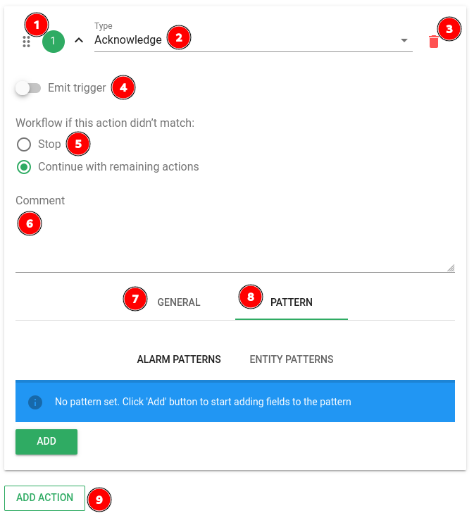

# Scenarios

## Définition

Les *scénarios* dans Canopsis permettent d'appliquer un enchainement d'actions sur les alarmes lors de [*triggers*](/guide-administration/architecture-interne/triggers) sur celles-ci.
Ils sont gérés par le *moteur Action* et le *moteur Webhook* (pour la partie webhooks).

## Paramètres généraux

!!! warning
	
	Les configurations de *scenarios* sont rechargées toutes les minutes.
	Lors de l'ajout ou de la modification d'un *scenario*
	attendez une minute avant de tester votre nouvelle configuration.

| Paramètre | Description |
| --- | --- |
| **Name (1)** | Nom du *scenario*, affiché dans l'interface de gestion des *scenarios* |
| **Delay (2)** | Délai avant de commencer à exécuter les actions lorsqu'un *trigger* déclenche le scénario |
| **Unit (3)** | Unité de temps pour le paramètre **Delay (2)** (second, minute, hour) |
| **Enabled (4)** | Si activé, le *scenario* sera execute sinon il sera ignoré |
| **Triggers (5)** | *triggers* déclenchant le *scenario*. Il est possible d'en sélectionner plusieurs. [Liste des différents *triggers*](/guide-administration/architecture-interne/triggers) |
| **Priority (7)** | Priorité du *scenario* lorsque plusieurs sont applicables à un même *trigger*. Les *scenarios* sont exécutés par ordre de priorité croissant (d'abord le `1` ensuite le `2` etc).|

## Actions

### Paramètres communs

| Paramètre | Description |
| --- | --- |
| **Poignée de réorganisation (1)** | Permet de réorganiser les *actions* dans le *scenario*, elles sont exécutées de haut en bas. |
| **Type (2)** | Type d'*action*. Les différents types sont énumérés [plus bas](#types-dactions). |
| **Bouton de suppression (3)** | Permet de supprimer une *action* dans un *scenario*. |
| **Emit trigger (4)** | Si activé l'*action* déclenchera un *trigger*. (Exemple: Si le **Type (2)** d'*action* est `Acknowledge`, que **Emit trigger (4)** est activé et que l'action est exécutée, elle activera le *trigger* `ack` qui a son tour déclenchera les *scenarios* ayant `ack` dans leur [**Triggers (5)**](#parametres-generaux). |
| **Workflow if this action didn't match (5)** | Lors de l'exécution du *scenario* si l'*action* n'a pas été déclenchée car l'*alarme* ne correspondait pas au **Pattern (9)** configuré et que cette option est mise sur `Stop`, alors l'exécution du scenario s'arrête. Dans tout les autres cas, elle continue. |
| **Comment (6)** | Commentaire pour l'*action* en cours, ne sera affiché que dans la fenêtre d'édition du *scenario*. |
| **General (7)** | Onglet de configuration des paramètres spécifiques au [Type d'*action*](#types-dactions) sélectionné. |
| **Pattern (8)** | Onglet de configuration du [*pattern*](../../../guide-administration/moteurs/moteur-che-event_filter/) permettant de sélectionner les alarmes sur lesquelles l'action sera exécutée. |
| **Add action (9)** | Bouton d'ajout de nouvelle *action* au *scenario*. |

### Types d'actions

#### Acknowledge

#### Acknowledge remove

#### Associate ticket

#### Cancel

#### Snooze

#### Pbehavior

#### Change state (Change and lock severity)

#### Webhook

