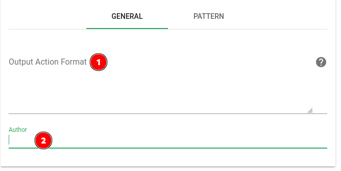
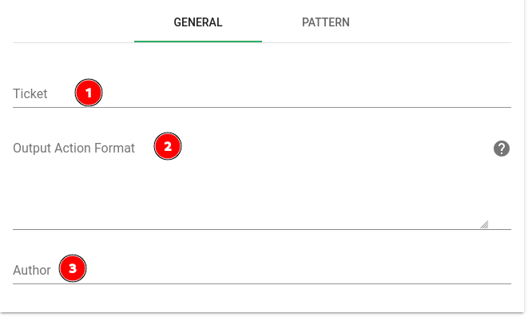
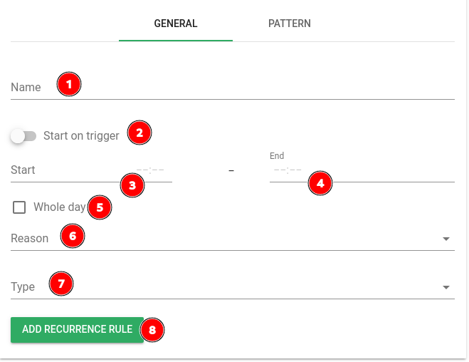
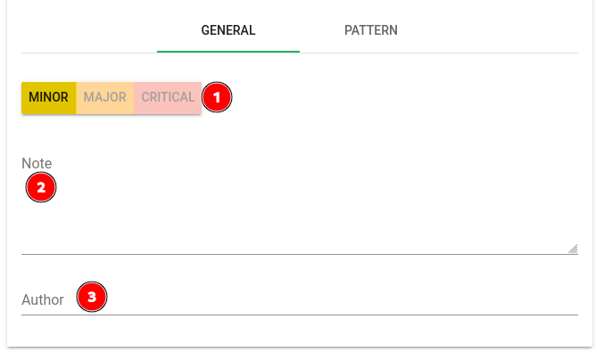
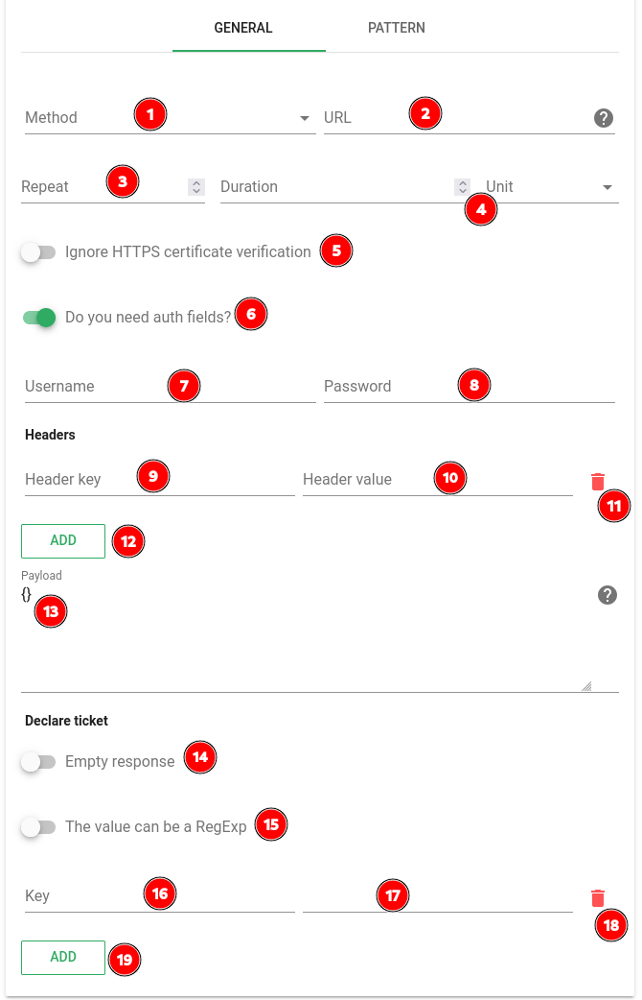

# Scenarios

## Définition

Les *scénarios* dans Canopsis permettent d'appliquer un enchainement d'actions sur les alarmes lors de [*triggers*](../../guide-administration/architecture-interne/triggers.md) sur celles-ci.
Ils sont gérés par le *moteur Action* et le *moteur Webhook* (pour la partie webhooks).

## Paramètres généraux

!!! warning
	
	Les configurations de *scenarios* sont rechargées toutes les minutes.
	Lors de l'ajout ou de la modification d'un *scenario*
	attendez une minute avant de tester votre nouvelle configuration.

| Paramètre | Description |
| --- | --- |
| **Name (1)** | Nom du *scenario*, affiché dans l'interface de gestion des *scenarios* |
| **Delay (2)** | Délai avant de commencer à exécuter les actions lorsqu'un *trigger* déclenche le scénario |
| **Unit (3)** | Unité de temps pour le paramètre **Delay (2)** (second, minute, hour) |
| **Enabled (4)** | Si activé, le *scenario* sera executé sinon il sera ignoré |
| **Triggers (5)** | *triggers* déclenchant le *scenario*. Il est possible d'en sélectionner plusieurs. [Liste des différents *triggers*](../../guide-administration/architecture-interne/triggers.md) |
| **Priority (7)** | Priorité du *scenario* lorsque plusieurs sont applicables à un même *trigger*. Les *scenarios* sont exécutés par ordre de priorité croissant (d'abord le `1` ensuite le `2` etc).|

## Actions

### Paramètres communs

| Paramètre | Description |
| --- | --- |
| **Poignée de réorganisation (1)** | Permet de réorganiser les *actions* dans le *scenario*, elles sont exécutées de haut en bas. |
| **Type (2)** | Type d'*action*. Les différents types sont énumérés [plus bas](#types-dactions). |
| **Bouton de suppression (3)** | Permet de supprimer une *action* dans un *scenario*. |
| **Emit trigger (4)** | Si activé l'*action* déclenchera un *trigger*. (Exemple: Si le **Type (2)** d'*action* est `Acknowledge`, que **Emit trigger (4)** est activé et que l'action est exécutée, elle activera le *trigger* `ack` qui a son tour déclenchera les *scenarios* ayant `ack` dans leurs [**Triggers (5)**](#parametres-generaux). |
| **Workflow if this action didn't match (5)** | Lors de l'exécution du *scenario* si l'*action* n'a pas été déclenchée car l'*alarme* ne correspondait pas au **Pattern (9)** configuré et que cette option est mise sur `Stop`, alors l'exécution du scenario s'arrête. Dans tout les autres cas, elle continue. |
| **Comment (6)** | Commentaire pour l'*action* en cours, ne sera affiché que dans la fenêtre d'édition du *scenario*. |
| **General (7)** | Onglet de configuration des paramètres spécifiques au [Type d'*action*](#types-dactions) sélectionné. |
| **Pattern (8)** | Onglet de configuration du *pattern* permettant de sélectionner les alarmes sur lesquelles l'action sera exécutée. |
| **Add action (9)** | Bouton d'ajout de nouvelle *action* au *scenario*. |

### Types d'actions

#### Acknowledge, Acknowledge remove, Cancel, Snooze

| Paramètre | Description |
| --- | --- |
| **Output Action Format (1)** | Commentaire à mettre sur l'*action* dans la timeline de l'*alarme*. Supporte les [Templates GO](../../guide-utilisation/templates-go/index.md). |
| **Author (2)** | Auteur de l'*action* effectuée |

#### Associate ticket

Les paramètres **Author (3)** et **Output Action Format (2)** sont les mêmes que pour les [autres *actions*](#acknowledge-acknowledge-remove-cancel-snooze).

| Paramètre | Description |
| --- | --- |
| **Ticket (1)** | Numéro du ticket à associer à l'alarme. |

#### Pbehavior

| Paramètre | Description |
| --- | --- |
| **Name (1)** | Nom du *pbehavior* à créer. |
| **Start on trigger (2)** | Permet de commencer la période du *pbehavior* au moment ou l'*action* est executée. Vous pourrez alors choisir une durée pour votre *pbehavior* au lieu d'une date de fin. |
| **Start (3)** | Date et heure de début du *pbehavior*. |
| **End (4)** | Date et heure de fin du *pbehavior*. |
| **Whole day (5)** | Indique que le *pbehavior* se passe sur des journées entières. Enlève le besoin de configurer des heures de début et de fin.
| **Reason (6)** | *raison* du *pbehavior*. |
| **Type (7)** | *type* de *pbehavior*. |
| **Add recurrence rule (8)** | Bouton permettant d'ajouter une [*règle de récurrence*](../interface/pbehaviors/index.md#récurrence) au *pbehavior*. |

#### Change state (Change and lock severity)

Le paramètre **Author (3)** est le même que pour les [autres *actions*](#acknowledge-acknowledge-remove-cancel-snooze).

| Paramètre | Description |
| --- | --- |
| **Selecteur de criticité (1)** | Niveau de *Criticité* à appliquer à l'*alarme*. |
| **Note (2)** | Note à mettre sur le changement de *Criticité* dans l'historique de l'*alarme*. |

#### Webhook

!!! note
	Les webhooks sont gérés par le [*moteur webhook*.](../menu-exploitation/scenarios.md#webhook)

| Paramètre | Description |
| --- | --- |
| **Method (1)** | [Méthode HTTP](https://datatracker.ietf.org/doc/html/rfc7231#section-4.3) à utiliser. |
| **URL (2)** | URL de la requête HTTP. |
| **Repeat (3)** | Nombre de tentatives avant d'abandonner en cas de problème avec la requête. |
| **Duration & Unit (4)** | Intervalle entre les tentatives (ex : `Duration` = `5` et `Unit` = `minutes` : la requête sera répétée toutes les 5 minutes jusqu'à réussite ou jusqu'à épuisement du nombre de tentatives. ) |
| **Ignore HTTPS certificate verification (5)** | Si coché, la validité du certificat HTTPS n'est pas vérifiée et la requête est exécutée même si le serveur HTTP présente un certificat invalide. |
| **Do you need auth fields? (6)** | Si coché, active l'authentification HTTP pour la requête. |
| **Username (7)** | Nom d'utilisateur pour la requête HTTP. |
| **Password (8)** | Mot de passe pour la requête HTTP. |
| **Header key (9)** | Nom du header HTTP à ajouter à la requête. |
| **Header value (10)** | Valeur du header HTTP. |
| **Remove header button (11)** | Permet d'enlever un header HTTP à la requête. |
| **Add header button (12)** | Permet d'ajouter un header HTTP à la requête. |
| **Payload (13)** | Corps de la requête. Supporte les [Templates GO](../../guide-utilisation/templates-go/index.md). |
| **Empty response (14)** | Autorise une réponse vide de la part du serveur HTTP pour la création d'un ticket. |
| **The value can be a RegExp (15)** | Permet d'appliquer une REGEX dans le champ **Value (17)** |
| **Key (16)** | Nom de la propriété à ajouter à l'*alarme* |
| **Value (17)** | Nom du champ de la réponse à mettre dans la propriété **Key (16)** de l'alarme. La réponse doit être au format JSON.  (exemple : `Key (16)` = `myprop`, `Value (17)` = `ticket.msg` et la réponse de l'api est `{"ticket":{"msg" : "Ticket message"}}` alors le champ `myprop` de l'alarme aura pour valeur `"Ticket message"`).|
| **Remove property button (18)** | Permet d'enlever une propriété à récupérer dans la réponse. |
| **Add property button (19)** | Permet d'ajouter une propriété à récupérer dans la réponse. |
