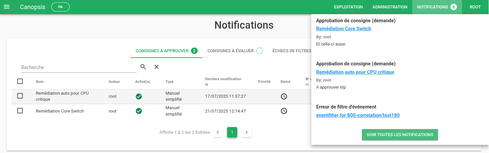

# Notifications

## Présentation générale

Le module Notifications est une nouvelle fonctionnalité de Canopsis.  
Il centralise dans une seule interface toutes les alertes et actions à effectuer par l'utilisateur :

* Les consignes à approuver
* Les consignes à évaluer
* Les échecs de filtres d'événements à traiter

Cette page de notifications est accessible depuis le menu principal et permet à chaque utilisateur de consulter et accéder directement aux éléments qui le concernent.

## Accès rapide via le menu Notifications

Le menu situé dans la barre d'entête affiche :

* Un compteur global du nombre total de notifications
* Un menu déroulant (popover) listant les trois dernières notifications non traitées,
* Un bouton "Voir toutes les notifications" qui redirige vers la page Notifications

Depuis ce menu :

* Un clic sur le nom d'une consigne ouvre directement la modale correspondante (approbation ou évaluation)
* Un clic sur un filtre d'événements ouvre l'onglet "Echecs de filtres d'événements" avec le panneau de détail correspondant
* En cas d'absence de nouvelles notifications, un message "Aucune notification" est affiché.

## Page Notifications

La page comporte trois onglets principaux, chacun disposant d'un compteur (nombre d'éléments visibles) :

* Consignes à approuver
* Consignes à évaluer
* Échecs de filtres d'événements

Chaque onglet présente les éléments associés et permet d'ouvrir les modales ou panneaux détaillés.  

### Consignes à approuver

Cet onglet regroupe les consignes nécessitant une validation manuelle par les utilisateurs habilités.

Fonctionnalités principales :

* Liste des consignes en attente d'approbation (ou refusées).
* Clic sur le nom de la consigne : ouverture de la modale d'approbation.

### Consignes à évaluer

Cet onglet reprend la logique historique des notifications de notation de consignes :

* Une notification est créée lorsqu'une consigne est terminée.
* Si l'utilisateur a déjà évalué une consigne cette semaine, aucune nouvelle notification n'est affichée.
* Une cloche apparaît si la consigne n'a pas été évaluée après 24h.

Une modale de notation est accessible via la cloche ou depuis la ligne de consigne.  
De plus, chaque consigne dispose désormais d'un onglet "Évaluation" directement dans sa fiche détaillée.

### Échecs de filtres d'événements

Cet onglet présente les erreurs détectées dans les [filtres d'événements](../menu-exploitation/filtres-evenements.md#gestion-des-erreurs).  
Chaque ligne correspond à une erreur non lue.

Depuis le menu de notifications :

* Un clic sur le nom du filtre ouvre directement cet onglet
* Le panneau latéral s'ouvre automatiquement sur le filtre concerné
* Une fois la règle de filtrage mise à jour, les notifications associées sont supprimées automatiquement et les erreurs correspondantes sont marquées comme lues.

