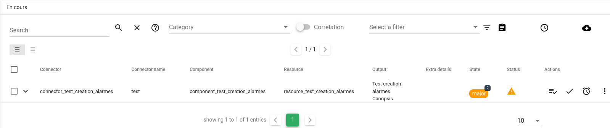

# Premier accès à Canopsis

Après une installation de Canopsis, ses différents composants utiliseront les adresses et identifiants par défaut.

L'interface web de Canopsis est disponible depuis votre navigateur à l'adresse suivante : <http://localhost>.

Les identifiants de connexion par défaut sont `root` / `root`.

On arrive par défaut sur la liste des alarmes en cours :

Parcourez ensuite [le Guide d'utilisation](../index.md) pour en apprendre davantage sur l'interface web de Canopsis.
