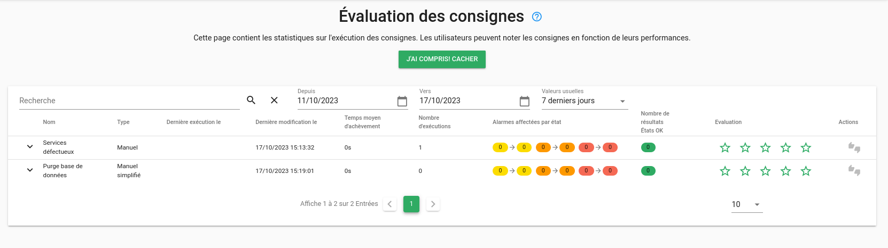

# La remédiation dans Canopsis

!!! abstract "Pages associées"
    Cette page fait partie d'une série de trois documentations au sujet de la
    remédiation dans Canopsis :
    
    1. La page en cours présente la fonctionnalité et montre l'exécution d'une
    consigne pour l'utilisateur final ;
    2. La page [Mise en œuvre de la remédiation](../menu-administration/consignes.md) décrit la
    configuration de la remédiation dans Canopsis pour la gestion des consignes
    et des jobs ;
    3. Le guide d'administration
    [La remédiation et les jobs dans Canopsis][admin-remed] traite de
    l'architecture technique et de la configuration à réaliser pour exécuter des
    jobs dans les ordonnanceurs supportés.

## Introduction

!!! quote "Définition"
    Plan d’actions mis en œuvre pour corriger une situation.

La principe de *remédiation* a été mis en œuvre dans Canopsis afin de répondre
à différents objectifs :

* Faire office de référentiel de consignes
* Mettre à disposition d'une alarme toutes les consignes adaptées
* Identifier les alarmes orphelines, c'est-à-dire sans consigne associée

Les bénéfices de l'utilisation de ce module sont multiples :

| Bénéficiaires                 | Bénéfices                                |
|:----------------------------- |:---------------------------------------- |
| Équipes de pilotage           | Gain de temps                            |
|                               | Diminution du risque d’erreur            |
|                               | Observance des remédiations              |
| Équipes de management         | Amélioration continue du service         |
|                               | Données objectives de suivi              |
| Le SI de manière générale     | Référentiel pour d’autres outils         |
|                               | Communication / diffusion des résultats  |

## Anatomie d'une remédiation

La remédiation est représentée par une **Consigne**, composée elle-même
d'**Étapes** composées d'**Opérations**.  
Une **opération** peut être liée à un job de remédiation qui sera exécuté par un
ordonnanceur de tâches.

## Prérequis

Les ordonnanceurs de tâches compatibles avec les jobs de remédiation sont :

1. [Rundeck](https://www.rundeck.com/)
2. [AWX](https://www.ansible.com/products/awx-project)
2. [Jenkins](https://www.jenkins.io/)

## Exécution d'une remédiation

Du point de vue « pilotage », voici comment exécuter une consigne.  

* Vérifier la présence d'une ou plusieurs consignes associées

* Exécuter la consigne à partir du menu d'actions

* Évaluer la consigne

Vous avez la possibilité d'évaluer la consigne que vous venez d'exécuter.
Ces évaluations seront comptabilisées et transmises aux administrateurs.

* Filtrer les alarmes avec ou sans consignes

## La suite

Pour paramétrer le module de *Remédiation* dans Canopsis, vous pouvez consulter
la [documentation de mise en œuvre de la remédiation](../menu-administration/consignes.md).

[mise-en-oeuvre]: ./mise-en-oeuvre.md
[admin-remed]: ../../guide-administration/remediation/index.md
