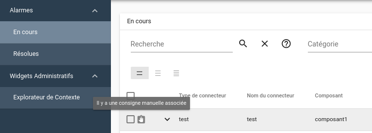
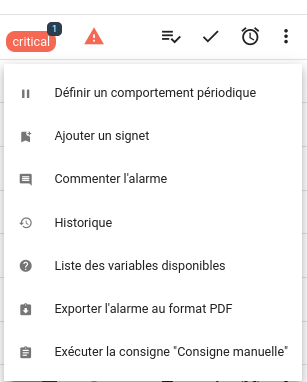

# La remédiation dans Canopsis

!!! abstract "Pages associées"
    Cette page fait partie d'une série de trois documentations au sujet de la
    remédiation dans Canopsis :
    
    1. La page en cours présente la fonctionnalité et montre l'exécution d'une
    consigne pour l'utilisateur final ;
    2. La page [Mise en œuvre de la remédiation](../menu-administration/consignes.md) décrit la
    configuration de la remédiation dans Canopsis pour la gestion des consignes
    et des jobs ;
    3. Le guide d'administration
    [La remédiation et les jobs dans Canopsis][admin-remed] traite de
    l'architecture technique et de la configuration à réaliser pour exécuter des
    jobs dans les ordonnanceurs supportés.

## Introduction

!!! quote "Définition"
    Plan d’actions mis en œuvre pour corriger une situation.

La principe de *remédiation* a été mis en œuvre dans Canopsis afin de répondre
à différents objectifs :

* Faire office de référentiel de consignes
* Mettre à disposition d'une alarme toutes les consignes adaptées
* Identifier les alarmes orphelines, c'est-à-dire sans consigne associée

Les bénéfices de l'utilisation de ce module sont multiples :

| Bénéficiaires                 | Bénéfices                                |
|:----------------------------- |:---------------------------------------- |
| Équipes de pilotage           | Gain de temps                            |
|                               | Diminution du risque d’erreur            |
|                               | Observance des remédiations              |
| Équipes de management         | Amélioration continue du service         |
|                               | Données objectives de suivi              |
| Le SI de manière générale     | Référentiel pour d’autres outils         |
|                               | Communication / diffusion des résultats  |

## Anatomie d'une remédiation

La remédiation est représentée par une **Consigne**, composée elle-même
d'**Étapes** composées d'**Opérations**.  
Une **opération** peut être liée à un job de remédiation qui sera exécuté par un
ordonnanceur de tâches.

## Prérequis

Les ordonnanceurs de tâches compatibles avec les jobs de remédiation sont :

1. [Rundeck](https://www.rundeck.com/)
2. [AWX](https://www.ansible.com/products/awx-project)
3. [Jenkins](https://www.jenkins.io/)
4. [Visual TOM](https://absyss.fr/produits/visual-tom/)

## Exécution d'une remédiation

Du point de vue « pilotage », voici comment exécuter une consigne.  

Pour rappel, il existe 3 types de consignes :

| Type de consigne | Description |
| ---------------- | ----------- |
| Manuel           | L'exécution de la remédiation est à l'initiative du pilote à partir d'un bac à alarmes. Le système lui présente toutes les opérations à effectuer. Ces opérations peuvent inclure des [jobs](#taches) |
| Automatique      | L'exécution de la remédiation est déclenchée par un [trigger](#declenchement-dune-consigne-et-activation-dune-alarme). Le pilote ne peut que constater le résultat de la remédiation |
| Manuel simplifié | L'exécution de la remédiation est à l'initiative du pilote à partir d'un bac à alarmes. Ces remédiations sont uniquement une succession de jobs, sans opération manuelle à exécuter |

* Vérifier la présence d'une ou plusieurs consignes associées

* Exécuter la consigne à partir du menu d'actions

A ce stade, si la consigne est de type "Manuel", le formulaire d'exécution vous proposera d'exécuter toutes les opérations indiquées dans la consignes y compris les jobs associés.

Si la consigne est de type "Manuel Simplifié", seule l'exécution des jobs vous sera proposée.

* Évaluation des consignes

Vous avez la possibilité d'évaluer la consigne que vous venez d'exécuter.
Ces évaluations seront comptabilisées et transmises aux administrateurs.

Pour cela, RDV dans menu `Notifications-> Évaluation des consignes`

* Filtrer les alarmes avec ou sans consignes

## Status des remédiations

Voici les différents statuts de remédiation en cas de succès :

Voici les différents statuts de remédiation en cas d'échec :

1. Consigne manuelle en cours. Aucune consigne n'a été exécutée jusque là. Icône clignotante.

1. Consigne automatique en cours. Aucune consigne n'a été exécutée jusque là. Icône qui clignotante.

1. Pas de consigne en cours. Il n'y a plus de consigne à exécuter. Au moins une consigne automatique est KO. Icône rouge présentée même si certaines consignes automatiques ont été OK.

1. Pas de consigne en cours. Il n'y a plus de consigne à exécuter. Au moins une consigne manuelle est KO. Icône rouge présentée même si certaines consignes ont été OK. S'il y avait plusieurs consignes de différents types, l'icône de la dernière est présentée.

1. Une consigne manuelle est KO tandis qu'une autre (manuelle ou automatique) est en cours. L'icône rouge clignote. S'il y avait plusieurs cosnignes de différents types, l'icône de la dernière est présentée.

1. Une consigne automatique est KO tandis qu'une autre (manuelle ou automatique) est en cours. L'icône rouge clignote. S'il y avait plusieurs consignes de différents types, l'icône de la dernière est présentée.

1. Une consigne automatique est KO et il y a une consigne manuelle à exécuter. Une icône rouge plus carré est présentée. Idem pour une consigne manuelle.

1. Aucune consigne n'a été exécutée jusque la. Il existe au moins une consigne manuelle à exécuter. Icône noire présentée.

## La suite

Pour paramétrer le module de *Remédiation* dans Canopsis, vous pouvez consulter
la [documentation de mise en œuvre de la remédiation](../menu-administration/consignes.md).

[mise-en-oeuvre]: ./mise-en-oeuvre.md
[admin-remed]: ../../guide-administration/remediation/index.md
