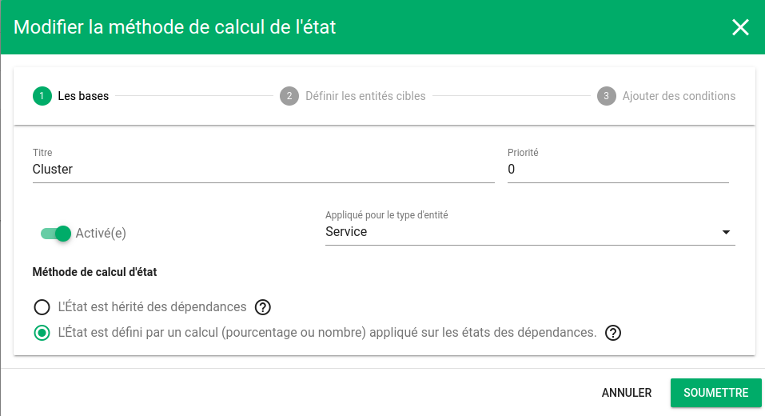
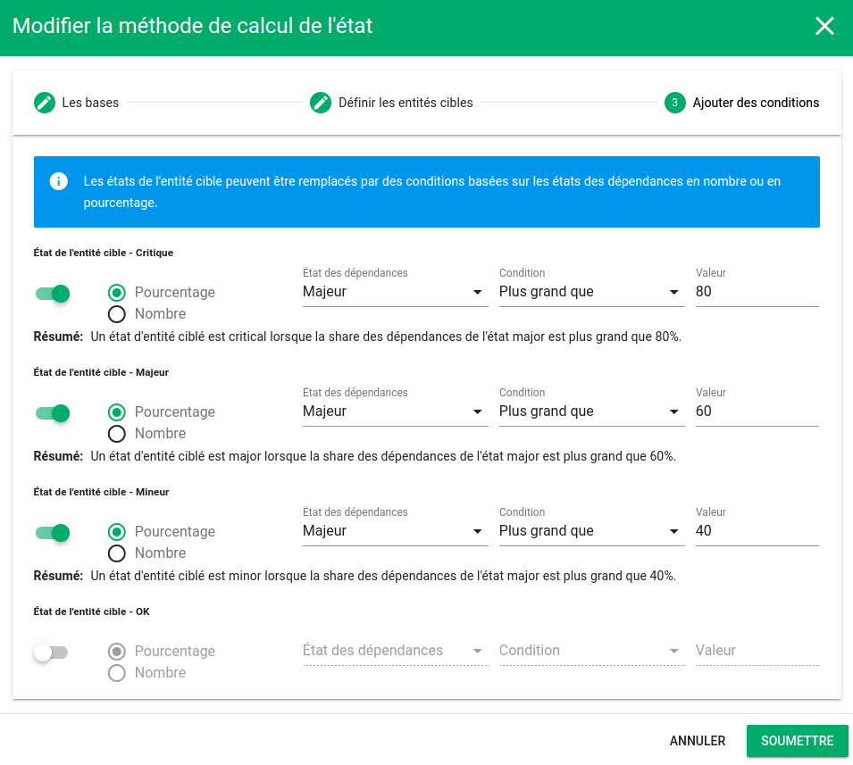
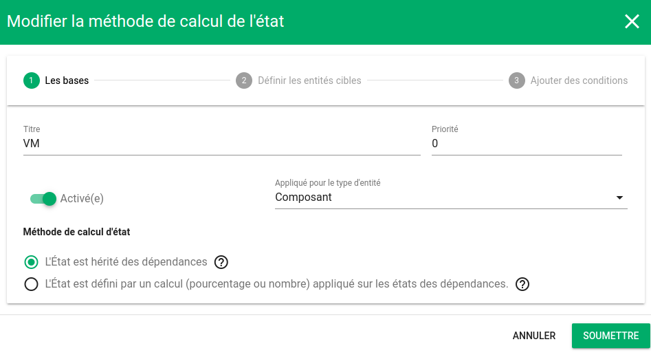
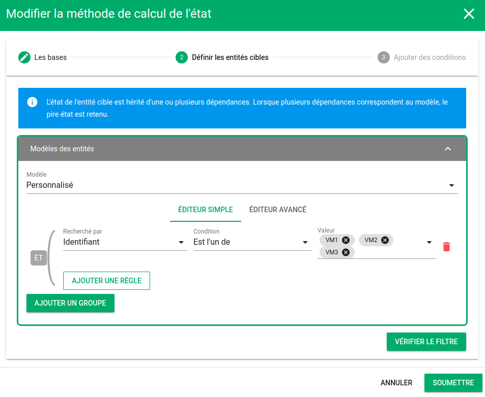
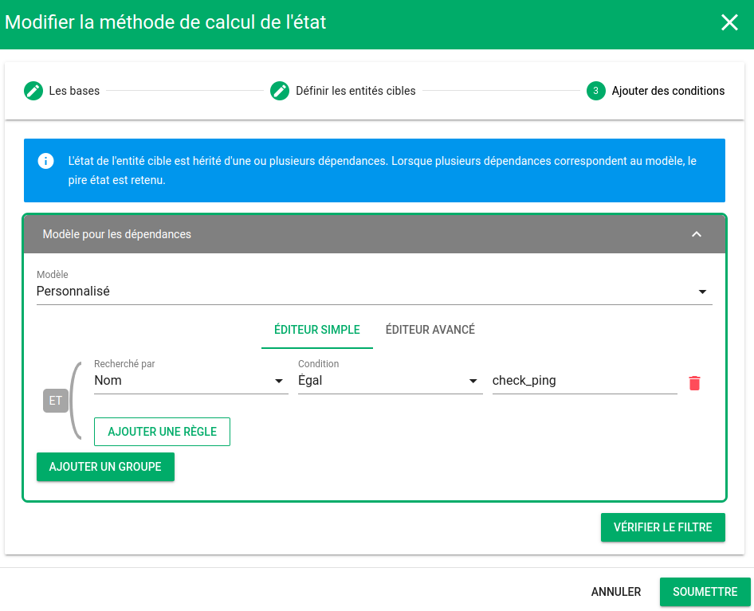
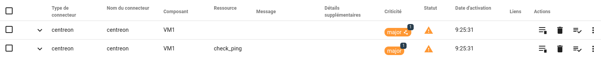

# Cas d'usage de méthode de calcul d'état

Pour ce cas d'usage, nous considérons le schéma suivant : 


4 étages de dépendances sont visibles :

1. Des ressources dont l'état est piloté par des événements entrants dans Canopsis
2. Des composants `VM[1-3]`
3. Des Services `ESX[1-2]` hébergeant des VM
4. D'un Service `Cluster` composé de 2 ESX


Voici les règles de gestions que nous souhaitons implémenter :

1. `Cluster` est OK si l'un au moins de ESX[1-2] est OK. Nous considérons que ESX1 est substituable par ESX2 et inversement.
2. L'état  de `ESX[1-2]` vaut 
   1. Critique si 80% des dépendances sont Majeures
   2. Majeur si 60% des dépendances sont Majeures
   3. Mineur si 40% des dépendances sont Majeures
3. L'état de `VM1` vaut l'état de la ressource `check_ping` qui lui est associée
4. L'état des ressources est piloté par des événements entrants dans Canopsis


## Coté définition et administration

### Paramètre de Cluster

#### Définition du service

Le service `Cluster` est défini avec ses 2 dépendances `ESX1` et `ESX2`.


#### Règle de calcul d'état

Nous créons une règle de calcul d'état dont les caractéristiques sont :

* Appliquée sur le type d'entité `Service`

* L'état est défini par une part ou un nombre de dépendances d'un état spécifique

  

* Le modèle d'entités ciblées est : `Nom Égal Cluster`

  

* Conditions : L'état du service vaut OK lorsque le nombre de dépendances en état OK est supérieur strictement à 0

  


### Paramètres de ESX[1-2]

#### Définition des services

Le service `ESX1`est défini avec ses dépendances `VM[1-3]`ET son ping de rattachement


Il en va de même avec le service `ESX2`

#### Règle de calcul d'état

Nous créons une règle de calcul d'état dont les caractéristiques sont :

* Appliquée sur le type d'entité `Service`

* L'état est défini par un calcul

  

* Le modèle d'entités ciblées est : `Nom Est l'un de ESX1, ESX2`

  

* Conditions 

  


### Paramètres de VM[1-3]

#### Définition des composants

Etant donné que VM[1-3] sont des composants, nous considérons qu'ils seront automatiquement créés par Canopsis lors de la réception d'événements les concernant.

#### Règle de calcul d'état

Nous créons une règle de calcul d'état dont les caractéristiques sont :

* Appliquée sur le type d'entité `Composant`

* L'état est hérité des dépendances

  

* Le modèle d'entités ciblées est : `Identifiant Est l'un de VM1, VM2, VM3`

  

* Conditions : L'état du service vaut l'état de la dépendance `check_ping`

  

## Coté exploitation

A présent, le schéma de calcul d'états est implémenté. Nous allons pouvoir l'exploiter en émettant des événements qui vont provoquer des changements d'état.

**État nominal**

En état nominal, toutes les tuiles de météo de Services sont au vert.


**Création d'une alerte sur check_ping/VM1**




Étant donnée qu'une alarme a été créée sur `check_ping/VM1`, le composant `VM1`porte à son tour une alarme résultante de l'application de la règle de calcul d'état.

En cliquant sur le badge de sévérité `major` du composant `VM1`, vous découvrez le diagramme de cause racine.


La cinétique de ce diagramme précise qu'un événement est venu mettre en alarme `check_ping/VM1` qui a propagé cet état à `VM1`.

Si on regarde le diagramme de cause racine de `ESX1`, on peut vérifier que les conditions ne sont pas réunies pour changer l'état ce celui-ci.


**Création d'une alerte sur check_ping/VM2**


A l'instar de `VM1`, `VM2` est à son tour en alerte pour les mêmes raisons.

En regardant le diagramme de cause racine de `ESX1`, on se rend compte que les conditions sont réunies pour changer l'état de celui-ci.


Le service `Cluster`n'est quant à lui pas impacté par ce changement d'état car `ESX2` n'est pas en alarme.


**Création d'une alerte sur check_ping/BUR**

A ce stade, `ESX1` et `ESX2` sont en alarme et vont donc provoquer le changement d'état de `Cluster`.


## Commandes permettant de créer les objets de ce cas d'usage

Les commandes suivantes permettent de créer les objets et événements qui conduisent à la situation décrite dans ce document.

### Variables d'environnement à positionner

```shell
export CPS_API_URL="http://localhost:8082"
export CPS_API_USERNAME="user"
export CPS_API_PASSWORD="password"
```


### Création des règles de calcul d'état

**Cluster**

```shell
curl -L -X POST "${CPS_API_URL}/api/v4/state-settings" \
-H "Content-Type: application/json" \
-u "${CPS_API_USERNAME}:${CPS_API_PASSWORD}" \
-d '{
    "method": "dependencies",
    "title": "Cluster",
    "enabled": true,
    "priority": 0,
    "entity_pattern": [
	[
	    {
		"field": "name",
		"cond": {
		    "type": "eq",
		    "value": "Cluster"
		}
	    }
	]
    ],
    "state_thresholds": {
	"ok": {
	    "method": "number",
	    "state": "ok",
	    "cond": "gt",
	    "value": 0
	}
    },
    "type": "service",
    "editable": true,
    "deletable": true
}'
```

**ESX**

```shell
curl -L -X POST "${CPS_API_URL}/api/v4/state-settings" \
-H "Content-Type: application/json" \
-u "${CPS_API_USERNAME}:${CPS_API_PASSWORD}" \
-d '{
    "method": "dependencies",
    "title": "ESX",
    "enabled": true,
    "priority": 0,
    "entity_pattern": [
	[
	    {
		"field": "name",
		"cond": {
		    "type": "is_one_of",
		    "value": [
			"ESX1",
			"ESX2"
		    ]
		}
	    }
	]
    ],
    "state_thresholds": {
	"critical": {
	    "method": "share",
	    "state": "major",
	    "cond": "gt",
	    "value": 80
	},
	"major": {
	    "method": "share",
	    "state": "major",
	    "cond": "gt",
	    "value": 60
	},
	"minor": {
	    "method": "share",
	    "state": "major",
	    "cond": "gt",
	    "value": 40
	}
    },
    "type": "service",
    "editable": true,
    "deletable": true
}'
```

**VM**

```shell
curl -L -X POST "${CPS_API_URL}/api/v4/state-settings" \
-H "Content-Type: application/json" \
-u "${CPS_API_USERNAME}:${CPS_API_PASSWORD}" \
-d '{
    "method": "inherited",
    "title": "VM2",
    "enabled": true,
    "priority": 0,
    "entity_pattern": [
	[
	    {
		"field": "_id",
		"cond": {
		    "type": "is_one_of",
		    "value": [
			"VM1",
			"VM2",
			"VM3"
		    ]
		}
	    }
	]
    ],
    "inherited_entity_pattern": [
	[
	    {
		"field": "name",
		"cond": {
		    "type": "eq",
		    "value": "check_ping"
		}
	    }
	]
    ],
    "type": "component",
    "editable": true,
    "deletable": true
}'
```


### Envoi d'événements correspondants

```shell
curl -L -X POST "${CPS_API_URL}/api/v4/event" \
-H "Content-Type: application/json" \
-u "${CPS_API_USERNAME}:${CPS_API_PASSWORD}" \
--data-raw "[
    {
        \"event_type\": \"check\",
        \"state\": 2,
        \"output\": \"\",
        \"connector\": \"centreon\",
        \"connector_name\": \"centreon\",
        \"component\": \"VM1\",
        \"resource\": \"check_ping\",
        \"source_type\": \"resource\"
    },
    {
        \"event_type\": \"check\",
        \"state\": 3,
        \"output\": \"\",
        \"connector\": \"centreon\",
        \"connector_name\": \"centreon\",
        \"component\": \"VM1\",
        \"resource\": \"check_cpu\",
        \"source_type\": \"resource\"
    },
    {
        \"event_type\": \"check\",
        \"state\": 2,
        \"output\": \"\",
        \"connector\": \"centreon\",
        \"connector_name\": \"centreon\",
        \"component\": \"VM2\",
        \"resource\": \"check_ping\",
        \"source_type\": \"resource\"
    },
    {
        \"event_type\": \"check\",
        \"state\": 3,
        \"output\": \"\",
        \"connector\": \"centreon\",
        \"connector_name\": \"centreon\",
        \"component\": \"VM2\",
        \"resource\": \"check_cpu\",
        \"source_type\": \"resource\"
    },
    {
        \"event_type\": \"check\",
        \"state\": 0,
        \"output\": \"\",
        \"connector\": \"centreon\",
        \"connector_name\": \"centreon\",
        \"component\": \"VM3\",
        \"resource\": \"check_ping\",
        \"source_type\": \"resource\"
    },
    {
        \"event_type\": \"check\",
        \"state\": 3,
        \"output\": \"\",
        \"connector\": \"centreon\",
        \"connector_name\": \"centreon\",
        \"component\": \"VM3\",
        \"resource\": \"check_cpu\",
        \"source_type\": \"resource\"
    },
    {
        \"event_type\": \"check\",
        \"state\": 0,
        \"output\": \"\",
        \"connector\": \"centreon\",
        \"connector_name\": \"centreon\",
        \"component\": \"SUP\",
        \"resource\": \"check_ping\",
        \"source_type\": \"resource\"
    },
    {
        \"event_type\": \"check\",
        \"state\": 3,
        \"output\": \"\",
        \"connector\": \"centreon\",
        \"connector_name\": \"centreon\",
        \"component\": \"SUP\",
        \"resource\": \"check_cpu\",
        \"source_type\": \"resource\"
    },
    {
        \"event_type\": \"check\",
        \"state\": 2,
        \"output\": \"\",
        \"connector\": \"centreon\",
        \"connector_name\": \"centreon\",
        \"component\": \"BUR\",
        \"resource\": \"check_ping\",
        \"source_type\": \"resource\"
    },
    {
        \"event_type\": \"check\",
        \"state\": 3,
        \"output\": \"\",
        \"connector\": \"centreon\",
        \"connector_name\": \"centreon\",
        \"component\": \"BUR\",
        \"resource\": \"check_cpu\",
        \"source_type\": \"resource\"
    }
]"
```

