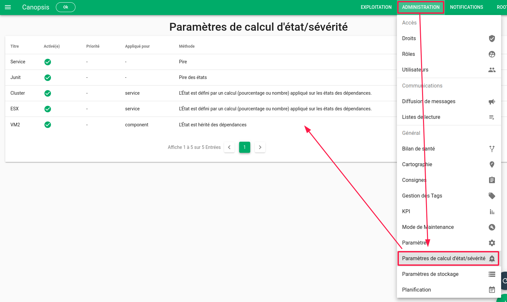

# Les services

## Définition

Un *service* est un type d'entité du référentiel interne de Canopsis au même
titre que les *connecteurs*, les *composants*, ou encore les *ressources*.

Il permet de regrouper d'autres entités à partir d'un filtre/pattern et ainsi de créer des arbres de dépendances entre entités.  

Le schéma ci-après propose un exemple d'arbre de dépendances, pouvant être porté par les `Services` Canopsis.

Un [cas d'usage complet](cas-d-usage-complet.md) est disponible.

[L'état du service](#calcul-detat-severite) est dépendant d'un ensemble de règles qui définissent une méthode de calcul :

* Pire état des dépendances
* Un pourcentage de dépendances considérées comme KO
* L'état d'une dépendance

## Explorateur de contexte

C'est [l'explorateur de contexte](../interface/widgets/contexte/index.md) qui permet de manipuler les services.

| Paramètre                    | Description                                                  |
| ---------------------------- | ------------------------------------------------------------ |
| **Nom**(*)                   | Nom du service à créer                                       |
| **Catégorie**(*)             | Catégorie du service. Sera utile pour filtrer les services   |
| **État de disponibilité**(*) | Sévérité à partir de laquelle on considère le service comme indisponible. |
| **Niveau d'impact**(*)       | Impact du service permettant de calculer la priorité des alarmes qui seront créées (de 1, peu impactant, à 10, très impactant). |
| **Latitude/Longitude**       | Coordonnées géographiques du service                         |
| **Modèle de message**(*)     | Template qui définit le message des alarmes qui seront créées pour ce service. La liste des variables disponibles est accessible grâce à l'icône (x) |
| **Activée**(*)               | Le service est-il activé ou non ?                            |
| **Paramétrage de l'état**    | Règle de calcul d'état qui s'applique                        |
| **Modèles des entités**(*)   | La règle ne s'applique que sur les événements dont l'entité correspond au modèle |
| **Gérer les informations**   | Panneau de gestion des informations enrichies sur le service |

## Calcul d'état / sévérité

L'état ou la sévérité d'un Service est dépendant de règles de calcul d'état qui s'appliquent sur les dépendances de celui-ci.
Ces règles, qui sont personnalisables, peuvent être définies dans [« Administration » > « Paramètres de calcul d'état/sévérité »](../menu-administration/parametres-de-calculd-etat-sévérité.md) :

## Représentation dans l'interface graphique

Les services sont représentés par l'intermédiaire du [widget Météo des Services](../interface/widgets/meteo-des-services/index.md) sous forme de tuile.  

Une tuile représente un Service. Elle est accompagnée d'un jeu de couleurs et d'icônes qui correspondent à l'état courant du Service :

* Basé sur la sévérité : liée à la [règle de calcul de d'état/sévérité](#calcul-detat-severite)
* Basé sur la priorité : produit de la sévérité par l'impact de l'entité

Par ailleurs, étant donné que les services sont des entités comme les autres, si une alarme apparaît sur un service, elle sera également présente dans les widgets de type `Bac à alarmes`. 

