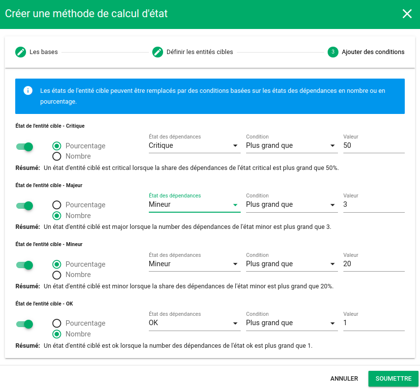

# Les services

## Définition

Un `service` est un type d'entité du référentiel interne de Canopsis au même titre que les `connecteurs`, les `composants`, ou encore les `ressources`.  
Il permet de regrouper d'autres entités à partir d'un [filtre/pattern]() et ainsi de créer des arbres de dépendances entre entités.  

Le schéma ci-après propose un exemple d'arbre de dépendance pouvant être porté par les `Services` Canopsis.

Un [cas d'usage complet](./cas-d-usage-complet.md) est disponible.

[L'état du service]() est dépendant d'un ensemble de règles qui définissent une méthode de calcul :

* Pire état des dépendances
* Un pourcentage de dépendances considérées comme KO
* L'état d'une dépendance

## Explorateur de contexte

C'est [l'explorateur de contexte]() qui permet de manipuler les services.

| Paramètre                  | Description                                                  |
| -------------------------- | ------------------------------------------------------------ |
| **Nom**                    | Nom du Service à créer                                       |
| **Catégorie**              | Catégorie du Service. Sera utile pour filtrer les Services   |
| **État de disponibilité**  | Sévérité à partir de laquelle on considère le Service comme indisponible. |
| **Niveau d'impact**        | Impact du service permettant de calculer la priorité des alarmes qui seront créées. |
| **Latitude/Longitude**     | Coordonnées géographiques du Service                         |
| **Modèle de message**      | Template qui définit le message des alarmes qui seront créées pour ce Service. La liste des variables disponibles est accessible grâce à l'icône  |
| **Activée**                | Le Service est-il activé ou non ?                            |
| **Paramétrage de l'état**  | Règle de calcul d'état qui s'applique                        |
| **Modèles des entités**    | La règle ne s'applique que sur les événements dont l'entité correspond au modèle |
| **Gérer les informations** | Panneau de gestion des informations enrichies sur le Service |

## Calcul d'état / sévérité

L'état ou la sévérité d'un Service est dépendant de règles de calcul d'état qui s'appliquent sur les dépendances de celui-ci.

Lorsqu’aucune règle ne s'applique, l'état du service vaut le pire état de ses dépendances.

### Les bases

| Paramètre                          | Description                                                  |
| ---------------------------------- | ------------------------------------------------------------ |
| **Nom**                            | Nom de la règle à créer                                      |
| **Priorité**                       | Priorité d'application de la règle                           |
| **Activée**                        | La règle est-elle activée ou non ?                           |
| **Appliqué pour le type d'entité** | Cette règle de calcul s'applique t-elle aux `Composants` ou aux `Services` ? |
| **Méthode de calcul d'état**       | Choix de la méthode de calcul d'état                         |

### Définir les entités cibles

| Paramètre               | Description                                                  |
| ----------------------- | ------------------------------------------------------------ |
| **Modèles des entités** | La règle de calcul d'état s'applique aux entités ciblées par ce modèle |

### Ajouter des conditions

#### L'État est hérité des dépendances

|                             | Description                                                  |
| --------------------------- | ------------------------------------------------------------ |
| **Modèles des dépendances** | Quelle(s) dépendance(s) de l'entité ciblée sera(ont) responsable(s) de l'état final ? Si plusieurs dépendances sont sélectionnées par me modèle alors le pire état de celles-ci sera utilisé. |

#### L'État est défini par un calcul (pourcentage ou nombre) appliqué sur les états des dépendances

Dans ce mode, il est possible de définir l'état d'un service à partir de conditions basées sur un pourcentage ou un nombre d'états des dépendances du service.

Nous pourrions par exemple exprimer le fait que le service sera en état 

* Critique si plus de 50% de ses dépendances sont en état critique ou

* Majeur si 3 de ses dépendances sont en état mineur ou

* Mineur si 20% des entités sont en état majeur ou

* OK si au moins 1 dépendance est en état OK

  

Pour cela, des conditions peuvent être définies pour chaque état final du service

## Représentation dans l'interface graphique

Les services sont représentés par l'intermédiaire du [widget Météo des Services]() sous forme de tuile.  

Une tuile représente un Service. Elle est accompagnée d'un jeu de couleurs et d'icônes qui correspondent à l'état courant du Service :

* Basé sur la sévérité : liée à la [règle de calcul de sévérité]()
* Basé sur la priorité : produit de la sévérité par l'impact de l'entité

Par ailleurs, étant donné que les services sont des entités comme les autres, si une alarme apparaît sur un service, elle sera également présente dans les widgets de type `Bac à alarmes`. 

