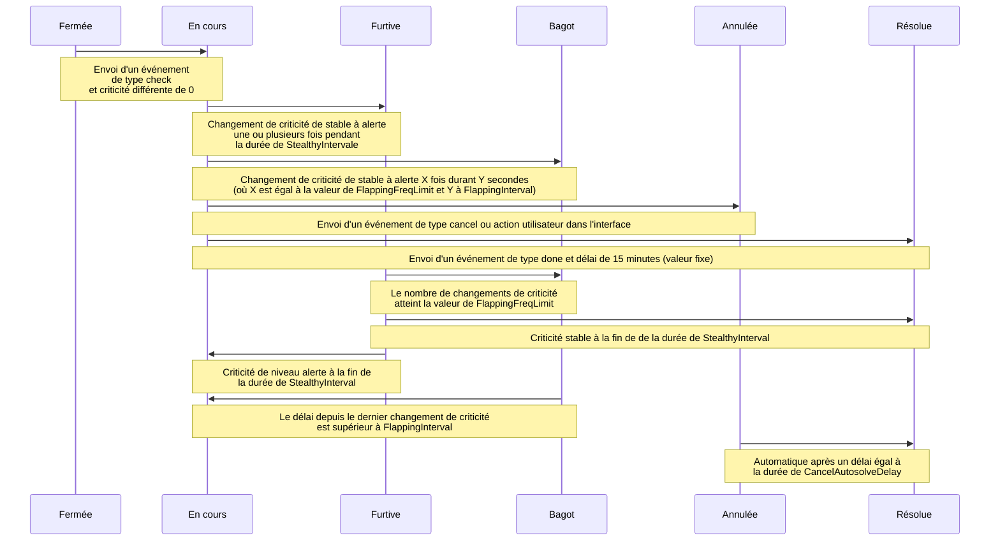

# Vocabulaire

## Alarme

Une *alarme* est le résultat du traitement des [évènements](#evenement) par un [moteur](#moteur) et sert à alerter sur un problème.

Elle est liée à une [entité](#entite) de type [composant](#composant), [ressource](#ressource) ou [observateur](#observateur). La combinaison d'un [connecteur](#connecteur), d'un [nom de connecteur](#nom-de-connecteur), d'un [composant](#composant) et d'une [ressource](#ressource) créé une alarme unique. Si l'un de ces éléments change, une alarme différente est créée.

Elle peut connaître de multiples changements de criticité et de statut, et subir une suite d'actions (acquittement, mise en veille, changement de criticité, annulation, etc.), [utilisateurs](../interface/widgets/bac-a-alarmes/actions.md) ou [automatiques](../../guide-administration/moteurs/moteur-action.md). L'ensemble de ces changements et actions s'appelle un *cycle d'alarme*.

On peut visualiser les alarmes via un widget [bac à alarmes](../interface/widgets/bac-a-alarmes/index.md).

Vous pouvez consulter sa [structure dans la documentation développeur](../../guide-developpement/base-de-donnees/periodical-alarm.md).

## Battement

Un [moteur](#moteur) effectue une tâche périodique appelée *battement* (ou « beat ») à un intervalle régulier. L'intervalle typique est de 1 minute.

## Composant

Un *composant* peut être soit :

- Un type d'[entité](#entite) créé suite au traitement d'un [évènement](#evenement).
- Un champ d'un [évènement](#evenement). Le plus souvent, il s'agit d'une machine ou d'un périphérique réseau (serveur, routeur, etc.). Une [alarme](#alarme) peut être rattachée à un *composant*.

## Context-Graph

Le *context-graph* est un schéma relationnel entre les [entités](#entite) de Canopsis. Il sert à grapher leur contexte. Il s'appuie sur les notions de [`impact` et `depends`](../../guide-developpement/base-de-donnees/default-entities.md#context-graph). Il est présent au sein de chaque [entité](#entite) et peut être visualisé via le widget [explorateur de contexte](../interface/widgets/contexte/index.md).

## Connecteur

Un *connecteur* peut être soit :

- Un type d'[entité](#entite) créé suite au traitement d'un [évènement](#evenement). Il est le fruit de la concaténation des champs `connector` et `connector_name`.
- Un champ d'un [évènement](#evenement). Le plus souvent, il s'agit du nom du logiciel qui envoie ses données à Canopsis. Il sert à créer l'entité [connecteur](#connecteur).
- Un [script](../../interconnexions/index.md#connecteurs) permettant d’envoyer à Canopsis des [évènements](#evenement) à partir de sources d'informations extérieures.

## Criticité

Une [alarme](#alarme) a une *criticité*, indiquant la gravité de l'incident. Il y a actuellement 4 criticités possibles : 1 stable et 3 d'alerte.

*  0 - Info (quand en cours)/ OK (quand résolue), stable
*  1 - Minor, alerte
*  2 - Major, alerte
*  3 - Critical, alerte

## Enrichissement

L'*enrichissement* est l'action d'ajouter des informations supplémentaires. On peut enrichir :

- Un [évènement](#evenement) via l'[event-filter du moteur `engine-che`](../../guide-administration/moteurs/moteur-che-event_filter.md)
- Une [entité](#entite) via l'[event-filter du moteur `engine-che`](../../guide-administration/moteurs/moteur-che-event_filter.md#set_entity_info_from_template), l'[explorateur de contexte](../interface/widgets/contexte/index.md) ou les [drivers](../../interconnexions/index.md#drivers)
- Une [alarme](#alarme) via le [moteur `engine-dynamic-infos`](../../guide-administration/moteurs/moteur-dynamic-infos.md)

## Entité

Les *entités* servent à structurer les [alarmes](#alarme). Elles sont liées entre elles via le [context-graph](#context-graph). Elles peuvent permettre, via l'[enrichissement](#enrichissement) de conserver des données statiques (emplacement du serveur, nom du client, etc.).

Les entités peuvent être visualisées via le widget [explorateur de contexte](../interface/widgets/contexte/index.md)

Les types d'*entité* sont :

| Type d'entité | Résulte du traitement d'un [évènement](#evenement) | Peut être lié à une [alarme](#alarme)|
|---------------|--------------------------------------|---------------------------|
|[composant](#composant)|✅            |✅         |
|[connecteur](#connecteur)|✅          |❌                        |
|[observateur](#observateur)|❌                       |✅         |
|[ressource](#ressource)|✅            |✅         |

Vous pouvez consulter la [structure d'une entité dans la documentation développeur](../../guide-developpement/base-de-donnees/default-entities.md).

## Évènement

Un *évènement* est un message arrivant dans Canopsis.

Il est formatté en JSON et peut être de plusieurs [types](../../guide-developpement/struct-event.md#liste-des-types-devenements), avec leurs propres [structures](../../guide-developpement/struct-event.md).

Les évènements de type [`check`](../../guide-developpement/struct-event.md#event-check-structure) peuvent provenir d'une source externe, d'un [connecteur](../../interconnexions/index.md#connecteurs) ([email](../../interconnexions/Transport/Mail.md), [SNMP](../../interconnexions/Supervision/SNMPtrap.md), etc.) ou de Canopsis lui-même. Ils aboutissent à la création ou la mise-à-jour d'une [alarme](#alarme) dans le [bac à alarmes](../interface/widgets/bac-a-alarmes/index.md).

## Météo

La [*météo des services* est un widget](../interface/widgets/meteo-des-services/index.md) qui permet permet d'avoir une vue globale sur l'état d'un ensemble d'[entités](#entite). Pour cela, elle affiche des tuiles dont la couleur est représentative de [la criticité](#criticite) des [alarmes](#alarme) liées aux [observateurs](#observateur).

## Moteur

Un *moteur* Canopsis consomme les [évènements](#evenement) entrants pour les traiter, puis les acheminer vers le(s) moteur(s) suivant(s). Ils effectuent également une tâche périodique au [battement](#battement) et consomment leurs enregistrements en base de données lorsqu'ils sont disponibles. Vous pouvez consulter plus d'informations sur les *moteurs* dans la documentation du [guide d'administration](../../guide-administration/moteurs/index.md)

## Nom de connecteur

Un *nom de connecteur* (ou « connector name ») est le champ d'un [évènement](#evenement). Le plus souvent, il s'agit du nom du logiciel qui envoie ses données à Canopsis, complété par sa localisation ou sa numérotation (`superviseur_lille` ou `superviseur_5` par exemple). Il sert à créer l'entité [connecteur](#connecteur).

## Observateur

Un *observateur* est une [entité](#entite) destinée à inclure d'autres [entités](#entite) dans son [context-graph](#context-graph) via des patterns. Ils peuvent être ajoutés via l'[explorateur de contexte](../interface/widgets/contexte/index.md).

Ils peuvent être visualisés via la [Météo](#meteo) de services.

## Ressource

Une *ressource* peut être soit :

- Un type d'[entité](#entite) créé suite au traitement d'un [évènement](#evenement). Il est le fruit de la concaténation des champs `resource` et `component`.
- Un champ d'un [évènement](#evenement). Le plus souvent, il s'agit du nom de la vérification effectuée (RAM, DISK, PING, CPU, etc.). Une [alarme](#alarme) peut être rattachée à une *ressource*.

## Statut

Une [alarme](#alarme) a un *statut* , indiquant la situation dans laquelle se trouve l'alarme indiquant un incident. Il y a actuellement 5 statuts possibles :

*  0 - Fermée
*  1 - En cours
*  2 - Furtive
*  3 - Bagot
*  4 - Annulée

### Fermée

Une [alarme](#alarme) est considérée **fermée** (off) si elle est stable. C'est-à-dire que sa [criticité](#criticite) est stable à 0.

### En cours

Une [alarme](#alarme) est considérée **en cours** (ongoing) si sa [criticité](#criticite) est dans un état d'alerte (supérieur à 0).

### Furtive

Une [alarme](#alarme) est considérée **furtive** (stealthy) si sa [criticité](#criticite) est passée d'alerte à stable dans un délai spécifié.  

Si la [criticité](#criticite) de cette [alarme](#alarme) est modifiée à nouveau dans le délai spécifié, elle est toujours considérée **furtive**.  

Une alarme restera **furtive** pendant une durée spécifiée et passera à **fermée** si la dernière criticité était 0, **en cours** s'il s'agissait d'une alerte ou **bagot** s'il se qualifie en tant que tel.

### Bagot

Une [alarme](#alarme) est considérée **bagot** (flapping) si elle est passée d'une [criticité](#criticite) d'alerte à un état stable un nombre spécifique de fois sur une période donnée.

### Annulée

Une [alarme](#alarme) est considérée **annulée** (cancel) si l'utilisateur l'a signalée comme tel à partir de l'interface utilisateur.

Après une période donnée, une [alarme](#alarme) marquée comme **annulée** changera de criticité pour être considérée comme **résolue**.

### Relations entre les statuts d'une alarme

Note : cliquez sur les liens suivants pour accéder aux informations relatives aux variables utilisées dans ce diagramme : [`StealthyInterval`](../../guide-administration/moteurs/moteur-axe/#option-stealthyinterval), [`FlappingFreqLimit`](../../guide-administration/moteurs/moteur-axe/#option-flappingfreqlimit), [`FlappingInterval`](../../guide-administration/moteurs/moteur-axe/#option-flappinginterval) et [`CancelAutosolveDelay`](../../guide-administration/moteurs/moteur-axe/#option-cancelautosolvedelay)
