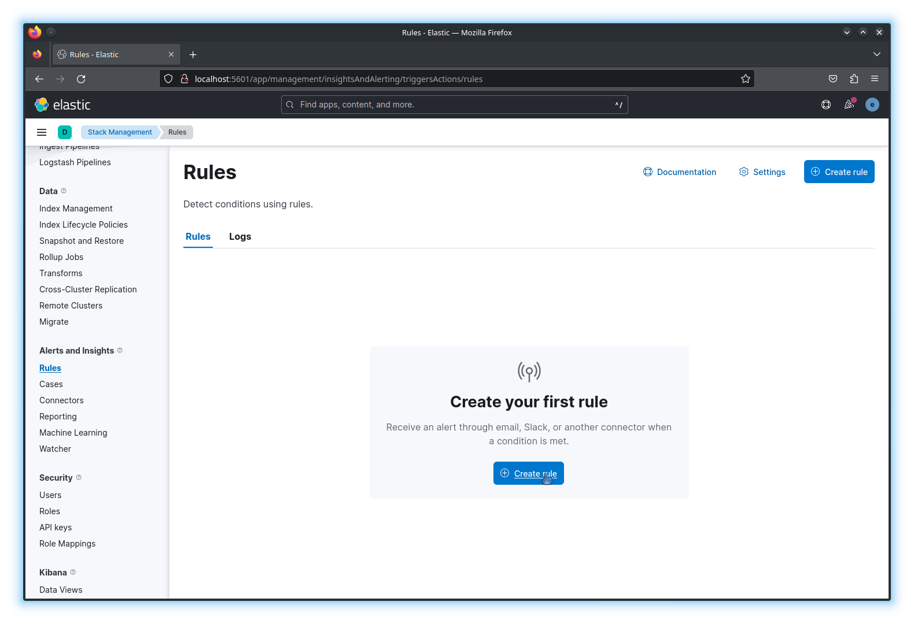

# Interconnexion Elasticsearch vers Canopsis

Elasticsearch est un logiciel propriétaire fournissant un moteur de recherche et
d'indexation ainsi que la base de données sous-jacente, pouvant stocker des
documents sans structure définie.

Il existe trois possibilités pour envoyer des évènements à partir
d'Elasticsearch vers Canopsis :

- Watchers
    * Produit : Elasticsearch
    * Avantages :
        + Pas besoin d'outil supplémentaire
        + Automatisable via API
    * Inconvénients :
        + Requiert la version avec souscription
- Alerts
    * Produit : Kibana
    * Avantages :
        + Création des règles via une interface graphique
        + Intégration avec les autres applications Kibana
        + Automatisable via API
    * Inconvénients :
        + Requiert la version avec souscription
- ElastAlert
    * Produit : ElastAlert
    * Avantages :
        + Open Source
        + Automatisable via le format déclaratif des alertes
    * Inconvénients :
        + Outil supplémentaire

Quelle que soit la solution retenue, la technique utilisée est toujours la même
: l'outil exécute à intervalles réguliers une requête définie, si le résultat
est conforme aux critères définis, un webhook est déclenché vers un outil
extérieur.

La suite de cette documentation décrit un exemple pour chaque possibilité. Il
est supposé que les différents outils sont installés et fonctionnels.

## Interconnexion avec Elasticsearch watchers

Lien vers la documentation officielle : [Elasticsearch Watchers][es-watchers].

Un watcher est composé d'un [trigger][watcher-trigger], d'un
[input][watcher-input], d'une [condition][watcher-condition] et d'une
[action][watcher-action].

Dans l'exemple suivant, nous créons un watcher qui a les propriétés suivantes :

- Trigger : toutes les 10 secondes
- Input : recherche des documents ayant une clef `message` contenant le motif
  `error`
- Condition : dès qu'au moins 1 résultat est trouvé
- Action : envoi d'un évènement à Canopsis

```json
$ curl -X PUT "http://localhost:9200/_watcher/watch/log_error_watch?pretty" -H 'Content-Type: application/json' -d'
{
  "trigger" : { "schedule" : { "interval" : "10s" }},
  "input" : {
    "search" : {
      "request" : {
        "indices" : [ "logs" ],
        "body" : {
          "query" : {
            "match" : { "message": "error" }
          }
        }
      }
    }
  },
  "condition" : {
    "compare" : { "ctx.payload.hits.total" : { "gt" : 0 }}
  },
  "actions" : {
    "log_error" : {
      "webhook" : {
        "method": "POST",
        "host": "api",
        "port": 8082,
        "path": "/api/v4/event",
        "headers" : {
          "Content-Type" : "application/json"
        },
        "auth" : {
          "basic" : {
            "username" : "root",
            "password" : "root"
          }
        },
        "body":"{\"event_type\":\"check\",\"connector\":\"elasticsearch_webhook\",\"connector_name\":\"elasticsearch_webhook\",\"component\":\"elasticsearch\",\"resource\":\"log_errors\",\"source_type\":\"resource\",\"state\":3,\"output\":\"{{ctx.payload.hits.total}} errors detected\",\"long_output\":\"{{ctx.payload}}\"}"
      }
    }
  }
}
'
```

## Interconnexion avec Kibana alerting

Lien vers la documentation officielle : [Kibana Alerting][kibana-alerting].

La configuration des alertes se situe dans le module **Stack Management** de
Kibana, dans la section **Alerts and Insights**.

La première étape consiste à créer un **connector** pour Canopsis.


Le connecteur est de type **Webhook**.


Le connecteur utilise les propriétés suivantes :

- Nom du connecteur : `Canopsis`
- Méthode : `POST`
- L'URL, se terminant par : `/api/v4/event`
- Les informations d'autentification
- Le header `Content-Type`: `application/json`

!!! warning "Avertissement"

    Le champ URL ne supporte pas les noms DNS courts. Pour un usage avec Docker,
    il est nécessaire de rajouter un point à la fin du nom court (représentant
    la zone DNS racine).


Une validation est possible en utilisant le bouton **Save & Test**. Le body de
test est `{}`.


Il est maintenant possible de créer les règles d'alerting, dans le menu
**Rules**.



Pour l'exemple, la règle utilise une requête Kibana sur une vue prédéfinie
déjà mise en place.


La règle est modifiée pour détecter la première instance d'un message avec
"Error" dans les 5 dernières minutes.


Pour retrouver le connecteur Canopsis, une action de type **Webhook** est
sélectionnée.


Enfin, une action utilisant le connecteur Canopsis est utilisée pour transmettre
l'alerte.


En insérant un document qui correspond à la règle qui vient d'être créée, on
peut constater le bon fonctionnement du connecteur.


## Interconnexion avec ElastAlert

Lien vers la documentation officielle : [ElastAlert][elastalert].

Une **rule** est consistuée d'un **type** et d'une **alerte**. Dans cet
exemple, on choisit un type [frequency][elastalert-frequency] avec une alerte de
type [post][elastalert-post].

Pour créer une alerte, on ajoute un fichier YAML de définition de **rule** dans
le dossier paramétré dans la clef `rules_folder` du fichier `config.yaml`.

Ici, on créera le fichier `log_error_watch.yaml` avec le contenu :

```yaml
# Rule info
name: "log_error_watch"
type: "frequency"
is_enabled: true

# Trigger configuration
num_events: 1
realert:
  minutes: 5
terms_size: 50
timeframe:
  minutes: 5

# Match expression
timestamp_field: "timestamp"
timestamp_type: "iso"
use_strftime_index: false
index: "logs"
filter:
  - query:
      match:
        message: "error"

# Alert type
alert:
  - "post"

# Webhook settings
http_post_url: "http://api:8082/api/v4/event"
http_post_payload:
  output: message
  long_output: message
http_post_static_payload:
  event_type: check
  connector: elasticsearch_webhook
  connector_name: elasticsearch_webhook
  component: elasticsearch
  resource: log_errors
  source_type: resource
  state: 3
http_post_headers:
  # echo -n 'root:root' | base64
  authorization: Basic cm9vdDpyb290
```

Pour tester la **rule**, la commande suivante peut être exécutée :

```bash
elastalert-test-rule --config ./config.yaml ${rules_folder}/log_error_watch.yaml
```

ElastAlert recharge les **rules** périodiquement (la périodicité est
configurable avec le paramètre `run_every` dans `config.yaml`). Un redémarrage
du service est aussi possible.

[es-watchers]: https://www.elastic.co/guide/en/elasticsearch/reference/current/xpack-alerting.html
[kibana-alerting]: https://www.elastic.co/guide/en/kibana/current/alerting-getting-started.html
[elastalert]: https://elastalert.readthedocs.io/en/latest/elastalert.html
[watcher-trigger]: https://www.elastic.co/guide/en/elasticsearch/reference/current/trigger.html
[watcher-input]: https://www.elastic.co/guide/en/elasticsearch/reference/current/input.html
[watcher-condition]: https://www.elastic.co/guide/en/elasticsearch/reference/current/condition.html
[watcher-action]: https://www.elastic.co/guide/en/elasticsearch/reference/current/actions.html
[elastalert-frequency]: https://elastalert2.readthedocs.io/en/latest/ruletypes.html#frequency
[elastalert-post]: https://elastalert2.readthedocs.io/en/latest/ruletypes.html#http-post
