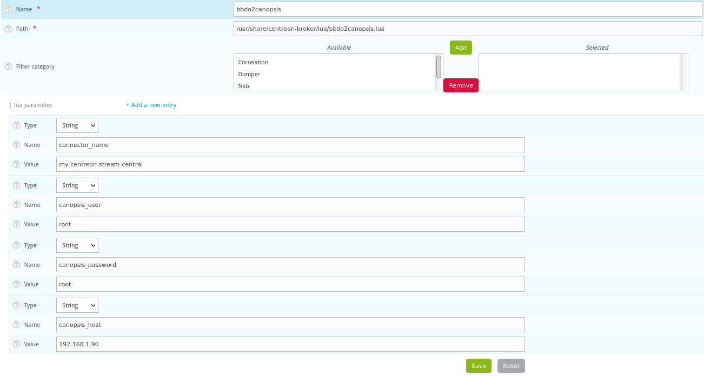

# Connecteur Centreon « Stream Connector »

## Description

Le connecteur convertit des évènements envoyés par le Broker Centreon en évènements Canopsis.

Ce connecteur est écrit en Lua et utilise les fonctionnalités du Stream Connector de Centreon.

Liens connexes :

- [README des sources du connecteur][readme]
- [Documentation du Stream Connector de Centreon][centreon-stream-connector]

## Principe de fonctionnement

Tous les évènements filtrés par le connecteur sont traduits au format JSON et envoyés à l'API Canopsis via le protocole HTTP.

Les évènements de type NEB suivants sont actuellement gérés par le connecteur et correspondent à une catégorie et à un élément du protocole BBDO de Centreon :

- Acquittement, ou *Acknowledgment* (category 1, element 1)
- Plages de maintenance, ou *Downtime* (category 1, element 5)
- Hôtes, ou *Host status* (category 1, element 14)
- Services, ou *Service status* (category 1, element 24)

Nous ajoutons des informations `extra` supplémentaires aux évènements hôtes et services :

- `action_url`
- `notes_url`
- `hostgroups`
- `servicegroups` (pour les services uniquement)

### Acquittement (ack)

Deux sortes d'actions sont envoyées à Canopsis :

1. Création d'un ack
2. Suppression d'un ack

L'acquittement est appliqué au couple `resource/component` concerné.

### Plages de maintenance (downtimes)

!!! attention
    Les downtimes récurrents ne sont actuellement pas gérés par le connecteur.

Deux sortes d'actions sont envoyées à Canopsis :

1. Création d'un downtime
2. Annulation d'un downtime

Pour chaque plage de maintenance, un identifiant unique est généré afin que l'action d'annulation puisse être fonctionnelle en retrouvant le downtime précédemment créé.

### Hôtes (hosts)

Seuls les évènements de type `HARD` lors d'un changement d'état sont envoyés à Canopsis.

La traduction des états entre Centreon et Canopsis est la suivante :

| Centreon        | Canopsis    |
|-----------------|-------------|
| UP (0)          | INFO (0)    |
| DOWN (1)        | CRITICAL (3)|
| UNREACHABLE (2) | MAJOR (2)   |

!!! information
    Cette traduction des états peut être désactivée via l'option `disable_state_mapping`.

### Services

Seuls les évènements de type `HARD` lors d'un changement d'état sont envoyés à Canopsis.

La traduction des états entre Centreon et Canopsis est la suivante :

| Centreon        | Canopsis    |
|-----------------|-------------|
| OK (0)          | INFO (0)    |
| WARNING (1)     | MINOR (1)   |
| CRITICAL (2)    | CRITICAL (3)|
| UNKNOWN (3)     | MAJOR (2)   |

!!! information
    Cette traduction des états peut être désactivée via l'option `disable_state_mapping`.

## Installation du connecteur

### Prérequis

- Lua ≥ 5.1.4
- `lua-socket` ≥ 3.0rc1-2
- `centreon-broker` versions 19.10.5, 20.04 ou 20.10

Depuis sa version 1.0.3, le connecteur est compatible avec Canopsis 4.x.

### Installation par les paquets

Ajout du dépôt Canopsis pour CentOS 7 :

```sh
echo "[canopsis]
name = canopsis
baseurl=https://repositories.canopsis.net/pulp/repos/centos7-canopsis-connectors/
gpgcheck=0
enabled=1" > /etc/yum.repos.d/canopsis.repo
```

=== "Centreon ≥ 20.10.3"

    Installation du connecteur pour Centreon 20.10, **à partir de Centreon 20.10.3** (tout ancien paquet `canopsis-connector-centreon-stream-connector` doit être supprimé au préalable) :
    
    ```sh
    yum install canopsis-connector-centreon-stream-connector-2010
    ```

=== "Centreon ≥ 20.04.12"

    Installation du connecteur pour Centreon 20.04, **à partir de Centreon 20.04.12** (tout ancien paquet `canopsis-connector-centreon-stream-connector` doit être supprimé au préalable) :
    
    ```sh
    yum install canopsis-connector-centreon-stream-connector-2004
    ```

=== "Précédentes versions de Centreon 20.04 et 20.10"

    Installation de l'ancienne version du connecteur pour Centreon 19.10.5, 20.04.2–20.04.11 et Centreon 20.10.1–20.10.2 :
    
    ```sh
    yum install canopsis-connector-centreon-stream-connector
    ```

### Installation depuis les sources

L'installation par paquets doit être privilégiée lorsqu'elle est possible.

Il est néanmoins possible d'installer ce connecteur (**pour Centreon ≥ 20.04.12 et ≥ 20.10.3 uniquement**) à partir des sources à l'aide des manipulations suivantes :

1. Récupérer les [sources du connecteur][sources] ;
2. Copier le script sur le serveur Centreon central dans `/usr/share/centreon-broker/lua/bbdo2canopsis.lua` ;
3. Modifier l'appartenance et les permissions sur le fichier ainsi :

    ```console
    # chown centreon-engine:centreon-engine /usr/share/centreon-broker/lua/bbdo2canopsis.lua
    # chmod 644 /usr/share/centreon-broker/lua/bbdo2canopsis.lua
    ```

## Activation du connecteur

1. Ajout d'une nouvelle entrée [*Generic - Stream connector*][configure-centreon-broker]. Voir les détails de la configuration dans la [section Configuration](#configuration).
2. Export de la [configuration du poller][configure-centreon-broker].
3. Redémarrage des services : `systemctl restart cbd centengine gorgoned`

## Configuration

Toute la configuration du connecteur peut se faire au travers de l'interface Centreon.

Voici les principaux paramètres :

| Variable          | Description                   | Valeur par défaut       |
|-------------------|-------------------------------|-------------------------|
| connector_name    | Nom du connecteur             | centreon-stream-central |
| canopsis_user     | Utilisateur de l'API          | root                    |
| canopsis_password | Mot de passe de l'utilisateur | root                    |
| canopsis_host     | Hôte Canopsis                 | localhost               |
| canopsis_port     | Port d'écoute de Canopsis     | 8082                    |
| canopsis_version  | Version Canopsis              | 4                       |

Paramétrage du temps de propagation et convergence des évènements :

| Variable          | Description                                                    | Valeur par défaut |
|-------------------|----------------------------------------------------------------|-------------------|
| init_spread_timer | Temps de propagation (en secondes) des évènements, quel que soit leur état, au démarrage du connecteur | 360 |

Étant donné que seuls les changements d'état sont transmis à Canopsis, au moment du démarrage du connecteur, s'il existe déjà des alarmes Centreon elles ne seront pas transmises à Canopsis, car aucun changement d'état ne sera détecté.

Pour limiter ce phénomène, nous proposons une option qui permet d'envoyer à Canopsis tous les évènements qui circulent sans qu'il y ait forcément de changement d'état, ceci pendant la durée du `init_spread_timer`.

!!! attention
    Cela implique un pic de charge lors de l'activation du connecteur pendant la durée du `init_spread_timer`.

Directives optionnelles :

| Variable                            | Description                                                                                      | Valeur par défaut | Valeurs possibles | Version minimum du connecteur |
|-------------------------------------|--------------------------------------------------------------------------------------------------|-------------------|-------------------|-------------------------------|
| disable_state_mapping               | Désactiver les mappings d'états automatiques                                                     | 0 ("faux")        | 0/1               | 1.0.5                         |
| use_instance_name_as_connector_name | Utilise le nom de l'instance du poller Centreon au lieu de la valeur `connector_name` configurée | 1 ("vrai")        | 0/1               | 1.0.5                         |
| verbose                             | Active le mode Debug                                                                             | 0 ("faux")        | 0/1               | 1.0.5                         |

### Configuration avancée

En modifiant des valeurs dans le code source en Lua, il est possible de changer
le comportement de la file d'attente :

| Variable          | Description                                   | Valeur par défaut |
|-------------------|-----------------------------------------------|-------------------|
| max_buffer_age    | Durée (en secondes) de rétention des évènements avant envoi | 60  |
| max_buffer_size   | Nombre d'évènements en attente avant envoi    | 10                |

### Exemple de configuration

Dans Centreon, rendez-vous dans Configuration > Pollers > Broker configuration > central-broker-master > Output, sélectionnez « Generic - Stream connector » puis cliquez sur Add :



## Contrôle du bon fonctionnement

Connectez-vous à l'interface de Canopsis et assurez-vous que les évènements et leurs états affichés du côté de Centreon correspondent avec les alarmes côté Canopsis.

Pour rappel, en fonctionnement nominal le connecteur n'envoie que les
changements d'état.

Aussi, la vue Bac à alarmes de Canopsis affiche les alarmes en cours (éléments
dont l'état est différent de « OK »).

[readme]: https://git.canopsis.net/canopsis-connectors/connector-centreon-stream-connector/-/blob/master/README.md
[sources]: https://git.canopsis.net/canopsis-connectors/connector-centreon-stream-connector
[configure-centreon-broker]: https://docs.centreon.com/current/en/developer/developer-stream-connector.html#configure-centreon-broker
[centreon-stream-connector]: https://docs.centreon.com/current/en/developer/developer-stream-connector.html#docsNav
