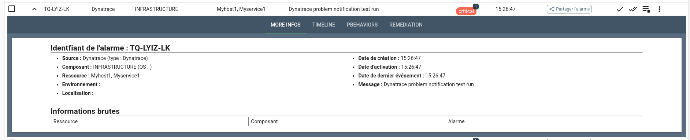

# Envoi d'événement avec Dynatrace

## Description

Convertir des webhooks Dynatrace en alarme Canopsis.

## Fonctionnement

Il n'existe pas réellement de connecteur entre Dynatrace et Canopsis. Pour créer des alarmes depuis dynatrace nous allons utiliser l'envoi de webhook vers l'api de création d'alarme.

## Configuration

### Canopsis

Pour mettre en place la création d'alarme depuis Dynatrace, il va falloir créer un utilisateur qui aura un rôle ayant la permission de se connecter à l'API.

Pour ce faire, il faut aller sur dans l'onglet `Administration > Rôles` puis créer un nouveau rôle avec les propriétés suivantes:

| Paramètre  | Valeur  |
|-------------------------|----------------------------------------------------------------------------------------|
| Nom | Connecteur API |

Puis on lui donne les bon droits sur l'API dans `Administration > Droits`

On va dans l'onglet `API` puis on cherche la permission pour `Événements`,  on la sélectionne uniquement pour le rôle `Connecteur API` et on sauvegarde.

Une fois que le rôle et la permission a été configuré, on va créer notre utilisateur. Pour ça, il faut aller dans `Administration > Utilisateurs`

| Paramètre  | Valeur  |
|-------------------------|----------------------------------------------------------------------------------------|
| Identifiant | Dynatrace |
| Email | adresse@ema.il |
| Mot de passe | `motdepassefort` |
| Rôles | Connecteur API |

On va ensuite appuyer sur l'icone de crayon à côté du nom de l'utilisateur et récupérer sa `Clé d'authentification`.

### Dynatrace

Pour envoyer les webhooks depuis Dynatrace, il faut en premier lieu les configurer. Pour ce faire, depuis votre instance Dynatrace il faut se rendre dans :

`Settings > Analyze and alert > Notifications > Problem notifications`

Puis remplir les champs comme suit:

| Option                  | Utilisation                                                                            |
|-------------------------|----------------------------------------------------------------------------------------|
| Notification type  | Le type de notification, dans notre cas nous utiliserons `Custom Integration`.              |
| Display name       | Le nom de notre connecteur, dans notre cas nous utiliserons `Canopsis`                      |
| Webhook url        | L'URL vers l'endpoint des événements, il doit avoir le format suivant: `https://url-de-canopsis/api/v4/events?authkey=[votreauthkey]`. La `authkey` doit être fournie dans l'URL. |
| Custom payload     | Le custom payload va nous permettre de donner toutes les informations dont nous avons besoin pour créer notre alarme dans Canopsis. |

Exemple de payload:
```json
{
  "event_type": "check",
  "connector": "Dynatrace",
  "connector_name": "Dynatrace",
  "component": "{ProblemImpact}",
  "resource": "{ImpactedEntity}",
  "source_type": "resource",
  "author": "Dynatrace",
  "state": 3,
  "debug": true,
  "output": "{ProblemTitle}"
}
```

## Résultat

Si tout fonctionne correctement, vous devriez voir vos alarmes dans votre Canopsis

