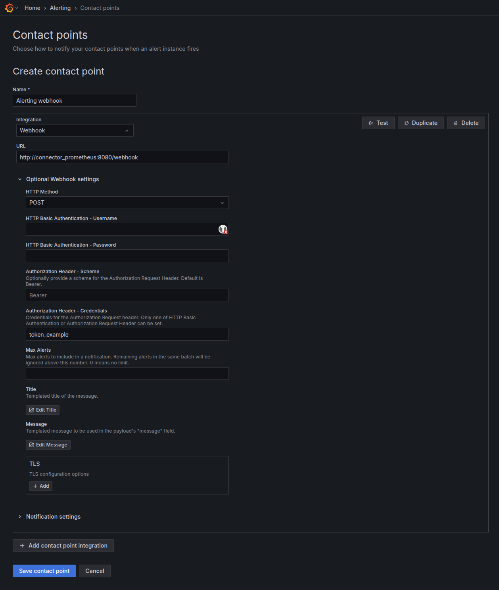
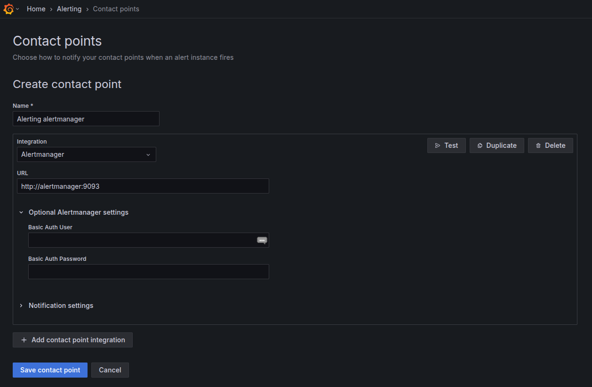
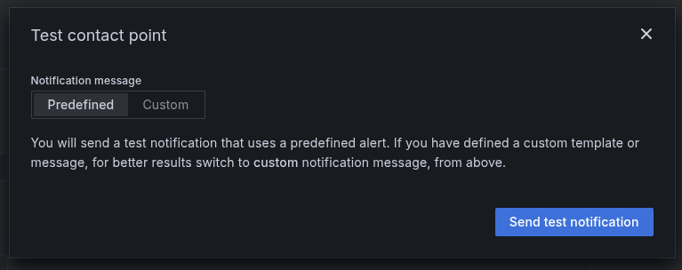
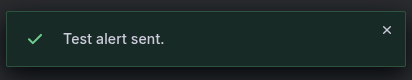
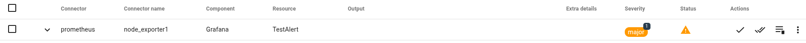

# Alerting Grafana vers Canopsis

## Fonctionnement général

Grafana permet de générer des alertes basées sur les métriques visualisées dans les tableaux de bord.

Lorsqu’une condition d’alerte est remplie, Grafana envoie une notification via un contact point configurable.

Il est possible d'utiliser un **webhook** ou un **Alertmanager Prometheus** comme canal de notification : 

- **Contact point Webhook** : Grafana envoie directement l'alerte au connecteur Prometheus de Canopsis ; 
- **Contact point Alertmanager** : Grafana envoie l'alerte à l’Alertmanager, qui la transmet ensuite au connecteur Prometheus.

Pour permettre à Canopsis de recevoir ces alertes, il est **nécessaire** de disposer du [connecteur Prometheus de Canopsis](../Supervision/Prometheus.md).

Ce connecteur est un **prérequis** : il récupère les messages d’alerte émis par l’Alertmanager (ou tout webhook compatible) et les convertit au format attendu par Canopsis, afin de les injecter dans le moteur de traitement des événements.

## Contact point Webhook

Sur votre instance Grafana, se rendre dans : 

`Alerting` &rarr; `Contact points` &rarr; `Manage contact points` puis `Create contact point`.

Ensuite, compléter les différents champs pour joindre le endpoint du connecteur Prometheus, exemple :

- **Integration** : `Webhook` afin de joindre directement le connecteur Prometheus ;
- **URL** : URL de votre connecteur Prometheus accessible par Grafana ;
- **HTTP Method** : Méthode POST par défaut ;
- **Méthode d'authentification** : Par défaut, le connecteur Prometheus utilise une authentification par `Bearer token`.

## Contact point Alertmanager

Sur votre instance Grafana, se rendre dans : 

`Alerting` &rarr; `Contact points` &rarr; `Manage contact points` puis `Create contact point`.

Ensuite, compléter les différents champs pour communiquer avec l'alertmanager, exemple :

- **Integration** : `Alertmanager` afin de joindre l'alertmanager ;
- **URL** : URL de votre Alertmanager accessible par Grafana ;
- **Méthode d'authentification** : Si besoin, à compléter avec les identifiants de votre Alertmanager.

## Test

Une fois les champs renseignés pour contacter votre `connecteur` ou `l'AlertManager`, cliquez sur `Test` &rarr; `Predefined` &rarr; `Send test notification` :

Un message de confirmation devrait apparaitre :

Cliquez ensuite sur `Save contact point`.

## Résultat

Du côté de Canopsis, vous devriez avoir une alarme du type :

