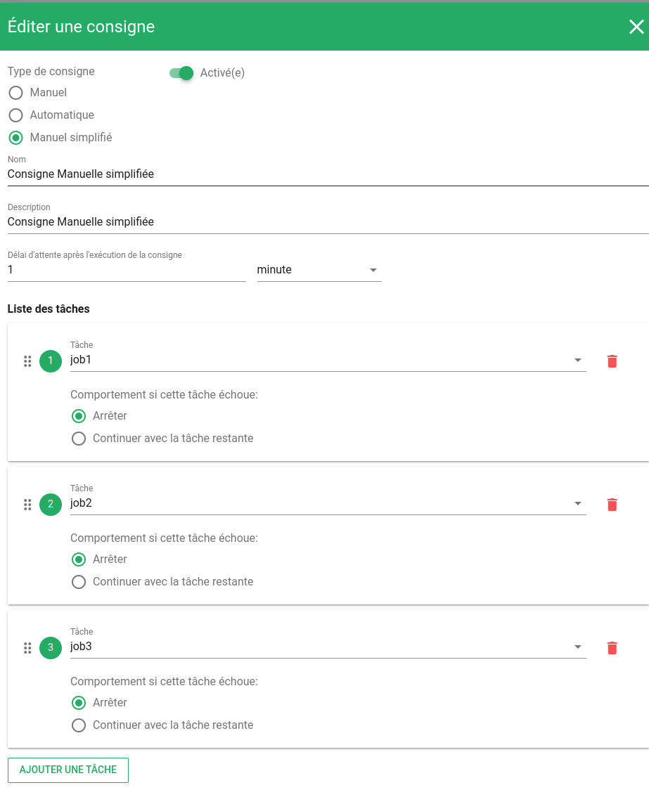
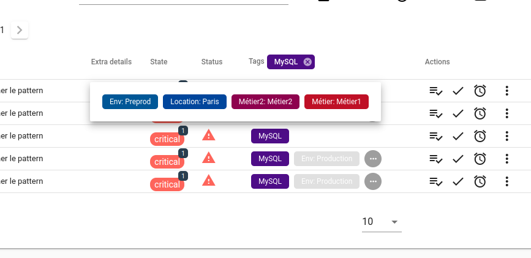

# Notes de version Canopsis 22.10.0

Canopsis 22.10.0 a été publié le 17 novembre 2022.

## Procédure d'installation

Suivre la [procédure d'installation de Canopsis](../guide-administration/installation/index.md).

## Procédure de mise à jour

Canopsis 22.10.0 apporte des changements importants tant au niveau technique que fonctionnel. À ce titre, le [Guide de migration vers Canopsis 22.10.0](migration/migration-22.10.0.md) doit obligatoirement être suivi pour les mises à jour d'installations déjà en place.

## Changements entre Canopsis 4.6.x et 22.10.0

#### API d'export de configuration Canopsis

Une route d'API permettant d'exporter toutes les configurations présentes dans Canopsis a été ajoutée.  
Elle permet de générer un fichier `yaml` au format `fixture`. Le but étant de pouvoir importer les configurations en question sur un environnement vierge.  
Voici un exemple d'utilisation

```sh
curl -X POST -u root:root -H "Content-type: application/json" -d '{
    "export": ["configuration", "acl","configuration", "pbehavior", "pbehavior_type","pbehavior_reason", 
"pbehavior_exception", "scenario", "metaalarm", "idle_rule", "eventfilter", "dynamic_infos", 
"playlist", "state_settings", "broadcast", "associative_table", "notification", "view", 
"view_tab", "widget", "widget_filter", "view_group", "instruction", "job_config", "job", 
"resolve_rule", "flapping_rule", "user_preferences", "kpi_filter", "pattern"]
}' 'http://localhost:8082/api/v4/export-configuration' > all_fixture_export.yml
```

Voici les différentes valeurs possibles :  

* `configuration` - export configuration collection
* `acl` - export default_rights collection
* `pbehavior` - export pbehavior collection
* `pbehavior_type` - export pbehavior_types collection
* `pbehavior_reason` - export pbehavior_reason collection
* `pbehavior_exception` - export pbehavior_exception collection
* `scenario` - export action_scenario collection
* `metaalarm` - export meta_alarm_rules collection
* `idle_rule` - export idle_rules collection
* `eventfilter` - export eventfilter collection
* `dynamic_infos` - export dynamic_infos collection
* `playlist` - export view_playlist collection
* `state_settings` - export state_settings collection
* `broadcast` - export broadcast_message collection
* `associative_table` - export default_associativetable collection
* `notification` - export notification collection
* `view` - export views collection
* `view_tab` - export viewtabs collection
* `widget` - export widgets collection
* `widget_filter` - export widget_filters collection
* `view_group` - export viewgroups collection
* `instruction` - export instruction collection
* `job_config` - export job_config collection
* `job` - export job collection
* `resolve_rule` - export resolve_rule collection
* `flapping_rule` - export flapping rule collection
* `user_preferences` - export userpreferences collection
* `kpi_filter` - export kpi_filter collection
* `pattern` - export pattern collection


### Filtres d'événements (Eventfiler / che)

De manière générale, retrouvez la [documentation des filtres d'événements ici](https://doc.canopsis.net/guide-utilisation/menu-exploitation/filtres-evenements/)

#### Calendrier d'exécution des règles d'eventfilter

Les règles d'eventfilter (drop, enrichissement) peuvent être exécutées selon un calendrier.  
Cas d'usage par exemple : supprimer des événements d'un périmètre donné pendant une journée spécifique.


### Suppression de la règle de recopie d'entité

Auparavant, pour enrichir une entité, il était nécessaire de définir une règle de recopie d'entité.  
L'action était la suivante : 

```json
{
	"from" : "ExternalData.entity",
	"type" : "copy",
	"to" : "Entity"
}
```

Cette règle est à présent gérée nativement par le moteur.


### Enrichissements par outils tiers

Il est désormais possible d'enrichir les événements par des outils externes de deux manières :

* via des collections MongoDB. 
Cela était déjà possible via un plugin. Le plugin a été supprimé au profit d'une implémentation native.

Par ailleurs, une fonction permet à présent d'utiliser des expressions régulières pour sélectionner les données dans les collections mongodb.

* via des API qui répondent au format JSON

Le formulaire de définition des appels API est identique à celui des webhooks.


Vous trouverez dans le formulaire d'enrichissement les éléments suivants : 

{ width="70%" }


### WebUI

Vous pouvez désormais accéder à une URL de vue qui active le plein écran directement.

```
https://canopsis/kiosk-views/6d912394-b237-41fe-a174-487374faccd4/9199926a-5be6-4a52-9f41-9d813e269271
```

### Remédiation

Un nouveau type de consigne a été ajouté : la consigne manuelle simplifiée.  
Il s'agit d'une consigne déclenchée manuellement mais qui n'est constituée que de jobs à exécuter (Aucune opération manuelle).

{ width="70%" }
{ width="50%" }
{ width="50%" }

Les statuts d'exécution des remédiations sont maintenant matérialisés par un jeu d'icônes spécifiques.

{ width="40%" }
{ width="40%" }

Il est également à présent possible de filtrer les alarmes dont une remédiation est en cours ou non.

{ width="50%" }


### Fonctionnalité TAG

une fonctionnalité "Tag" a été introduite dans Canopsis 22.10.0.  
Il s'agit de pouvoir traiter des `tags` en provenance des sources de données.  

En imaginant l'événement suivant

```sh
curl -X POST -u root:root -H "Content-type: application/json" -d '{
  "connector" : "test-connector",
  "connector_name" : "recetteventfilter",
  "event_type" : "check",
  "source_type" : "resource",
  "component" : "Composant-test-tags",
  "resource" : "Ressource-test-tags",
  "state" : 3,
  "tags" : {
	  "MySQL" : "",
	  "Location": "Paris",
	  "Env": "Preprod",
	  "Catégorie" : "Infra",
	  "Métier" : "Métier1",
	  "Métier2" : "Métier2"
  }
}' 'http://localhost:8082/api/v4/event'
```

vous aurez accès aux différents tags dans la colonne `tags` du bac à alarmes





Pour finir, le connecteur [Zabbix](../interconnexions/Supervision/Zabbix.md) est d'ores et déjà compatible avec les tags.

### Ergonomie des patterns

Vous l'attendiez avec impatience, l'auto completion des filtres est arrivée !
La mise en place d'un filtre dans Canopsis nécessitait une bonne connaissance des différents attributs disponibles pour chaque type d'objet.  
Vous deviez savoir qu'une entité est composée d'un nom, de liens avec d'autres entités, d'un composant, etc.

A présent, les formulaires de saisie de filtres vous proposent des valeurs pré-remplies.

Auto completion des attributs : 

{ width="70%" }


Auto completion des valeurs :

{ width="70%" }

Par ailleurs, il est désormais possible de sauvegarder ses filtres et de les utiliser où bon vous semble.

{ width="70%" }
{ width="70%" }
{ width="70%" }


### Widget Cartographie

Un nouveau widget fait son apparition, le widget `Cartographie` ou `Map`.  
Il offre la possibilité de créer des cartes de plusieurs types :

* Géographique

{ width="70%" }

* Flowchart

{ width="70%" }

* Diagramme au format [mermaid](https://mermaid-js.github.io/mermaid/)

{ width="70%" }

* Arbre de dépendances

{ width="70%" }

### Vues partagées

Vous avez à présent la possibilité de "partager" une vue grâce à un système de jeton.  
Pour cela, rendez-vous sur les actions d'une vue 

{ width="20%" } 

Puis complétez le nom de ce partage 

{ width="50%" } 

Il vous reste à copier l'URL et à la transmettre 

{ width="50%" }  


### Liste des modifications

*  **UI :**
    * Ajout d'un widget `Cartographie` (#4468)
    * Les droits des vues sont maintenant classés par groupes de vue (#4420)
    * Il existe désormais une URL permettant d'accéder à une vue en plein écran direct (#4395)
    * Ajout d'options de Timeout de déconnexion pour les groupes et les mécanismes d'authentification (#3996)
    * Ajout d'un compteur de connexions sur le panneau de gestion des utilisateurs (#4403)
    * Ajout de la possibilité de se logguer sur l'interface web grâce à une authkey (#4394)
    * **Bac à alarmes**
        * Les dates d'acquittement sont désormais affichées en format date et non timestamp (#4456)
        * Les actions du bac sont accessibles en fullscreen (#4507)
        * La liste des variables d'une alarme est maintenant exportable (#4410)
        * Ajout de la possibilité de désactiver la suppression du filtre par défaut (#4380,#4404)
        * Les filtres de remédiation peuvent afficher les alarmes avec une remédiation en cours (#4422)
        * Ajout d'une fonctionnalité d'affichage de tags (#4524, #4532)
        * Ajout d'un système de sélection multiple avec la touche `Ctrl` (#4378)
        * Un jeu complet d'icônes est mis en place pour présenter les statuts des remédiations (#4336)
    * **Météo des services**
        * Ajout de la variable `.Depends` accessible dans l'Output_Template des services (#4337)
    * **Remediation**
        * Les timeout et intervalle sont maintenant paramétrables au job près (#4424)
        * Ajout d'une zone de recherche dans la chronologie des alarmes des statistiques de remédiation (#4281)
        * Ajout d'un indicateur de remédiation : le pourcentage d'alarmes pouvant être remédiées (#4277)
        * Les consignes, configurations, et jobs epuvent être dupliqués (#4545)
        * Ajout d'un type de consigne : `Manuel simplifié` (#4474)
*  **API :**
    * La consultation des Comportements périodiques ne nécessite plus de droit CREATE (#4530)
    * La route `app-info` renvoie désormais la date d'installation de Canopsis (#4379)
    * Healthcheck : correction d'un bug qui donnait `redis`et `mongodb` non fonctionnels à tort (#4555, #4489)
    * Ajout d'une route `export-configuration` permettant d'exporter toutes les configurations de Canopsis au format "fixture" (#3988)
*  **Moteurs :**
    * **Correlation**
        * A présent, lorsque qu'une règle de corrélation est supprimée, les méta alarmes associées sont également supprimées (#4371)
    * **Axe**
        * Suppression des options de lancement suivantes : `-featureHideResources`, `-postProcessorsDirectory`, `-ignoreDefaultTomlConfig` (#4536)
    * **Che**
        * Suppression des options de lancement suivantes : `-dataSourceDirectory`, `enrichContext`, `enrichExclude`, `enrichInclude` (#4536)
        * Les règles `eventfilter` peuvent bénéficier d'un calendrier d'exécution (#4324)
        * Il est désormais possible d'enrichir un événement à partir d'une API JSON tierce (#79)
        * Il n'est plus nécessaire de paramétrer la règle d'enrichissement d'entité par défaut (#80)
        * Suppression du plugin datasource Mongodb au profit d'un mécanisme natif (#80)
        * Possibilité d'utiliser des expressions régulières dans l'enrichissement via mongodb (#4494)
    * **Pbehavior**
        * Suppression des options de lancement suivantes : `-publishQueue`, `-consumeQueue`, `-fifoAckExchange` (#4536)
    * **FIFO**
        * Suppression des options de lancement suivantes : `-dataSourceDirectory`, `enableMetaAlarmProcessing` (#4536)
    * **Remediation**
        * Suppression des options de lancement suivantes : `-c` (#4536)
*  **Connecteurs :**
    * **snmp2canopsis** : Le log de sortie du connecteur est désormais mono ligne (#4512)
    * **zabbix** : Le connecteur supporte à présent la transmission des tags et de leur valeur (#
*  **Général :**
    * **Canopsis-reconfigure** : Correction d'un bug qui empêchait la surcharge de certains attributs (#4537)
    * **Patterns** : Ajout d'un système d'auto completion des filtres (#4149,4194)
    * **Timescaledb** : Mise à jour de Timescaleddb (#4471)
*  **Documentation :**
    * [Section Remediation de canopsis.toml](https://doc.canopsis.net/guide-administration/administration-avancee/modification-canopsis-toml/#section-remediation)
    * [Documentation EventFilter](https://doc.canopsis.net/guide-utilisation/menu-exploitation/filtres-evenements/)
