# Notes de version Canopsis 23.04.0

Canopsis 23.04.0 a été publié le 27 avril 2023.

## Procédure d'installation

Suivre la [procédure d'installation de Canopsis](../guide-administration/installation/index.md).

## Procédure de mise à jour

Canopsis 23.04.0 apporte des changements importants tant au niveau technique que fonctionnel. À ce titre, le [Guide de migration vers Canopsis 23.04.0](migration/migration-23.04.0.md) doit obligatoirement être suivi pour les mises à jour d'installations déjà en place.

## Changements entre Canopsis 22.10 et 23.04

### Widgets de métrologie

Canopsis embarque désormais des widgets de représentation sous forme de graphes.  
Les types supportés sont :

| Type | Screenshot |
| ---- | ---------- |
| Diagramme circulaire | 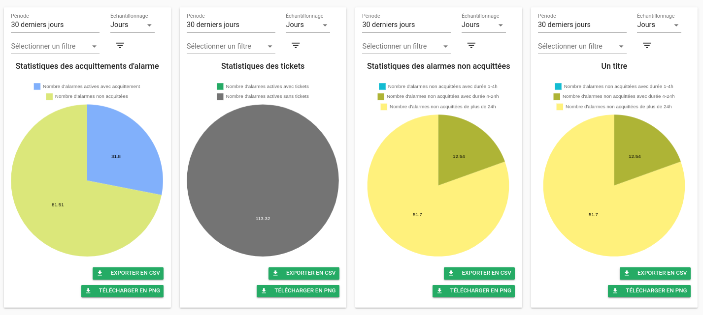 |
| Histogramme | 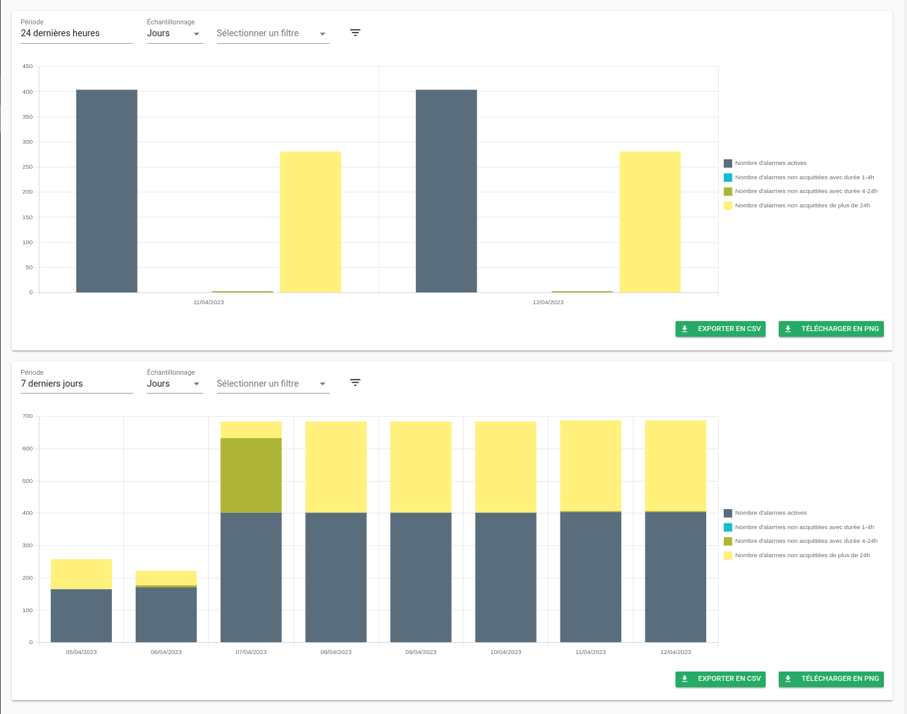 |
| En ligne | 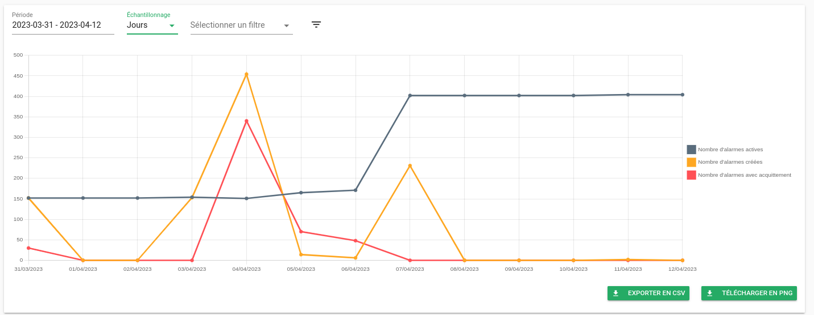 | 
| Compteur | 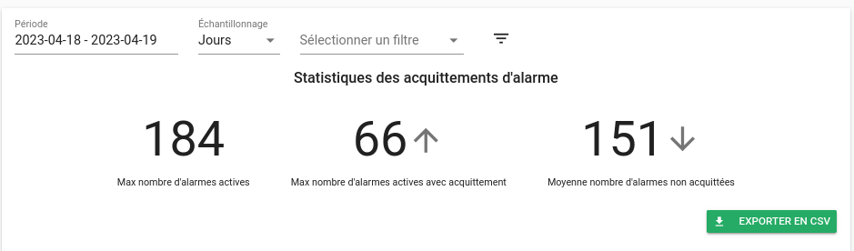 | 


### Gestionnaire de liens

Jusque Canopsis 22.10, un système de [génération de liens](../guide-administration/linkbuilder/index.md) était mis à disposition.  
Il nécessitait des compétences de développement dans le langage python.

A présent, Canopsis 23.04 permet de définir des politiques de génération de liens permettant par exemple de :

* Lier une alarme à son outil de supervision d'origine
* Rebondir vers le ticket d'incident créé sur une plate-forme tierce
* Rediriger l'utilisateur vers une procédure
* Présenter la fiche d'inventaire d'une entité

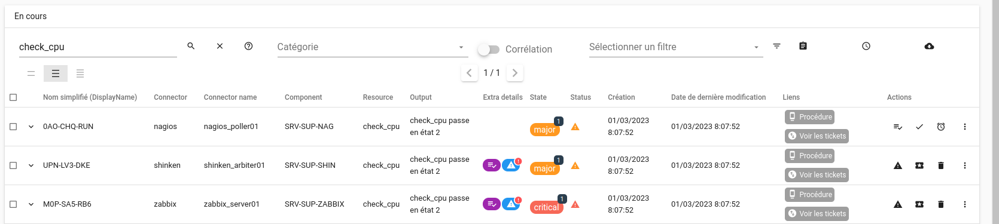

Pour découvrir le fonctionnement du module, RDV sur la [documentation associée](../guide-utilisation/menu-exploitation/generateur-liens.md).

### Modifications sur le widget Weather

Vous avez à présent la possibilité d'afficher des compteurs supplémentaires sur les tuiles de météo de services.  
Ces compteurs concernent les sévérités d'entités, les entités sous comportements périodiques, acquittées, non acquittées.

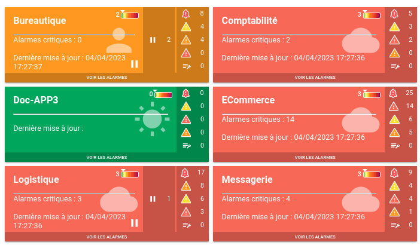

Ces compteurs peuvent également êtres utilisés dans des templates handlebars (exemple : `{{ counters.state.critical }}` pour le nombre d'entités en état critique).

Dans l'éditeur de texte, un menu vous permet de sélectionner les variables que vous soyhaitez afficher

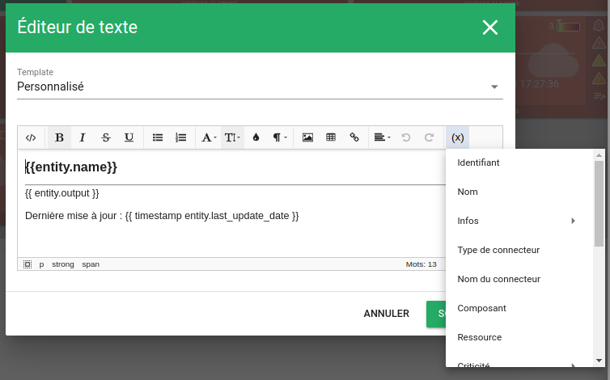

Un onglet dédié aux comportements périodiques a été ajouté sur la modale des tuiles de météo

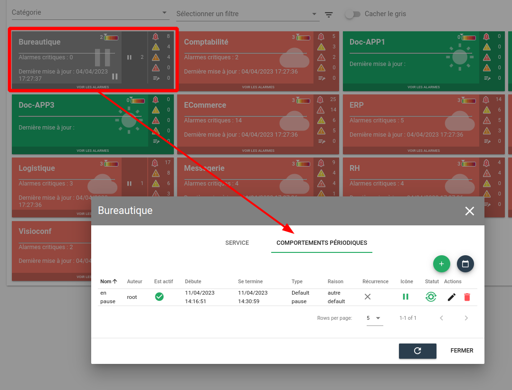


### Fonctionnalité Thèmes

Canopsis 23.04 introduit la notion de thème graphique.  
Les thèmes sont liés aux utilisateurs, qui choisissent celui qu'ils souhaitent appliquer.

Pour l'heure, 2 thèmes sont disponibles, avec pour chacun une variante sombre :

* Canopsis classique
* Canopsis destiné aux daltoniens


Dans la future version, la 23.10, vous pourrez créer vos propres thèmes.

### Fonctionnalité des templates de colonnes, moreInfos etc

Dans la plupart des widgets de l'interface graphique de Canopsis vous pouvez 

* Définir des colonnes avec des paramètres : dans un bac à alarmes, dans l'explorateur de contexte, dans les météos de services, etc
* Définir des templates servant à afficher plus d'informations concernant les alarmes (moreInfos popup)
* Définir des templates du widget de météo des services

Lorsque vous avez plusieurs widgets à configurer de manière identique, le travail peut vite devenir fastidieux.  
Nous avons ajouté à Canopsis une capacité à définir des templates de manière générale et à les appliquer sur les widgets souhaités.  
Cela vous permet de gagner un temps non négligeable en définissant des modèles (Menu `Administration->Paramètres->Modèles de widgets`)

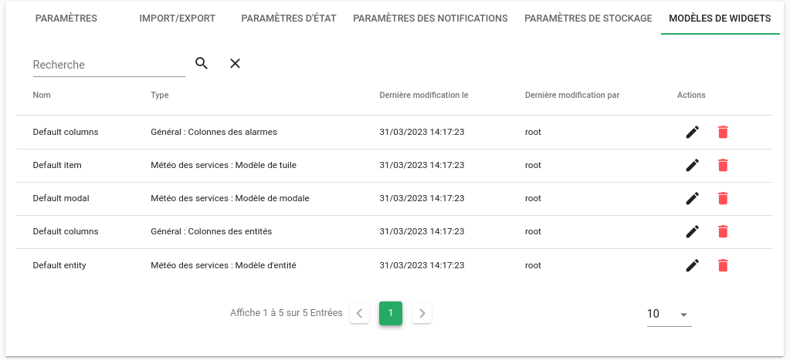

et en les appliquant à un widget

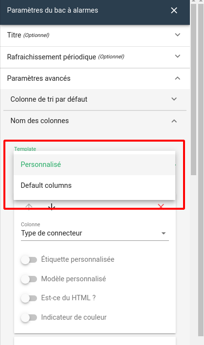


### Fonctionnalité déclaration de tickets

Un module de déclaration de tickets à été introduit dans Canopsis.  
Jusque là, lorsqu'un pilote souhaitait interagir avec un outil de ticketing, il utilisait le module [Scénario](../guide-utilisation/menu-exploitation/scenarios.md) couplé avec le déclencheur `declareticket`.  
A présent, Canopsis est doté d'un module dédié à cela. 

Ce module permet de 

* Définir des règles de déclaration de ticket sur plusieurs outils de ticketing
* Traiter les retours des API de ces outils
* Déclarer un ticket par alarme sélectionnée
* Déclarer un seul et même ticket à partir de plusieurs alarmes
* De visualiser pour une alarme l'historique des tickets déclarés

Pour plus d'informations, veuillez vous référer à la [documentation](../guide-utilisation/menu-exploitation/regles-declaration-tickets.md).


### Attributs `impact`et `depends` des entités

Les attributs `impact` et `depends` des entités ont été supprimés afin d'améliorer les performances (calcul de dépendances + comportements périodiques + espace occupés par des requêtes à la base de données).  
L'impact coté utilisateur se limite 

* aux filtres d'ancienne générations qui utiliseraient ces attributs (il n'était déjà plus possible de les utiliser dans les nouveaux patterns)
* aux scripts externes que vous utilisez peut-être.

Pour information, voici le comparatif entre les anciennes structures et les nouvelles structures

??? note "Comparatif"

    === "Ressource"

        Avant : 
        ```json
        {
          "_id": "cps_resource/cps_component",
          "depends": ["cps_connector/cps_connector_name"],
          "impact": ["cps_component", "cps_service_1", "cps_service_2"]
        }
        ```
        
        Après : 
        ```json
        {
          "_id": "cps_resource/cps_component",
          "connector": "cps_connector/cps_connector_name",
          "component": "cps_component",
          "services": ["cps_service_1", "cps_service_2"]
        }
        ```

    === "Composant"

        Avant : 
        ```json
        {
          "_id": "cps_component",
          "depends": ["cps_resource_1/cps_component", ..., "cps_resource_100000/cps_component"],
          "impact": ["cps_connector/cps_connector_name"]
        }
        ```
        
        Après : 
        ```json
        {
          "_id": "cps_component",
          "connector": "cps_connector/cps_connector_name"
        }
        ```

    === "Connecteur"

        Avant : 
        ```json
        {
          "_id": "cps_connector/cps_connector_name",
          "depends": ["cps_component"],
          "impact": ["cps_resource_1/cps_component", ... ,"cps_resource_100000/cps_component"]
        }
        ```
        
        Après : 
        ```json
        {
          "_id": "cps_connector/cps_connector_name"
        }
        ```

    === "Service"

        Avant : 
        ```json
        {
          "_id": "cps_service_1",
          "depends": ["cps_resource_1/cps_component", ... ,"cps_resource_100000/cps_component"]
          "impact": []
        }
        ```
        
        Après : 
        ```json
        {
          "_id": "cps_service_1"
        }
        ```

### Les types et raisons de comportements périodiques peuvent être cachés

Lorsque vous utilisez des types ou des raisons personnalisés de comportements périodiques, vous pouvez "cacher" les types et raisons par défaut.  
Cela permet aux utilisateurs de ne voir que les types et raisons qui vous intéressent.

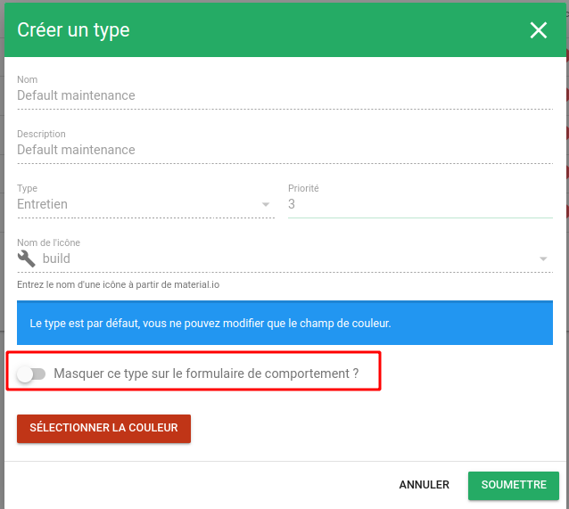


### Remédiation

Aujourd'hui, lorsqu'une alarme est créée, elle est activée dès lors qu'il n'y a plus de snooze ou de comportement périodique attachés à celle-ci.  
Le fait que l'alarme bénéficie d'une remédiation automatique n'influe par sur ce processus.  

Une [nouvelle option](../guide-administration/administration-avancee/modification-canopsis-toml.md) fait donc son apparition `ActivateAlarmAfterAutoRemediation`.  
Elle permet de décaler l'activation de l'alarme une fois la remédiation automatiquer terminée.

??? note "Schémas de fonctionnement"

    **"Option ActivateAlarmAfterAutoRemediation désactivée"**
    
    ```mermaid
    flowchart TD
        A[Création d'une alarme] --> B[snooze]
        A --> C[Début de comportement périodique]
        D --> G[unsnooze]
        D --> H[Fin de comportement périodique]
        A --> I[Remédiation automatique au moment de la création]
        B --> D[Ne pas activer l'alarme]
        C --> D
        G --> F{L'alarme est-elle snoozée ??\nOU\nen comportement périodique?\n}
        F -->|Oui| D
        F -->|Non| E[Activer l'alarme]
        H --> F
        I --> E
    ```

    **"Option ActivateAlarmAfterAutoRemediation activée"**
    
    ```mermaid
    flowchart TD
        A[Création d'une alarme] --> B[snooze]
        A --> C[Début de comportement périodique]
        D --> G[unsnooze]
        D --> H[Fin de comportement périodique]
        D --> J[Remédiation automatique au moment\nde la création terminée]
        A --> I[Remédiation automatique au moment de la créatio]
        B --> D[Ne pas activer l'alarme]
        C --> D
        G --> F{L'alarme est-elle snoozée ?\nOU\nen comportement périodique ?\nOU\nRemediation automatique au moment\nde la création en cours}
        F -->|Oui| D
        F -->|Non| E[Activer l'alarme]
        H --> F
        I --> D
        J --> F
    ```

Par ailleurs, les remédiations automatiques peuvent à présent être déclenchées sur

* Création d'une alarme
* Activation d'une alarme
* Augmentation/Diminution de la sévérité d'une alarme
* Changement et verrouillage de sévérité
* Entrée ou sortie de comportement périodique

### Homogénéisation des priorités de règles

Dans la plupart des règles d'exploitation de Canopsis, un système de priorité d'évaluation des règles existe. Ce système permet d'appliquer les règles dans l'ordre souhaité.  
Malheureusement, ce système n'était pas homogène pour l'ensemble des modules.  
A présent, il l'est, et voici les informations à savoir à ce sujet :

1. La priorité est optionnelle et peut être vide

2. Les utilisateurs peuvent utiliser les valeurs qu'ils souhaitent pour une priorité : 5, 25, 555, etc.

3. Si la valeur souhaitée est déjà utilisée par une autre règle, alors c'est la priorité de cette autre règle qui sera décalée de 1.

4. Lorsque 2 règles matchent le même cas (ex: peuvent être appliquées sur les mêmes alarmes, entités, événements, etc), les conditions suivantes s'appliquent :
    * S'il n'existe pas de priorité, les règles sont exécutées dans un ordre aléatoire.
    * Si une priorité est définie sur une règle et non définies sur une autre règle, la règle avec priorité définie est exécutée en premier.


### Améliorations des imports

Afin d'enrichir les entités gérées par Canopsis, vous pouvez utiliser des [règles d'enrichissement](../../guide-utilisation/menu-exploitation/filtres-evenements/) importer des informations de référentiel par anticipation.  
C'est la commande [import-context-graph](../../../interconnexions/drivers/driver-api/) qui vous permet cela.  

A présent, le mécanisme d'import permet d'importer : 

* Des ressources
* Des composants
* Des services

Par ailleurs, [différentes actions](../../../interconnexions/drivers/driver-api/#les-differentes-actions) ont été mises à disposition pour faciliter la transformation de données.  

Enfin, [un exemple complet](../../../interconnexions/drivers/cas-d-usage-complet/) est documenté.

### Connecteur Prometheus

Le connecteur de données `Prometheus`, plus précisément `alertmanager`, a été ré écrit en langage GO.  
La précédente version souffrait d'un bug de non reconnexion au service après un arrêt inopiné.

La documentation est disponible sur la page des [interconnexions](../../..//interconnexions/Supervision/Prometheus/).

### Montées de version 

Les outils suivants bénéficient de mises à jour :

| Outil       | Version d'origine | Version après 23.04 |
| ----------- | ----------------- | ------------------- |
| MongoDB     | 4.4               | 5.0                 |
| RabbitMQ    | 3.7               | 3.11                |
| Redis       | 5.x               | 6.2                 |
| Timescaledb | 2.7.2             | 2.9.3               |

Les instructions pour leur mise à jour sont précisées dans le [guide de migration](migration/migration-23.04.0.md).

### Liste des modifications

*  **UI :**
    * Le helper handlebars `request` support désormais la méthode POST (#4732)
    * Les paramètres des colonnes de bac à alarmes des widgets Météo et Compteurs sont maintenant alignés vers le bac à alarmes (#4783)
    * Correction d'un bug de droit qui empêchait l'utilisation de partage de token (#4875)
    * Ajout de la possibilité de dupliquer un rôle (#4910)
    * Ajout de nouvelles options pour le mode kiosk des vues de bac à alarmes : Masquer les actions, la sélection de masse, la barre des tâches (#4735)
    * **Bac à alarmes**
        * Ajout de l'action de masse `Commentaire` (#4793)
        * Ajout de l'action `Fast cancel` ou `Annulation rapide` (#4792)
        * En utilisant le mode `sticky header`, les entêtes de colonnes ainsi que les actions de masse restent affichées (#4828)
        * Correction d'un bug de droits qui permettait à un utilisateur non autorisé de modifier des filtres (#4865)
        * Les paramètres des `colonnes pour le suivi de cause racine` sont à nouveau fonctionnels (#4848)
    * **Explorateur de contexte**
        * Ajout du support des colonnes `import_source` et `imported` (#4806)
        * Ajout du support de la colonne `Date du dernier comportement périodique` (#349)
    * **Comportements périodiques**
        * Ajout d'un sélecteur rapide de dates, notamment pour sélectionner les années (#4539)
        * Les couleurs des comportements périodiques peuvent à présent être définies au type et au pbh près (#4543)
    * **Remediation**
        * Les sorties de jobs sont affichées correctement (#4594)
        * Le timeout après exécution d'une remédiation est présenté dans le tableau de chronologie des alarmes (#4746)
        * Correction d'un bug qui entrainait un non rafraichissement des icônes de remédiation lorsque la timeline était ouverte (#4821)
    * **Scenatio/Webhook**
        * Ajout de la variable `{{ .AdditionalData.RuleName }}`, accessible dans un payload (#4513)
*  **API :**
    * La consultation des Comportements périodiques ne nécessite plus de droit CREATE (#4530)
*  **Moteurs :**
    * **Remédiation**
        * Prise en compte du statut `FAILURE` pour l'odonnanceur `Jenkins` (#4683)
    * **Axe:**
        * Les événements de type `done` ne sont plus traités par Canopsis (#4631)
    * **Correlation:**
        * Correction d'un bug qui entrainait une panique du moteur lorsque l'ensemble des alarmes conséquences d'une méta étaient dissociées (#4884)
    * **CHE:**
        * Correction d'un bug qui empêchait de modifier la sévérité d'une alarme (#4915)
*  **Connecteurs :**
    * **zabbix** : Le connecteur supporte à présent la transmission des tags et de leur valeur
    * **prometheus** : Le connecteur prometheus a été ré écrit en langage GO (#4040)
*  **Templates GO :**
    * Ajout des fonctions `tag_has_key` et `get_tag` (#4716)
    * Ajout de la possibilité d'utiliser des variables d'environnement dans des templates GO (#4514)
*  **Général :**
    * **Timescaledb** : Mise à jour de Timescaledb 
*  **Documentation :**
    * [Templates GO](https://doc.canopsis.net/guide-utilisation/templates-go/)
    * [Métriques techniques](https://doc.canopsis.net/guide-de-depannage/metriques-techniques/)
