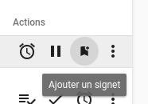

# Notes de version Canopsis 23.10.0

Canopsis 23.10.0 a été publié le 31 octobre 2023.

## Procédure d'installation

Suivre la [procédure d'installation de Canopsis](../guide-administration/installation/index.md).

## Procédure de mise à jour

Canopsis 23.10.0 apporte des changements importants tant au niveau technique que fonctionnel.  
À ce titre, le [Guide de migration vers Canopsis 23.10.0](migration/migration-23.10.0.md) doit obligatoirement être suivi pour les installations déjà en place.

## Changements entre Canopsis 23.04 et 23.10

### Environnement SNMP

Le moteur SNMP a été migré de Python 2 vers Python 3. 
Certains changements de configurations sont nécessaires pour que l'ensemble de la pile SNMP reste fonctionnel.  
Le [guide de migration](migration/migration-23.10.0.md) vous indique les changements à effectuer.

Voici les différents liens de documentations associées :

* [Règles SNMP](../guide-utilisation/menu-exploitation/regles-snmp.md)
* [Connecteur snmp2canopsis](../interconnexions/Supervision/SNMPtrap.md)

### Tags

La version [23.04](./23.04.0.md) a introduit une première version de gestion des tags à partir des événements.  
Canopsis 23.10 introduit une gestion interne des tags.  
La [documentation associée](../guide-utilisation/menu-administration/gestion-des-tags.md) fournit toutes les explications nécessaires à leur mise en oeuvre.


### Vues privées

Un système de `vues privées` a été ajouté à Canopsis.  
Il permet aux utilisateurs ayant le droit requis de créer leurs propres vues qui ne seront visibles et accessibles que par eux.  
 


### Bookmarks / Signets

Il existe à présent une fonctionnalité permettant de bookmarker une alarme.  
Elle se matérialise par une action du bac à alarmes.




### Fonctionnalité Thèmes

Canopsis 23.04 introduit la notion de thème graphique.  
Les thèmes sont liés aux utilisateurs, qui choisissent celui qu'ils souhaitent appliquer.


La version Canopsis 23.10 permet à présent de créer ses propres thèmes.  
Elle propose à l'utilisateur d'agir sur les paramètres qui concernent : 

* Principaux éléments du produit


* Paramètres de taille de police


* Paramètres du bac à alarmes


* Couleurs de criticités


Consultez [la documentation](../guide-utilisation/interface/themes/index.md) pour plus d'informations.

### Mode Maintenance

Lorsque vous opérez une mise à jour de Canopsis ou une maintenance sur des composants de Canopsis, vous disposez à présent d'un "mode maintenance".  
Celui-ci permet de déconnecter tous les utilisateurs présents sur la plate-forme pour garantir qu'il n'y ait pas de perturbation pendant l'intervention.  


La [documentation](../guide-utilisation/menu-administration/mode-maintenance.md) vous donne tous les détails.

### Rafraîchissement des alarmes

Une nouvelle option du bac à alarmes permet de rafraîchir les alarmes qui sont actuellement présentées sur un bac sans intervention.  
Seules les alarmes qui sont affichées sur le bac sont raffraîchies

!!! warning "Information importante"
    Si la mise à jour d'une alarme l'exclut du filtre en cours, l'alarme sera tout de même mise à jour mais ne disparaitra du filtre qu'après le rafraîchissement périodique paramétré ou manuel.

### Largeur et position des colonnes

Jusque Canopsis 23.04, la largeur des colonnes était gérée de manière automatique par le widget `Bac à alarmes`.  
La version 23.10 permet à l'utilisateur de gérer lui-même ce paramètre.  
Dans les paramètres avancés du widget, vous trouvez les `Paramètres des colonnes` :

* Glisser/Déposer les colonnes : l'ordre des colonnes est paramétrable en drag'n drop par l'utilisateur
* Redimensionner les colonnes : la largeur des colonnes est paramétrable en drag'n drop par l'utilisateur


### Plusieurs rôles pour un même utilisateur

Le système d'affectation des droits évolue et permet à présent d'affecter plusieurs rôles à un utilisateur.  
Les droits sont alors fusionnés.


### Enrichissement : gestion des erreurs

Lorsque le moteur d'enrichissement n'arrive pas à appliquer une règle, l'interface graphique de gestion de ces règles peut vous présenter les erreurs.


Les différents types d'erreurs suivants sont gérées :

* Pattern invalide
* Template invalide
* MongoDB
* API externe
* Autre

### Binaire **ready**

Le binaire `ready` (qui permet de vérifier que les backends de Canopsis sont prêts) vérifie maintenant que l'initialisation de Canopsis est terminée.

Ceci correspond à la fin du travail de la commande reconfigure pour la version de Canopsis en cours. 
Ce programme ready pourra servir notamment pour des systèmes d'orchestration de conteneurs (Kubernetes et assimilés).  
Avec cette technique, il sera possible de lancer les moteurs Canopsis seulement lorsque les conditions sont réunies, diminuant ou supprimant les phénomènes de crashs au démarrage.

### Smart feeder

Un générateur d'événements "intelligent" a été développé. 
Il permet de simuler le trafic d'un environnement de production, de manière réaliste.

Retrouvez la [documentation associée ici](../guide-administration/smart-feeder/index.md)

### Réception de métriques

Canopsis 23.10 est capable de recevoir des métriques dans ls événements.  
La documentation n'est pas encore prête. Elle le sera d'ici peu. 
En attendant, les métriques peuvent être transmises de la manière suivante :

```
"perf_data" : "cpu=20%;80;90;0;100"
```

Le format retenu est celui de [Nagios :trademark:](https://nagios-plugins.org/doc/guidelines.html#AEN200)

### Suppression de la fonctionnalité "Tour"

La fonctionnalité `Tour`, qui permettait d'afficher une aide lors de votre première connexion a été supprimée.

### Montées de version 

Les outils suivants bénéficient de mises à jour :

| Outil       | Version d'origine | Version après 23.10 |
| ----------- | ----------------- | ------------------- |
| NodeJS      | 16                | 20                  |

Les instructions pour leur mise à jour sont précisées dans le [guide de migration](migration/migration-23.10.0.md).

### Liste des modifications

*  **UI :**
    * Amélioration de la fonction de vérification des patterns (#4641)
    * Correction d'un bug qui empêchait de positionner une image sur la mire de connexion (#4948)
    * Désactivation de la possibilité de changer le type d'une consigne (#5048) 
    * La "forme" de l'auteur d'une action dans l'interface graphique peut utiliser un _template_ (#4800)
    * Le [helper handlebars `copy`](../guide-utilisation/interface/helpers/index.md#helper-copy) supporte certains caractères spéciaux (#5049)
    * Ajout d'un [helper handlebars `json`](../guide-utilisation/interface/helpers/index.md#helper-json) permettant de renvoyer des chaines au format json (#5049)
    * Le [helper handlebars `timestamp`](../guide-utilisation/interface/helpers/index.md#helper-timestamp) supporte les formats `moment` (#4765)
    * Les [variables d'environnement](../guide-administration/administration-avancee/modification-canopsis-toml.md#section-canopsistemplatevars) peuvent être utilisées sur la page de connexion (#4944)
    * Ajout d'un `mode maintenance` permettant de déconnecter les utilisateurs durant une intervention technique (#4114)
    * Un utilisateur peut hériter de plusieurs rôles dont les droits seront fusionnés (#4701)
    * Ajout d'un système de `vues privées` permettant aux utilisateurs ayant le droit de créer et gérer des vues qui leur sont propres (#4734)
    * **Bac à alarmes**
        * La sélection des colonnes se fait à présent de manière plus ergonomique et autorise le drag'n drop (#4872)
        * Correction d'un bug qui empêchait la déclaration de tickets en masse (#5069)
        * Lorsqu'un lien est présent dans les colonnes `output`, `longOutput`, `initialOutput`, ou `initialLongOutput`, il est directement interprété comme tel (#5036)
        * Ajout de la possibilité d'annuler l'annulation d'une alarme (#4971)
        * Ajout d'une option permettant de rafraîchir les alarmes présentes dans le bac sans intervention (#4473)
        * Ajout de la possibilité d'exporter une alarme au format PDF (#4899)
        * La recherche naturelle peut à présent porter sur des informations d'entités (#4881)
        * Le helper handlebars `tags` permet de filtrer les alarmes portant le tag (#5023)
        * En plus du nombre de conséquences, une méta alarme porte à présent les compteurs d'alarmes conséquences ouvertes et fermées (#4885)
        * Meilleure présentation des liens lorsque le nombre maximum de liens est spécifié (#4991)
        * Correction d'un bug qui empêchait l'export CSV dans certaines conditions (#4520)
        * Dans l'export CSV, il est désormais possible de définir un modèle d'export des informations dynamiques d'une alarme (#5136)
        * Ajout d'une option permettant d'exécuter des actions sur des alarmes en criticité "OK" (#4749)
        * La largeur des colonnes est maintenant paramétrable (#4694)
        * Un historique des recherches est à présent disponible. Les motifs de recherche peuvent également être épinglés (#4850)
        * Lors d'une déclaration de ticket, si une seule règle est appliquable, elle est automatiquement sélectionnée (#5075)
        * Le badge de déclaration de tickets associé à une alarme présente le dernier statut uniquement (#5106)
        * Le commentaire associé à une dissociation de méta alarme n'est plus obligatoire (#4924)
        * Dans la liste des variables, les boutons d'export ont été revus (#5045)
        * Ajout de la possibilité de bookmarker les alarmes (#4736)
        * Lorsqu'une remédiation en cours en minimisée, la fenêtre réduite est visible sans scroll (#5135)
    * **Météo des services**
        * Il est à présent possible de personnaliser le comportement des tuiles lorsqu'une action est requise (#4674)
    * **Règles SNMP**
        * Le formulaire de création de règles permet à présent d'effectuer des recherches dans la liste des OID (#5096)
    * **Règles de génération de liens**
        * Une nouvelle option permet de "masquer" les liens du menu action dans un bac à alarmes (#4962)
        * Nouvelles variables utilisables dans une URL : `.User.Email`, `.User.Username`, `.User.Firstname`, `.User.Lastname`, `.User.ExternalID`, `.User.Source`, `.User.Role` (#4797)
    * **Règles de déclaration de tickets**
        * Les [variables d'environnement](../guide-administration/administration-avancee/modification-canopsis-toml.md#section-canopsistemplatevars) sont utilisables dans les URL (#5066)
        * Il est à présent possible de forger l'URL du ticket en utilisant des variables fournies dans le retour d'API (#4984)
        * Le formulaire de déclaration de tickets montre à présent l'existence de ticket sur les alarmes (#5079)
    * **Explorateur de contexte**
        * Le filtre "Observateur" a été renommé en "Service" (#3890)
    * **Comportements périodiques**
        * Le formulaire de saisie des règles de récurrence a été revu (#4538)
        * Il est désormais possible d'ajouter des dates d'exception en utilisant des fichiers au format [`ics`](https://fr.wikipedia.org/wiki/ICalendar)(#4709)
    * **Editeur de pattern**
        * Amélioration de la présentation des `tags` lorsque leur nombre est important (#5081)
        * Dans les patterns de scénarios, mise à disposition des variables suivantes : `v.last_comment.initiator`, `v.ticket.initiator`, et `v.canceled.initiator` (#5085)
    * **Filtres d'événements**
        * Les erreurs d'enrichissement sont présentées dans les gestionnaire de règles (#4565)
*  **API :**
    * Seconde partie de correction d'un bug qui entrainait un calcul de durée d'alarme négatif (#5001)
    * Ajout d'un trigger capable de se déclencher après la réception de x événements sur une alarme (#5024)
    * Les variables d'environnement peuvent maintenant être exploitées dans Canopsis (#4946)
    * Correction d'un bug qui empechait l'export de statistiques de remédiation en cas d'absence de métrique (#5072)
    * Correction d'un bu qui présentait ce message de log "expect string for key=\"engine-run-info$$engine-correlation$$3140090f-309a-4605-b533-64d0b0a0ad89\" but got type=<nil>" (#4985)
*  **Moteurs :**
    * **AXE**
        * Seconde partie de correction d'un bug qui entrainait un calcul de durée d'alarme négatif (#5001)
        * Correction d'un bug de calcul de compteurs de services lorsque le débit d'événements est très élevé (#5050)
    * **Remediation**
        * Correction d'un bug qui générait une erreur 500 avec le message "runtime error: invalid memory address or nil pointer dereference" (#5046)
        * Correction d'un bug qui générait une erreur 500 avec le message "(Location4568) Total size of documents in job_history matching pipeline's $lookup stage exceeds 104857600 bytes" (#5057)
        * Les remédiations désactivées sont à présent réellement désactivées (#5065)
*  **Général :**
    * Le service `migrate-metrics-meta` ne fait plus partie des configurations de référence de Canopsis (#5067)
    * L'option `LastEventDate` (canopsis.toml) n'existe plus. La mise à jour de cette date est calculée naturellement, y compris sur les méta alarmes (#5027)
    * Ajout d'un générateur d'événement `smart-feeder` capable de simuler le comportement d'un environnement de production (#4876)
*  **Documentation :**
    * [Règles SNMP](../guide-utilisation/menu-exploitation/regles-snmp.md)
    * [Connecteur snmp2canopsis](../interconnexions/Supervision/SNMPtrap.md)
    * [Gestion des tags](../guide-utilisation/menu-administration/gestion-des-tags.md)
    * [Mode maintenance](../guide-utilisation/menu-administration/mode-maintenance.md) 
    * [Interconnexion Elastic vers Canopsis](../interconnexions/Base-de-donnees/Elasticsearch.md)
    * [Smart-feeder](../guide-administration/smart-feeder/index.md)
    * [Schémas d'interactions entre les composants de Canopsis](../guide-developpement/schemas/all-engines.md)
    * [Thèmes graphiques](../guide-utilisation/interface/themes/index.md)
