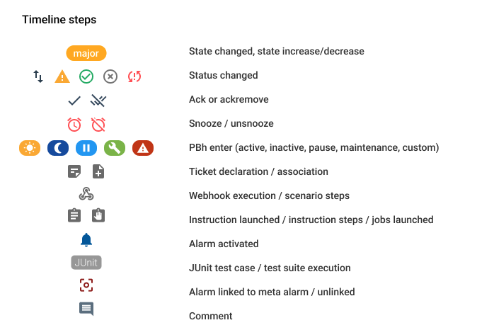

# Notes de version Canopsis 24.04.0

Canopsis 24.04.0 a été publié le 30 avril 2024.

## Procédure d'installation

Suivre la [procédure d'installation de Canopsis](../guide-administration/installation/index.md).

## Procédure de mise à jour

Canopsis 24.04.0 apporte des changements importants tant au niveau technique que fonctionnel.  
À ce titre, le [Guide de migration vers Canopsis 24.04.0](migration/migration-24.04.0.md) doit obligatoirement être suivi pour les installations déjà en place.

## Changements entre Canopsis 23.10 et 24.04

### Refonte de "Timeline" des alarmes

La chronologie ou timeline des alarmes a été revue. 

Les icônes représentatives des actions sont données sur le diagramme suivant : 

Les status sont représentés par :

Les steps sont quant à eux représentés par :

Par ailleurs, certains steps de la timeline pourront bénéficier d'un regroupement

### Méthodes de calculs des sévérités

La version originale de calcul de sévévité (d’état) de météo des services se base sur un algorithme pire état.  
Canopsis 24.04 inclut de nouveaux algorithmes de calculs qui s'appuient sur les dépendances d'un service.  

Vous pouvez par exemple exprimer le fait que le service sera en état :

* Critique si plus de 50% de ses dépendances sont en état critique ou
* Majeur si 3 de ses dépendances sont en état mineur ou
* Mineur si 20% des entités sont en état majeur ou
* OK si au moins 1 dépendance est en état OK

Pour cela, des conditions peuvent être définies pour chaque état final du service, comme dans l'illustration ci-dessous :

### Diagramme de cause racine

Grâce aux nouvelles règles de calcul d'état, Canopsis peut à présent représenter des diagrammes de cause racine qui permettent de comprendre d'un coup d'oeil l'origine d'une alerte.

Un [cas d'usage](../../guide-utilisation/services/cas-d-usage-complet/) complet est documenté.

### Widget de disponibilité

Canopsis 24.04 propose un nouveau widget capable de présenter des informations liées à la disponibilité des entités.  
Ces informations peuvent être la durée ou le pourcentage de disponibilité et d'indisponibilité assorties de fonctions de recherche, de filtrage.

Toutes les informations sont disponibles dans [la documentation](../../guide-utilisation/interface/widgets/disponibilite/)

### Recherche avancée dans le bac à alarmes

La recherche avancée du bac à alarme est maintenant dotée d'une aide en ligne qui propose des complétions automatiques concernant les mots clés du langage.  

### Icônes

Dans Canopsis, le jeu d'icône [material Design](https://fonts.google.com/icons) est mis à disposition.
Vous avez à présent la possibilité d'ajouter vos propres icônes au format svg.

Vous pourrez ensuite en bénéficier dans les modules compatibles

* Générateur de liens
* Comportements périodiques
* Modèles (Fenêtre plus d'infos, colonnes, etc)

Pour plus d'informations, RDV sur la [documentation](../../guide-utilisation/menu-administration/parametres/#icones)

### Authentification Oauth2/OpenID

Canopsis peut désormais authentifier ses utilisateurs par li'intermédiaire du protocole oauth2/openid.  
Vous trouverez dans la [documentation](../../guide-administration/administration-avancee/methodes-authentification-avancees/) des exemples d'utilisation des providers Github ou Gitlab.

### Tests des Scénarios

A l'instar des règles de déclaration de tickets, les scénarios qui embarquent des webhook peuvent à présent être testés depuis l'éditeur de scénario.  

### Montées de version 

Les outils suivants bénéficient de mises à jour :

| Outil       | Version d'origine | Version après 24.04 |
| ----------- | ----------------- | ------------------- |
| MongoDB     | 5                 | 7                   |
| TimescaleDB | 2.9.3             | 2.14.2              |
| RabbitMQ    | 3.11.11           | 3.12.13             |
| Vuetify     | 1                 | 2                   |

Les instructions pour leur mise à jour sont précisées dans le [guide de migration](migration/migration-24.04.0.md).

### Liste des modifications

*  **Général :**
    * Les appels au shell de mongoDB via la commande `mongo` ont été remplacés par des appels via la commande `mongosh` (#5267)
    * Ajout des fonctions suivantes dans les templates GO : `substrLeft`, `substrRight`, `substr`, `strlen`, `strpos`, `add`, `sub`, `mult`, `div` (#5286)
    * Les tags sont à présents éligibles à la politique de paramètres de stockage (#5359)
    * L'ancien format des patterns n'est plus supporté dans Canopsis (#4728)
    * La fonction de hashage des mots de passe `SHA-1` a été remplacée par `Bcrypt` (#5207) 
    * Optimisation de la fonctionnalité "Métriques techniques" (#5247)
*  **UI :**
    * Refonte de la chronologie/timeline des alarmes (#5300, #5074, #5305)
    * Amélioration de la fonction de vérification des patterns (#4641)
    * Correction d'un bug qui entrainait des changements de position de widgets sur une vue (#5421)
    * Ajout de la possibilité de commenter des entités depuis les météos de services et l'explorateur de contexte (#5087)
    * **Bac à alarmes**
        * Lorsque l'on souhaite ajouter une alarme dans une méta alarme manuellement, l'option "Résolution automatique" n'est plus visible (#5345)
        * La recherche avancée bénéficie à présent d'une aide et de complétions automatiques (#5147)
        * Correction de la période de temps utilisée par défaut dans une vue d'historique (#5364)
    * **Météo des services**
        * Possibilité de cacher l'icône secondaire sur les tuiles de météo (#5297)
        * Les liens des alarmes sont à présents disponibles sur les météos des services (#5339)
        * Les variables liées au dernier commentaire sont disponibles dans les templates (#5341)
        * Des modèles de météo de services peuvent être créés et partagés (#5182)
        * Les tags sont à présent accessibles depuis un template de météo des services (#5352)
    * **Consignes**
        * Ajout de le colonne "Priorité" dans la liste des consignes (#5288)
        * Lorsqu'une consigne n'a pas été approuvée, elle n'est désormais plus supprimée et peut être éditée (#5107)
    * **Scenarios**
        * Possibilité de dupliquer les étapes d'un webhook dans les scénarios (#5097)
        * Il est à présent possible d'utiliser des variables dans les ID de ticket (#5377)
        * Correction d'un bug qui présentait 2 fois la liste des onglets de l'action de type "pbehavior" (#5197)
    * **Healthcheck**
        * Le moteur SNMP est intégré au module de santé (#5134)
        * Les graphiques des messages FIFO peuvent être filtrés par type d'événements ou connecteur (#5334)
    * **Patterns**
        * Ajout du pattern "Est-ce une méta alarme ?" (#5362)
    * **Comportements périodiques**
        * Ajout d'une colonne donnant le nombre d'alarmes impactées par le comportement périodique (#5056)
    * **Règles de déclaration de ticket**
        * Il est à présent possible d'utiliser des variables dans les ID de ticket (#5377)
        * Ajout d'un popup de confirmation de création lorsqu'un ticket existe déjà (#5079)
    * **Disponibilité**
        * Ajout du widget Disponibilité (#5284)
    * **Scénario**
        * Ajout de la fonction de test des scénarios avec webhook (#5349)
    * **Règles de méta alarmes**
        * Le formulaire de gestion des règles de méta alarmes a été revu (#5328)
*  **API :**
    * Correction d'un bug qui empêchait la création d'un service avec le même nom qu'un service précédemment supprimé (#5218)
    * L'API `PUT /api/v4/contextgraph/import` a été supprimée et remplacée par `PUT /api/v4/contextgraph-import` (#5254)
    * Ajout de l'API `PATCH /api/v4/users/{id}` (#5299)
    * Suppression de la possibilité d'accéder à l'API Python Legacy via la variable **CPS_OLD_API_URL** (#5386)
    * Les logs de l'API sont éligibles à l'option `[Canopsis.logger.console_writer]` (#5351)
*  **Moteurs :**
    * **Remediation**
        * La collection mongoDB `instruction_week_stats` est maintenant gérée dans TimescaleDB (#5152)
        * L'option "TLS skip verify" est à présent prise en charge (#5268)
        * Lorsqu'une alarme est dissociée d'une méta alarme, le message de la méta alarme n'est plus mis à jour (#4924)
    * **CHE**
        * Ajout des actions `set_tags` et `set_tags_from_template` permettant de définir des tags depuis un événement (#5164)
        * Correction d'un bug qui empêchait l'action **copy** sur les chemins de type `Event.ExtraInfos.Meta.Children.entity.infos.test.value` (#5380)
    * **Correlation**
        * Ajout d'un paramètre permettant d'attendre un délai avant l'activation des alarmes qui matchent un modèle d'alarmes de règles de méta alarmes (#5280)
        * Il est à présent possible de lier manuellement une alarme à une méta alarme créée par une règle (#5367)
    * **FIFO**
        * Les statistiques des messages FIFO sont maintenant stockées dans TimescaleDB (#5153)
    * **SNMP**
        * Correction d'un bug qui empêchait le moteur de se reconncter au bus RabbitMQ après une coupure de celui-ci (#5397)
        * Les messages d'erreurs ed la librairie "pika" générés par des coupures RabbitMQ ne sont plus présentés dans les logs (#5397)
*  **Connecteurs :**
    * **Adapteur Centreon**
        * L'adapteur Centreon capable de gérer les comportements périodiques du connecteur Centreon Legacy (à présent obsolète) a été supprimé (#5347)
*  **Documentation :**
    * [Paramètres de calcul d'état/sévérité](../../guide-utilisation/menu-administration/parametres-de-calculd-etat-sévérité/)
    * [Les Services](../../guide-utilisation/services/)
    * [Diagramme de cause racine](/guide-utilisation/services/cas-d-usage-complet/)
    * [Templates GO](../../guide-utilisation/templates-go/)
    * [Icônes](../../guide-utilisation/menu-administration/parametres/#icones)
    * [Authentification Oauth2/OpenID](../../guide-administration/administration-avancee/methodes-authentification-avancees/)
    * [Widget Disponibilité](../../guide-utilisation/interface/widgets/disponibilite/)
