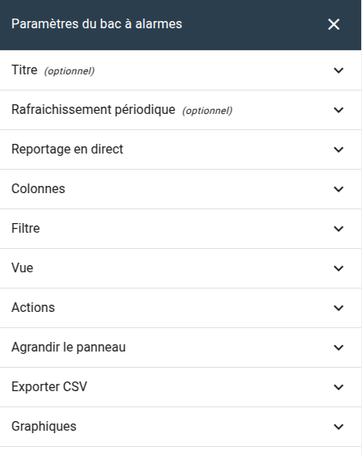

# Notes de version Canopsis 24.10.1

Canopsis 24.10.1 a été publié le 17 mars 2025.

## Procédure d'installation

Suivre la [procédure d'installation de Canopsis](../guide-administration/installation/index.md).

## Procédure de mise à jour

Suivre la [procédure standard de mise à jour de Canopsis](../guide-administration/mise-a-jour/index.md).

### Changements importants

!!! warning "Politique de rétention TimescaleDB"

    Dans les "paramètres de stockage", accessibles depuis le menu "Administration", toutes les politiques utilisant l'unité "mois" sont erronées et interprétées en unité "minute". Il est donc impératif de refaire vos configurations et de les sauvegarder à nouveau après installation de cette version.


!!! warning "Date de la dernière mise à jour"

    A présent, lorsqu'un "step" est ajouté à une alarme, la **date de dernière mise à jour (last_update_date)** est mise à jour. Auparavant, seule une mise à jour de sévérité provoquait la mise à jour de cette date.  
    Pour les besoins de la fonctionnalité "Règles d'inactivité", un champ similaire au précédent a été conservé (last_st_upd_dt)

!!! warning "Stockage de fichiers dans Canopsis"

    Dans le [fichier de configuration principal de Canopsis](../../../guide-administration/administration-avancee/modification-canopsis-toml/), tous les paramètres de la section `[Canopsis.file]` ont été remplacés par un paramètre unique `Dir`.

    Nouveau paramètre :

    ```ini
    [Canopsis.file]
    Dir = "/opt/canopsis/var/lib"
    ```

    Paramètres supprimés :

    ```ini
    [Canopsis.file]
    Upload = "/opt/canopsis/var/lib/upload-files"
    Junit = "/opt/canopsis/var/lib/junit-files"
    JunitApi = "/tmp/canopsis/junit"
    Icon = "/opt/canopsis/var/lib/icons"
    ```

!!! info "Paramètres du widgets Bac à alarmes"

    Les paramètres du widget "Bac à alarmes" sont à présent classés par groupe. Cela signifie que tout le menu des paramètres a été revu et travaillé par thématique en lieu et place de la catégorie "Paramètres avancés".  
    
    

### Corrections de bugs

*  **Général :**
    * Le tri de la liste des utilisateurs est à présent fonctionnel (#5719)
    * Correction d'un bug de politique de rétention coté timescaledb. L'unité "Month" était interprétée comme "Minute" (#5762)

*  **Interface graphique :**
    * Correction d'un bug qui rendait inopérant le filtre des des informations dynamiques dans des patterns d'alarmes (#5729)
    * Correction d'un défaut de scroll horizontal dans le panneau d'évaluation des consignes (#5708)
    * Correction d'un bug qui empêchait les modèles de widgets de méta alarmes de s'appliquer correctement dans certaines situations (#5748)
    * **Météo des Services :**
        * Correction d'un bug qui entrainait une erreur de calcul de compteur de pbh dans les tuiles de météo de services (#5758)
        * Correction d'un bug qui empêchait la reprise de supervision sur des entités de météo de services (#5686)
    * **Bac à alarmes :**
        * Correction d'un bug qui empêchait l'affichage d'un bac à alarmes lorsque, dans les paramètres des colonnes, aucune configuration n'était disponible (#5716)
        * L'onglet présentant les alarmes conséquences d'une méta alarme depuis son lien direct est à nouveau présent (#5668)
        * Correction d'un bug qui entrainait un affichage erroné des contenus de colonnes en mode "Tronqué" (#5674)
        * Correction d'un bug qui empếchait l'héritage des modèles d'infos popups (#5700)
        * Correction d'un bug qui faisait apparaitre un popup d'erreur lors de l'exécution d'une remédiation manuelle (#5741)
        * Correction d'un bug qui empêchait les badges de tags d'être en couleur (#5775)
        * Correction d'un bug qui empêchait la recherche avancée sur des informations d'entités de fonctionner correctement (#5737)
    * **Remédiation :**
        * Correction d'un bug qui empêchait la lecture des payloads de job de remédiation (#5685)
    * **Editeur de patterns :**
        * Dans l'éditeur de filtre, le champ prédéfini "2 derniers jours" correspond à présent réellement à 2 jours (#5770)
        * Correction d'un bug qui rendait incomplète les listes des infos d'entités dans l'éditeur de pattern (#5648)

*  **Moteurs :**
    * **Action :**
        * Correction d'un bug qui entrainait un crash du moteur "action" avec l'erreur "fatal error: concurrent map writes" (#5702)
    * **Axe :**
        * Correction d'un bug qui empêchait dexécuter des actions de type "Fast cancel" avec le message de log suivant `remaining time -1.637541ms until context deadline is less than or equal to 90th percentile RTT: operation not sent to server, as Timeout would be exceeded: context deadline exceeded` (#5753)
    * **Correlation :**
        * Le message initial (initial_output) d'une méta alarme est à présent correctement positionné (#5696)

*  **API :**
    * Correction d'un bug qui entrainait l'erreur "runtime error: invalid memory address or nil pointer dereference" worker="worker healthcheck" dans l'API (#5740)


### Améliorations

*  **Général :**
    * La fonctionnalité "sli_duration" peut être désactivée depuis l'interface graphique (#5717)
    * Lorsqu'un IdP est injoignable, le service d'API peut à présent fonctionner normalement (#5725)
    * La "date du dernier update" est mise à jour lorsqu'un ticket est créé (#5733)
    * Tous les chemins de la section [Canopsis.file] du fichier de configuration toml de Canopsis ont été remplacés par un unique paramètre `Dir` (#5476)

*  **Interface graphique :**
    * Ajout d'une fonctionnalité de téléchargement de règles telles qu'elles existent dans mongodb (#5404)
    * Redirection du navigateur sur la page de login après le timeout de session (#5746)
    * **Bac à alarmes :**
        * Le bac à alarmes est à présent équipé d'un filtre de tags (#5617)
        * Les paramètres du widget "Bac à alarmes" sont à présent classés par groupe (#5626)
        * Amélioration du ressenti utilisateur lors du changement de page d'un bac (#5663)
    * **Scénarios :**
        * La structure .AdditionalData est à présent disponible dans les template d'output des actions de scénarios (#5732) 
        * Comme pour une règle de déclaration de ticket, il est désormais possible de déclarer un nom de système dans un scénario (#5620)

*  **Editeur de patterns :**
    * Ajout des champs suivants dans l'éditeur de patterns : Auteur/initiateur de snooze, initiateur de state (#5768)
    * Amélioration des scripts de migration de patterns (#5656)

*  **API :**
    * La politique de stockage peut être exécutée plusieurs fois par semaine (#5722)

*  **Moteurs :**
    * **Comportements périodiques :**
        * Optimisation d'un requête mongoDB permettant d'accélérer le traitement des comportements périodiques (#5765)
    * **Axe :**
        * Optimisation du process de calcul des tags du moteur engine-axe. Des messages de type previous `run still in progress, skip periodical worker spent_time=...` pouvaient être observés dans les logs (#5745)
    * **SNMP :**
        * Mise à jour du composant traptester.py pour utiliser directement pika pour la publication d'événements AMQP, en remplacement de l'implémentation précédente AmqpPublisher, et en améliorant la gestion des erreurs ainsi que la gestion des connexions (#5665)

*  **Documentation :**
    * Mise à jour de la [documentation d'interconnexion entre PRTG et Canopsis](../../../interconnexions/Supervision/PRTG/) (#5743)
