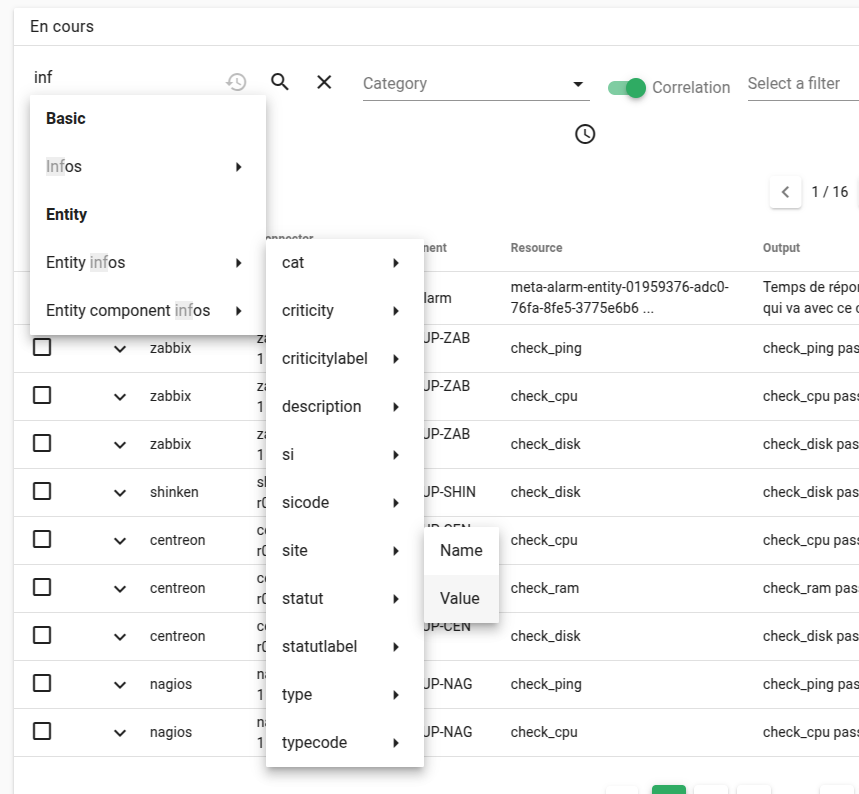
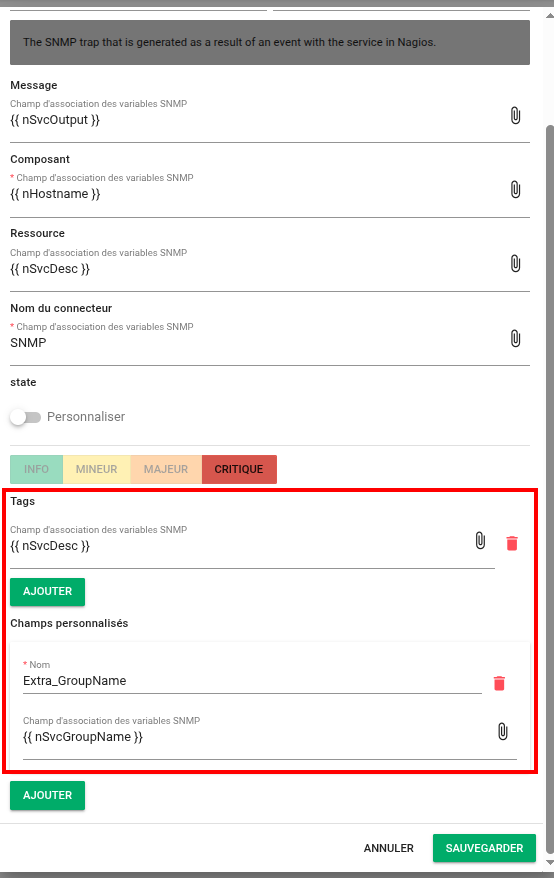

# Notes de version Canopsis 25.04.0

Canopsis 25.04.0 a été publié le 30 avril 2025.

## Procédure d'installation

Suivre la [procédure d'installation de Canopsis](../guide-administration/installation/index.md).

## Procédure de mise à jour

Canopsis 25.04.0 apporte des changements importants tant au niveau technique que fonctionnel.  
À ce titre, le [Guide de migration vers Canopsis 25.04.0](migration/migration-25.04.0.md) doit obligatoirement être suivi pour les installations déjà en place.

## Changements entre Canopsis 24.10.1 et 25.04.0

### Données externes d'enrichissement

Les règles de filtrage d'événements permettent d'enrichir les alarmes ainsi que les entités sur lesquelles portent les alarmes depuis une [source de données externes](../../guide-utilisation/menu-exploitation/filtres-evenements/#source-externe).

La fonctionnalité "Données externes" permet de gérer ces données depuis l'interface graphique.  

La [documentation](../../guide-utilisation/menu-exploitation/donnees-externes) décrit toutes les fonctionnalités offertes par le module.

### Refonte de la recherche avancée du bac à alarmes 

La recherche avancée depuis le bac à alarmes a été totalement revue.  
Un système d'auto complétion permet à l'utilisateur de choisir les termes de ses recherches sans avoir besoin de connaitre les modèles de données. 

### Support d'extra attributs et des tags dans les règles SNMP

Les [règles SNMP](../../guide-utilisation/menu-exploitation/regles-snmp) permettent à présent de définir des extra attributs ainsi que des tags

### Changements importants

l'auteur d'un comportement périodique est maintenant pris en compte dans les "steps" d'une alarme alors qu'il était systématiquement positionné sur "system" auparavant (#5706)

Séparation des droits UI et API, réorganisation et nettoyage des droits existants (#5191)

Cette mise à jour apporte une amélioration majeure dans la gestion des droits au sein de Canopsis. Les droits ont été scindés en deux catégories distinctes :

* Ceux dédiés aux utilisateurs accédant à l'interface UI
* Ceux destinés aux intégrations API.

Cette séparation permet une configuration plus claire et pertinente des rôles, évitant ainsi la double saisie de droits pour les utilisateurs de l'interface graphique.  
Par ailleurs, une refonte a été effectuée pour simplifier et regrouper les droits, avec la suppression de droits obsolètes, l'ajout de nouveaux droits manquants et une réorganisation plus intuitive des catégories.

#### Séparation des flux en trois catégories : user, system, external

Dans cette version, nous avons repensé la gestion des événements en séparant les flux en trois catégories distinctes en fonction de leur origine :  

* User : événements déclenchés par les utilisateurs via l’UI
* System : événements internes du moteur (ex. : alarmes, triggers)
* External : événements provenant des connecteurs

Chaque flux dispose désormais de son propre processeur et d’un pool de workers dédié, garantissant une exécution fluide et évitant qu’un flux ne bloque les autres. Cette refonte améliore la réactivité du système, en particulier pour les actions utilisateur, et supprime les configurations obsolètes liées aux files de publication/consommation (publishQueue, consumeQueue).  

De nouveaux flags permettent d’ajuster finement le nombre de workers par type d’événement pour une meilleure scalabilité.

### Montées de version 

Les outils suivants bénéficient de mises à jour :

| Outil          | Version d'origine | Version en 24.04    |
| -------------- | ----------------- | ------------------- |
| MongoDB        | 7.0.14            | 7.0.18              |
| Redis / Valkey | Redis 6.2.14      | Valkey 8.0.2        |
| RabbitMQ       | 3.12.13           | 4.0.7               |

Les instructions pour leur mise à jour sont précisées dans le [guide de migration](migration/migration-25.04.0.md).

### Connecteurs

Les connecteurs `email`, `snmp`, et `prometheus` bénéficient de changements

**Connecteur email :**

Le connecteur `connector-email2canopsis` a été renommé en `connector-email` (docker.canopsis.net/docker/pro/connector-email).  
Les logs sont à présent fournis en JSON pour une meilleure intégration avec les systèmes de logs centralisés.

**Connecteur snmp :**
   
Le connecteur `connector-snmp2canopsis` a été renommé en `connector-snmp` (docker.canopsis.net/docker/pro/connector-snmp).  
Les logs sont à présent fournis en JSON pour une meilleure intégration avec les systèmes de logs centralisés.
  
**Connecteur prometheus :**

Le connecteur `prometheus` supporte à présent plusieurs cibles AMQP. Il lui est donc possible de publier ses événements vers plusieurs instances Canopsis. 

### Améliorations

*  **Général :**
    * Remplacement de Redis par Valkey (#5650)

*  **Interface graphique :**
    * Le focus "souris" est à présent positionné sur le premier champ texte des formulaires lorsque cela est possible (#5433)
    * Le tooltip qui s'affiche en passanr la souris sur la version de Canopsis est à présent personalisable (#5724)
    * Le système de droit permet à présent de positionner une vue en lecture seule (#5245)
    * Sur un bac à alarme, le scroll horizontal peut être rendu visible en bas de page (#5330)
    * Un thème par défaut peut être défini (#5576)
    * Les variables d'environnement postionnées dans Canopsis peuvent être invoquées dans tous les éditeurs de la page de paramètres (#5576)
    * Séparation des droits UI et API, réorganisation et nettoyage des droits existants (#5191)
    * Ajout d'un module graphique permettant de gérer les données d'enrichissements externes (#5612)
    * **Bac à alarmes :**
        * Refonte de la recherche avancée du bac à alarmes (#5624)
    * **Météo des services :**
        * Possibilité de paramétrer le comportement des tuiles lorsqu'aucune action n'est requise ou que toutes les entités sont saines (comprendre lorsque toutes les alarmes ont été acquittées) (#5470)
    * **Meta alarmes :**
        *  Il est désormais possible de gérer des tags depuis le formulaire de création de règles de méta alarmes (#5378)
    * **Comportements Périodiques :**
        * Ajout de la gestion des fuseaux horaires dans les comportements périodiques (#4633)
        * l'auteur d'un comportement périodique est maintenant pris en compte dans les "steps" d'une alarme alors qu'il était systématiquement positionné sur "system" auparavant (#5706)
         * Ajout d'une option permettant à un comportement périodique sur service d'être appliqué à toutes les dépendances de celui-ci (#5538)
     * **Générateurs de liens :**
         * Possibilité d'utiliser des icônes personnalisées sans bordure ajoutée par Canopsis (#5734)
     * **Remédiation :**
        * Ajout d'informations permettant de mieux comprendre pourquoi une remédiation n'a pas abouti à la clôture d'une alarme (#5778)
        * Ajout de certaines colonnes permettant d'améliorer la compréhension des statistiques de remédiation (#5695)
        * Lorsqu'une remédiation échoue (timeout http par exemple), la raison est affichée dans la chronologie de l'alarme, dans l'onglet "remédiation" ainsi que dans les statistiques des remédiations (#5785)

*  **Editeur de patterns :**
    * L'éditeur de patterns permet de filtrer les alarmes en fonction de l'auteur du dernier commentaire (#5645)
    * Ajout de la possibilité de filtrer les tags par leur label (#5739)

*  **API :**
    * Les commentaires des alarmes sont présentés dans la réponse de l'API GET alarms (#5585)
    * Ajout d'une route PATCH api/v4/bulk/users permettant de modifier les utilisateurs en masse (#5676)
    * Il est désormais possible de provisioner (POST /api/v4/users) des utilisateurs oauth2/openid avec un nom personnalisé (#5791)
    * Les événements peuvent utiliser un attribut "close_delay" permettant à une alarme de se cloturer automatiquement une fois le délai passé (#4929)
    * Ajout du type d'événement `check_no_count` permettant de ne pas incrémenter les `event_count` et `last_event_date` d'une alarme existante (#5709)

*  **Import Contexte :**
    * Les tags peuvent à présent être importés par l'API et l'outil import-context-graph (#5623)

*  **Moteurs :**
    * Amélioration de la gestion des flux d’événements avec une séparation en trois catégories (user, system, external), optimisant la réactivité et la scalabilité du moteur (#5202)
    * **Remédiation :**
        * Ajout d'un contrôle permettant de vérifier que `job_retry_interval` soit bien supérieur à `http_timeout` (#5805)
    * **Informations dynamiques :**
        * Les informations dynamiques sont rafraichies à chaque événement lorsqu'un template contient des objets .Event (#5711)
    * **SNMP :**
        * Ajout du support d'extra attributs et des tags dans les règles SNMP (#5146)

*  **Connecteurs :**
    * **Email :**
        * Renommage du connecteur en `connector-email` (#5644)
        * Ajout du support des logs en JSON (#5644)
    * **SNMP :**
        * Renommage du connecteur en `connector-snmp` (#5644)
        * Ajout du support des logs en JSON (#5644)
    * **Prometheus :**
        * Ajout du support multi target AMQP (#5764)
 
*  **Documentation :**
    * [Données externes](../../../guide-utilisation/menu-exploitation/donnees-externes) 

### Corrections de bugs

!!! info "Corrections effectuées en 25.04.0"

    Bon nombre de corrections de bugs ont été effectuées en version 24.10.1. N'hésitez pas à consulter les [notes de versions de celle-ci](../../../24.10/notes-de-version/24.10.1/).
 

*  **Général :**
    * Le tri de la liste des utilisateurs est à présent fonctionnel (#5719)
*  **Interface graphique :**
     * Le menu "Enregistreur d'événements" n'est plus présenté en version Community (#5822)
*   **Import Contexte :**
      * Correction d'un bug qui entrainait une non mise à jour des informations ComponentInfos lors d'un import (#5812)

