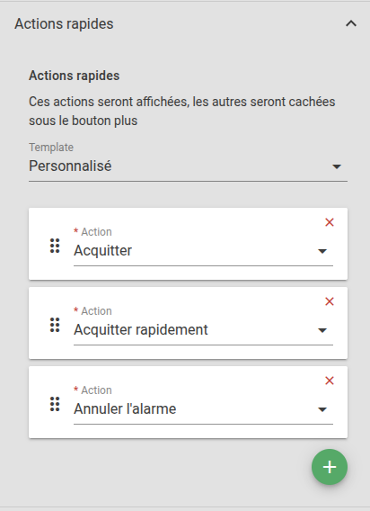

# Notes de version Canopsis 25.10.0

Canopsis 25.10.0 a été publié le 28 octobre 2025.

## Procédure d'installation

Suivre la [procédure d'installation de Canopsis](../guide-administration/installation/index.md).

## Procédure de mise à jour

Canopsis 25.10.0 apporte des changements importants tant au niveau technique que fonctionnel.  
À ce titre, le [Guide de migration vers Canopsis 25.10.0](migration/migration-25.10.0.md) doit obligatoirement être suivi pour les installations déjà en place.

## Changements entre Canopsis 25.04.2 et 25.10.0

Bloc de doc à faire concernant la résilience de manière générale.

https://git.canopsis.net/canopsis/canopsis-pro/-/issues/5903

https://git.canopsis.net/canopsis/canopsis-pro/-/issues/5904

https://git.canopsis.net/canopsis/canopsis-pro/-/issues/5698

A discuter ce vendredi.

### Nouveautés fonctionnelles

#### Studio Templates

La fonctionnalité "Studio Templates" vous permet de vérifier le rendu de vos [modèles (templates Go)](../../guide-utilisation/templates-go/index.md) avant d'enregistrer une règle ou un widget.  
Plutôt que de tester vos modifications directement en production, vous pouvez :

* Créer un jeu de test : associez un nom et sélectionnez des données de test (événement, entité, réponse webhook, etc.).
* Prévisualiser le résultat : voyez instantanément comment vos modèles seront interprétés, avec les variables remplacées.
* Identifier les erreurs : toute erreur de syntaxe ou donnée manquante est signalée immédiatement, avec mise en évidence du champ concerné.
* Réutiliser vos tests : enregistrez, modifiez ou supprimez des jeux de tests et de données pour valider facilement vos futurs modèles.

##### Données externes

https://git.canopsis.net/canopsis/canopsis-pro/-/issues/5653

Possibilité de typer les colonnes : jusque là seules les chaines de caractères étaient supportées. On ajoute les int, bool, datetime, array

Possibilité de parser des structures dans chaque case.  On peut aller lire un json dans une des cases

Ajout d'un algo de tri des enregistrements pour sélectionner le plus précis en première intention.  
Il existe un système de score qui permet d'ajouter automatiquement une colonne de priorité.  

| Value Type                        | Score |
|-----------------------------------|---|
| Empty or `.*`                     | 0 |
| Contains `*` or general regex     | 1 |
| Starts or ends with `^` / `$`     | 2 |
| Exact value (no wildcard/regex)   | 3 |

#### Alias d'infos d'entité

Dans les versions précédentes de Canopsis, les données issues des informations d'entité (`entity.infos`) étaient identifiées uniquement par leur clé interne et par une valeur brute.  Cela posait deux problèmes :

* **Lisibilité et recherche :** les clés techniques ne sont pas toujours parlantes pour les utilisateurs.  Par exemple, l'information `entity.infos.customer.value` peut être difficile à mémoriser.  Les utilisateurs souhaitaient pouvoir créer un alias tel que *Client* afin de rechercher et filtrer cette information de manière plus intuitive.

* **Incohérence des types :** les valeurs numériques étaient parfois interprétées comme des timestamps Unix et exportées dans des colonnes CSV sans conversion de date.  Le système ne possédait pas de métadonnées permettant de distinguer un entier simple d'un timestamp.

La fonctionnalité d'alias résout ces deux problèmes en apportant :

1. Une **typologie des informations** permettant de préciser si la valeur est une chaîne, un nombre, un booléen, un tableau de chaînes ou un timestamp.
Cette typologie est ensuite utilisée dans les formulaires de recherche et d'export. 

2. La possibilité de définir un **alias lisible** pour chaque clé.  L'alias est utilisé dans l'interface (menus, recherches, colonnes de table) et dans les exports CSV.  L'alias peut contenir des espaces, des caractères spéciaux ou accentués et offre un accès plus simple aux informations.

#### Règles d'enrichissement d'entités

L'objectif de cette fonctionnalité est de permettre de retracer, pour une alarme donnée, toutes les mises à jour d'infos d’entité qui l'ont impactée entre sa création et sa résolution.
Cela est utile pour comprendre "qui a modifié quoi, quand" dans des contextes avec de nombreuses règles et processus d’enrichissement.

Les résultats de ce suivi sont visibles dans un nouvel onglet du bac à alarmes, **Filtres d'événements**.

#### Politique de retry des remédiations en echec

Lorsque vous définissez une consigne de remédiation, vous devez spécifier un **Délai d'attente après exécution de la consigne**.  
Il s'agit du délai à partir duquel Canopsis considérera que l'exécution de la consigne a permis de résoudre une alarme ou au contraire ne l'a pas permis.  

Passé ce délai, Canopsis regarde l'état de l'alarme.  

* Si l'alarme est résolue alors la remédiation a permis de résoudre l'alarme et le trigger **"L'alarme est en état OK après toutes les consignes automatiques/autoinstructionresultok"** est déclenché.  
* Sinon si l'alarme n'est pas résolue alors la remédiation n'a pas permis de résoudre l'alarme et le trigger **"L'alarme n'est en état OK après toutes les consignes automatiques/autoinstructionresultfail"** est déclenché.  

Dans le second cas, il est à présent possible de définir une politique de retry.

#### Token d'authentification dans les webhooks

https://git.canopsis.net/canopsis/canopsis-pro/-/issues/5847

Montrer les screenshots sur figma

Au moment de la suppression d'un token, vérifier si le token n'est pas utilisé quelque chose 

https://git.canopsis.net/canopsis/canopsis-pro/-/issues/5930 : support réponse plaintext

#### Métriques de comportements périodiques

https://git.canopsis.net/canopsis/canopsis-pro/-/issues/5444

Montrer screenshots issue

#### Notifications, première étape

https://git.canopsis.net/canopsis/canopsis-pro/-/issues/5017

#### Scenario multi url

Un même webhook peut à présent être exécuté sur plusieurs URLs.  
L'attribut "URL" doit alors représenter une chaine de caractères utilisant la virgule comme séparateur d'URLs.  
Un exemple complet est disponible sur la documentation des [règles de déclaration de tickets](../../guide-utilisation/menu-exploitation/regles-declaration-tickets/#executer-un-webhook-sur-plusieurs-urls)

#### Filtres sur une colonne

https://git.canopsis.net/canopsis/canopsis-pro/-/issues/5918

Exemple live sur instance locale

#### Filtres de remédiation

https://git.canopsis.net/canopsis/canopsis-pro/-/issues/5275

Refonte du filtre de remédiation

La [documentation](../../guide-utilisation/menu-exploitation/donnees-externes) décrit toutes les fonctionnalités offertes par le module.

#### Actions sur les alarmes

Il est désormais possible de personnaliser l'ordre et la sélection des actions disponibles (unitaires ou en masse) sur les alarmes.

#### API

L'API Canopsis intègre des changements que vous devez prendre en compte :

* [Changelog](./api/changelog-25.10.0.md)
* [Breaking changes](./api/breaking-25.10.0.md)

### Montées de version 

Les outils suivants bénéficient de mises à jour :

| Outil          | Version d'origine | Version en 25.10    |
| -------------- | ----------------- | ------------------- |
| MongoDB        | 7.0.18            | 8.0.12              |
| TimescaleDB    | 2.5.1-pg15        | 2.21.4-pg17         |
| RabbitMQ       | 4.0.7             | 4.1.4               |
| Yarn           | 1.22              | 4.9.1               |

Les instructions pour leur mise à jour sont précisées dans le [guide de migration](migration/migration-25.10.0.md).

Montée de version timescale  https://git.canopsis.net/canopsis/canopsis-pro/-/issues/5908

Montée de version mongodb https://git.canopsis.net/canopsis/canopsis-pro/-/issues/5896

Nous avons migré le code Go de Canopsis vers la version v2 du driver MongoDB.  
Ce qui ne change pas :
        
* Aucun changement dans les paramètres de configuration, flags ou variables d’environnement.
* Aucun impact significatif constaté sur les performances générales.
* Les intégrations et composants existants continuent de fonctionner sans modification.

**ReadPreference Mongo strictement définie par l'application**

Nous avons désactivé la possibilité de surcharger le readPreference via l’URL de connexion Mongo.  
La `readPreference` est maintenant définie par l’application elle-même et non modifiable depuis l’extérieur.  

Par défaut, toutes les lectures sont effectuées depuis le nœud primaire.

Des exceptions existent dans certains composants, où la lecture depuis les secondaires est explicitement activée (cf. plus bas).  
Cette décision a été prise pour éviter les erreurs fréquentes liées à un usage incorrect ou abusif du readPreference;  
Cela causait des anomalies difficiles à diagnostiquer, comme des erreurs du type : "mongo: no documents in result."  

**Composants utilisant les lectures sur noeuds secondaires**

Les lectures depuis les réplicas secondaires sont actuellement activées dans :
        
* L'API des alarmes
* L'API d’export des alarmes
* Les moteurs engine-che et engine-dynamic-infos (dictionnaires d’info)
* Le Prometheus exporter

* Pptions des moteurs deprecated

https://git.canopsis.net/canopsis/canopsis-pro/-/issues/5913

### Connecteurs

Les connecteurs `email`, `snmp`, et `prometheus` bénéficient de changements

**Grafana :**

Une [documentation permettant d'interconnecter Grafana avec Canopsis](https://doc.canopsis.net/latest/interconnexions/Supervision/Grafana/) est à présent disponible.  

Grafana permet de générer des alertes basées sur les métriques visualisées dans les tableaux de bord.  
Lorsqu’une condition d’alerte est remplie, Grafana envoie une notification via un contact point configurable.

Il est possible d'utiliser un webhook ou un Alertmanager Prometheus comme canal de notification :

* Contact point Webhook : Grafana envoie directement l'alerte au connecteur Prometheus de Canopsis ;
* Contact point Alertmanager : Grafana envoie l'alerte à l’Alertmanager, qui la transmet ensuite au connecteur Prometheus.

### Améliorations

*  **Général :**
    * Le paramètre "readPreference" de mongodb ne peut plus être surchargé dans l'URI de connexion (#5698)
    * Suppression du type "null" pour les informations d'entité. Ce type était présent sur l'interface graphique mais non interprété par le backend (#5997)

*  **Interface graphique :**
    * Pour améliorer l'accesibilité de l'interface web de Canopsis, l'ensemble du jeu de couleurs a été entièrement revu (#5794)
    * **Editeur de patterns :**
        * Ajout des opérateurs temporels (agissant sur des dates) "Au cours des", "Plus ancien que", "Dans l'intervalle" (#5713)
    * **Bac à alarmes :**
        * Les "infopopup" de colonne bénéficient à présent d'un sélecteur de variables (#5862)
        * Amélioration des filtres de remédiation dans le bac à alarmes (#5275)
        * Les alarmes fermées/annulées mais non encore résolues sont à présent repérées par un picto dédié (#5858)
        * Il est désormais possible de personnaliser l’ordre et la sélection des actions disponibles (unitaires ou en masse) sur les alarmes (#5720)
        * L'action "Changer et verrouiller la criticité" est disponible en action de masse (#5940)
        * Lorsqu'une alarme est "dépliée", le rafraîchissement automatique des données de la page est suspendu (#5963)
        * A l'aide d'une configuration, les éléments d'une colonne peuvent être cliqués pour appliquer une recherche rapide (#5918)
        * Ajout d'un pictogramme permettant de spécifier qu'une remédiation aurait dû être exécutée mais que cela n'a pas été le cas (#5479)
    * **Comportements périodiques :**
        * Ajout d'informations liées à la performance des comportements périodiques : temps de compilation du pattern (#5444) 

*  **Rôles :**
    * Le type d'un rôle ne peut à présent plus être modifié (#5848)
    * Les utilisateurs "non admin" ne sont plus en mesure d'affecter le rôle "admin" même si le droit est positionné (#5646)
    * Les utilisateurs avec un rôle "API" uniquement ne peuvent plus se logguer sur l'interface graphique (#5953)

*  **Gestion des tags :**
    * Une fois crée, le nom d'un tag ne peut plus être modifié (#5850)

*  **Scénario / Règles de déclaration de tickets :**
    * A présent, lorsque la fin de l'exécution d'un webhook se produit alors que l'alarme est déjà résolue, un step est quand même ajouté (#5949)

*  **API :**
    * Ajout des attributs maxState et initialstate aux alarmes (#5814)
    * Ajout de la fonction de pagination sur les tags, évitant ainsi des lenteurs sur l'interface dûes à des slow queries en base de données (#5951)

*  **Authentification :**
    * Oauth2 : Le paramètre insecure_skip_verify n’accepte plus que les certificats valides et auto-signés. Pour accepter tout type de certificat (y compris expirés ou invalides), utilisez désormais `insecure_verify_any_cert: true`
*  **Moteurs :**
    * Ajout de la possibilité d’activer et de configurer le service de profiling Go (pprof) sur les moteurs : activation via CPS_DEBUG_WEB_PPROF_ENABLE, choix de l’hôte et du port via CPS_DEBUG_WEB_PPROF_HOST et CPS_DEBUG_WEB_PPROF_PORT (#330). 
    * **Webhook :**
        * Il est à présent possible d'exécuter le même webhook sur plusieurs URL (#5774)
    * **FIFO :**
        * Ajout d'un mécanisme permettant d'interdir le lancement de plusieurs instances du moteur `engine-fifo` (#5904)

*  **Connecteurs :**
    * **Exporter Prometheus :**
        * De nouvelles métriques sont disponibles : alarmes actives/inactives, messages FIFO par type, entités actives par type et nombre de règles d’instructions (#5853)
 
*  **Documentation :**
    * [Données externes](../../guide-utilisation/menu-exploitation/donnees-externes) 
    * [Informations d'entités](../../guide-utilisation/menu-exploitation/informations-entite) 
    * [Studio Templates](../../guide-utilisation/menu-administration/studio-templates/) 

### Corrections de bugs

!!! info "Corrections effectuées en 25.10.0"

*  **Général :**
    * Les permissions de base du répertoire `/opt/canopsis/var/lib` sont à présent correctement positionnées dans une installation à partir de paquets RPM (#5945)

*  **Interface graphique :**
    * **Filtres d'événements :**
        * Correction d'un bug qui empêchait la création d'une règle de filtrage avec des données externes (#5946)
    * **Droits et rôles :**
        * La création d'un rôle utilisant un modèle de rôle est à nouveau fonctionnelle (#5941)
    * **Calendrier :**
        * Correction d'un bug qui entrainait un mauvais calcul du nombre d'alarmes sur une case mensuelle (#5892)
    * **Remédiation/Consigne :**
        * Les étapes d'une remédiation peuvent à nouveau être reordonnées par drag n drop (#5960)
        * Correction d'un bug qui empêchait la saisie d'un pattern (Consigne et Règles de résolution) s'il avait été oublié en première intention (#5961)
        * Correction d'un bug qui empêchait une consigne de s'éxécuter correctement lorsqu'un même job était affecté à plusieurs étapes (#5969)
        * Correction d'un bug qui entrainait le changement de type d'une consigne lorsqu'elle était en attente d'approbation (#5944)
        * La liste des remédiations est maintenant éligible au tri par priorité (#5943)
        * Correction d’un bug où une instruction avec stop_on_fail: true restait bloquée en chargement dans l’UI au lieu d’être marquée comme échouée (#5966)
    * **Rôles :**
        * Correction d'un bug qui rendait inopérante la duplication d'un rôle (#5964)
        * Correction d'un bug de la route `GET /roles` qui renvoyait systématiquement le flag "deletable" alors que certains rôles étaient affectés à des utilisateurs (#5942)

*  **Moteurs :**
    * 
    * **AXE :**
        * Correction d'un bug qui entraînait l'erreur suivante lib/axe/message_processor.go:178","message":"cannot process event" (#5967)

