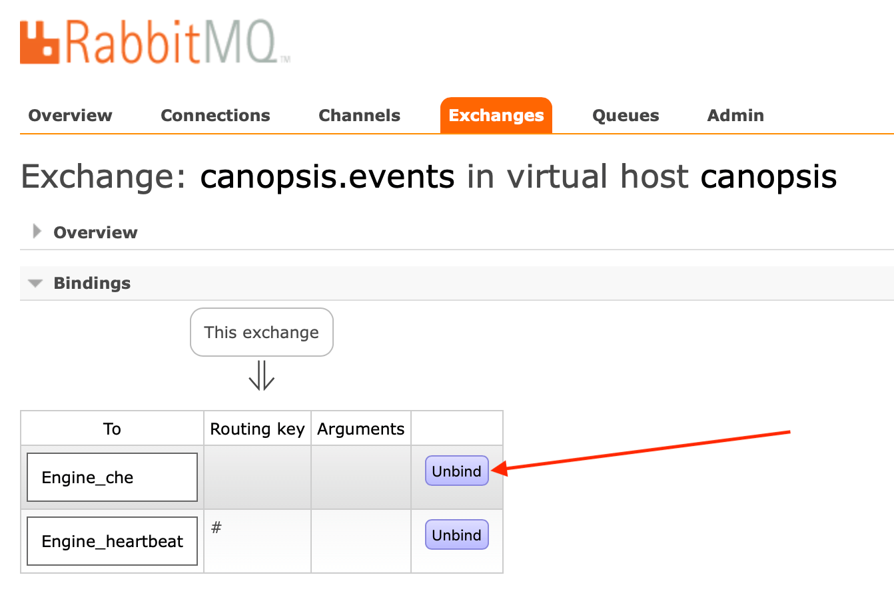
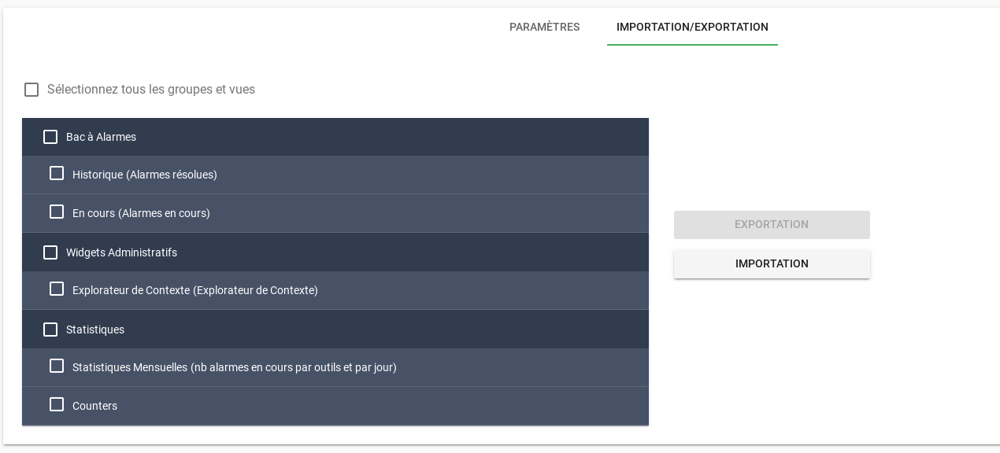

# Notes de version Canopsis 3.39.0

Canopsis 3.39.0 a été publié le 10 avril 2020.

## Procédure d'installation

Suivre la [procédure d'installation de Canopsis](../guide-administration/installation/index.md).

## Procédure de mise à jour

Suivre la [procédure standard de mise à jour de Canopsis](../guide-administration/mise-a-jour/index.md).

Puis, en fonction de votre méthode d'installation, effectuez les manipulations suivantes.

### Manipulations supplémentaires en environnement Docker

Redis doit être mis à jour vers sa version 5. La variable de référence (habituellement définie dans un fichier `.env`) utilisée est la suivante :

```ini
REDIS_TAG=5.0.8-buster
```

Si vous utilisez les moteurs Go, vous devez obligatoirement ajouter le nouveau moteur `engine-fifo` suivant à votre `docker-compose.yml` :

```yaml
  fifo:
    image: canopsis/engine-fifo:${CANOPSIS_IMAGE_TAG}
    env_file:
      - compose.env
    restart: unless-stopped
    command: /engine-fifo
```

Si vous utilisiez le moteur `engine-che` avec l'option `-alwaysFlushEntities`, celle-ci n'a plus d'utilité et doit obligatoirement être supprimée.

En édition Pro, si vous utilisez les moteurs `engine-webhook` et `engine-dynamic-infos`, vous pouvez simplifier les points d'entrée en supprimant les paramètres `-publishQueue`, si vous les aviez exactement configurés aux valeurs suivantes :

```yaml hl_lines="9 18"
  dynamic-infos:
    image: canopsis/engine-dynamic-infos:${CANOPSIS_IMAGE_TAG}
    env_file:
      - compose.env
    depends_on:
      - "mongodb"
    restart: unless-stopped
#   command: /cmd/engine-dynamic-infos -publishQueue Engine_webhook
    command: /cmd/engine-dynamic-infos
  webhook:
    image: canopsis/engine-webhook:${CANOPSIS_IMAGE_TAG}
    env_file:
      - compose.env
    depends_on:
      - "mongodb"
    restart: unless-stopped
#   command: /cmd/engine-webhook -publishQueue Engine_action
    command: /cmd/engine-webhook
```

Relancez l'ensemble de votre environnement avec `docker-compose up -d`. Assurez-vous avec `docker-compose ps` que le conteneur de provisionnement RabbitMQ `init` ait bien à nouveau été exécuté.

### Manipulations supplémentaires en installation par paquets

Redis doit être mis à jour vers sa version 5. Cette manipulation n'est facilement réalisable que dans le cadre d'une **nouvelle** installation de Canopsis avec `canoctl`, ou à l'aide de votre contrat de support Capensis si vous en bénéficiez.

Pour Redis, notez qu'il est **fort probable** que vous ayez besoin d'ajuster sa variable `maxmemory`. Voyez pour cela la [documentation sur le service Redis](../guide-administration/administration-avancee/configuration-composants/serveur-cache-redis.md).

Si vous utilisez les moteurs Go, vous devez activer le nouveau moteur `engine-fifo`, et forcer la création de sa file RabbitMQ associée :

```sh
systemctl enable canopsis-engine-go@engine-fifo
cp /opt/canopsis/etc/initialisation-cat.toml.example /opt/canopsis/etc/initialisation.toml
set -o allexport ; source /opt/canopsis/etc/go-engines-vars.conf
/opt/canopsis/bin/init -conf /opt/canopsis/etc/initialisation.toml
```

Supprimez toute référence à l'option `-alwaysFlushEntities` du moteur `engine-che`, si vous l'utilisiez :

```sh
vi $(grep -lr alwaysFlushEntities /etc/systemd/system/canopsis*)
systemctl daemon-reload
```

Vous devez ensuite resynchroniser votre fichier `amqp2engines.conf` avec les fichiers de référence suivants présents dans `/opt/canopsis/etc` :

*  `amqp2engines-go-cat.conf.example`
*  `amqp2engines-go-core.conf.example`
*  `amqp2engines-python-cat.conf.example`
*  `amqp2engines-python-core.conf.example`

Vous devez ensuite vous [connecter à l'interface de RabbitMQ](../guide-de-depannage/rabbitmq-webui/index.md) pour y apporter quelques changements.

Allez dans Exchanges > `canopsis.events` > Bindings, et cliquez sur le bouton « Unbind » de la file `Engine_che` :



Puis, redémarrez l'ensemble de vos moteurs :

```sh
canoctl restart
```

## Changements entre Canopsis 3.38.0 et 3.39.0

### Nouveau rythme de publication des nouvelles versions

Afin d'apporter de meilleures garanties sur les livrables, le rythme de publication de nouvelles versions de Canopsis passe maintenant de 2 à 3 semaines.

Les sprints de développement interne se poursuivent néanmoins sur leur rythme habituel de 15 jours.

### Nouveaux helpers Handlebars

De nouveaux helpers Handlebars propres à Canopsis ont été ajoutés :

*  `{{sum}}`, `{{minus}}`, `{{mul}}`, `{{divide}}` :  afin d'appliquer les opérations mathématiques basiques sur des nombres.
*  `{{concat}}` : afin de concaténer des chaines de caractères.

Consultez la [documentation des helpers Handlebars propres à Canopsis](../guide-utilisation/interface/helpers/index.md), afin d'en savoir plus.

### Nouveau mécanisme d'importation et d'exportation de vues

Les vues créées dans Canopsis peuvent maintenant être importées et exportées entre différents environnements, en quelques clics sur l'interface.



### Nouveau widget Compteur

Ce widget permet d'afficher des compteurs sous formes de tuiles.

Les compteurs concernés sont des nombres d'alarmes, d'alarmes acquittées, alarmes associées à un ticket d'incident, alarmes en veille.

Plus d'informations dans la [documentation du widget Compteur](../guide-utilisation/interface/widgets/compteur/index.md).

### Améliorations diverses du vocabulaire du Bac à alarmes

Certaines parties du vocabulaire présent dans l'interface de Canopsis ont été revues dans les traductions françaises et anglaises.

Par exemple, *l'état* d'une alarme, qui pouvait être confondu avec son *statut*, s'intitule dorénavant *criticité*. Des termes internes tels que *rrule* ont maintenant été traduits en des termes plus clairs, tels que *récurrence*.

Seule l'interface web est concernée par ces changements ; la base de données, les API et les connecteurs utilisent toujours les noms de champs historiques, par compatibilité avec l'existant.

### Déploiement facilité des moteurs Pro avec `canoctl deploy`

Si vous disposez d'une souscription à l'édition Pro de Canopsis, la commande de déploiement `canoctl deploy` est maintenant capable de déployer les moteurs Pro, sans nécessiter une quelconque manipulation supplémentaire.

(Ceci n'est valable que pour une nouvelle installation de Canopsis et de ses paquets.)

### Mise à jour du serveur de cache Redis

En environnement Docker, ou en installation par paquets, [Redis](https://redis.io) a été mis à jour d'une version 3 à une version 5, avec une configuration revue. Cette mise à jour est nécessaire au bon fonctionnement du nouveau moteur Go `engine-fifo`.

Voyez la procédure plus haut, pour les détails de cette mise à jour.

### Améliorations diverses du Guide d'administration

Certaines parties du [Guide d'administration](../guide-administration/index.md) ont été revues ou améliorées. Ce travail de fond se poursuivra lors des prochaines mises à jour de la plateforme de documentation.

### Liste des modifications

*  **Images Docker / paquets :**
    *  Mise à jour vers Redis 5 ([#2262](https://git.canopsis.net/canopsis/canopsis/-/issues/2262), [#2197](https://git.canopsis.net/canopsis/canopsis/-/issues/2197))
    *  Paquets : `canoctl deploy` déploie maintenant un environnement Go par défaut, et est maintenant capable d'activer des moteurs Pro si ceux-ci sont présents ([#2270](https://git.canopsis.net/canopsis/canopsis/-/issues/2270))
*  **Documentation :**
    *  Documentation de la fonctionnalité d'importation et d'exportation de vues Canopsis ([#2311](https://git.canopsis.net/canopsis/canopsis/issues/2311))
    *  Améliorations de la documentation du connecteur [`email2canopsis`](https://doc.canopsis.net/interconnexions/Transport/Mail/)
    *  Documentation du droit « Lister les variables disponibles » ([#2235](https://git.canopsis.net/canopsis/canopsis//issues/2235))
    *  Ajout d'une documentation sur Redis et son paramètre `maxmemory` ([#2301](https://git.canopsis.net/canopsis/canopsis/-/issues/2301))
    *  Documentation du droit "Lister les variables disponibles" ([#2235](https://git.canopsis.net/canopsis/canopsis//issues/2235))
    *  Documentation du nouveau widget « Compteur » ([#2247](https://git.canopsis.net/canopsis/canopsis/issues/2247))
*  **API :**
    *  Correction d'un bug dans l'API `Pbehavior` qui ne permettait pas de gérer le renommage correctement ([#2314](https://git.canopsis.net/canopsis/canopsis/issues/2314))
*  **Connecteurs :**
    *  **email2canopsis :**
        *  Ajout de 2 sélectionneurs `before_inc` et `after_inc` permettant d'inclure les bornes en elles-mêmes ([#2244](https://git.canopsis.net/canopsis/canopsis/issues/2244))
        *  Le sélectionneur `line` prend maintenant en charge le multi-lignes ([#2242](https://git.canopsis.net/canopsis/canopsis/issues/2242))
        *  Ajout du mot clé `and` permettant de concaténer des valeurs ([#2241](https://git.canopsis.net/canopsis/canopsis/issues/2241))
        *  Ajout de la fonction `print` permettant d'affecter une valeur statique à un attribut ([#2240](https://git.canopsis.net/canopsis/canopsis/issues/2240))
        *  Possibilité dans le fichier `ini` de spécifier l'expéditeur à l'aide d'une expression régulière ([#2239](https://git.canopsis.net/canopsis/canopsis/issues/2239))
        *  Le connecteur envoie à présent un événement complémentaire en cas d'erreur de connexion à la boite aux lettres ([#2245](https://git.canopsis.net/canopsis/canopsis/issues/2245))
*  **Moteurs :**
    *  **Moteurs nouvelle génération (Go) :**
        *  Ajout d'engine-fifo, garantissant la cohérence du traitement des évènements internes à Canopsis, et posant les fondations pour des améliorations futures de performance
        *  Correction d'un bug entrainant un plantage et redémarrage du moteur `watcher` ([#2254](https://git.canopsis.net/canopsis/canopsis/issues/2254))
        *  Prise en charge des types `pbhenter` et `pbhleave` dans les steps des alarmes ([#2228](https://git.canopsis.net/canopsis/canopsis/issues/2228))
        *  Le moteur `action` peut désormais exécuter les actions `ack/ackremove`, `assocticket/declareticket`, `cancel` ([#2178](https://git.canopsis.net/canopsis/canopsis/issues/2178))
        *  Le moteur `action` peut désormais ajouter un délai dans l'exécution des actions ([#2179](https://git.canopsis.net/canopsis/canopsis/issues/2179))
*  **UI :**
    *  Ajout de nouveaux helpers Handlerbars `{{sum}}`, `{{mul}}`, `{{minus}}`, `{{divide}}`, `{{concat}}` ([#2277](https://git.canopsis.net/canopsis/canopsis/issues/2277), [#2247](https://git.canopsis.net/canopsis/canopsis/issues/2247))
    *  **Bac à alarmes :**
        *  Prise en charge des types `pbehaviors` dans la chronologie de l'alarme ([#2290](https://git.canopsis.net/canopsis/canopsis/issues/2290))
        *  La compilation des templates `infopopup` a lieu au moment du clic et non pas au chargement du bac à alarmes ([#2279](https://git.canopsis.net/canopsis/canopsis/issues/2279))
        *  L'accès à la liste des variables brutes est désormais lié à un droit (et non plus lié à l'édition du widget) ([#2235](https://git.canopsis.net/canopsis/canopsis/issues/2235))
        *  Une alarme est désormais accessible par le biais d'une URL directe ([#2211](https://git.canopsis.net/canopsis/canopsis/issues/2211))
        *  Un filtre portant sur des `dynamic-infos` peut comporter un caractère joker ([#2193](https://git.canopsis.net/canopsis/canopsis/issues/2193))
    *  **Calendrier :**
        *  Correction d'un bug de positionnement de date ([#2304](https://git.canopsis.net/canopsis/canopsis/issues/2304))
    *  **CRUD Webhook :**
        *  Les webhooks peuvent être activés ou désactivés ([#2209](https://git.canopsis.net/canopsis/canopsis/issues/2209))
    *  **CRUD Dynamic Infos :**
        *  La mise à jour de l'auteur d'une règle est maintenant opérationnelle ([#2283](https://git.canopsis.net/canopsis/canopsis/issues/2283))
        *  Les valeurs d'informations dynamiques peuvent maintenant utiliser les templates Go ([#2123](https://git.canopsis.net/canopsis/canopsis/issues/2123))
        *  Il est désormais possible de créer des modèles d'informations dynamiques pour éviter de répéter des opérations de saisie ([#2137](https://git.canopsis.net/canopsis/canopsis/issues/2137))
    *  **CRUD Actions :**
        *  Correction de l'affichage des patterns d'alarmes et d'entités ([#2089](https://git.canopsis.net/canopsis/canopsis/issues/2089))
    *  **Linklist :**
        * Les liens sont maintenant triés par ordre alphabétique ([#2282](https://git.canopsis.net/canopsis/canopsis/issues/2282))
    *  **Widgets :**
        * Ajout d'un nouveau widget « Compteur » ([#2247](https://git.canopsis.net/canopsis/canopsis/issues/2247))
    *  **Paramètres :**
        * Ajout d'un mécanisme d'import/export des vues de Canopsis ([#2243](https://git.canopsis.net/canopsis/canopsis/issues/2243))
* **Expérience utilisateur :**
    *  Amélioration des traductions au travers de toute l'interface ([#2278](https://git.canopsis.net/canopsis/canopsis/issues/2278), [#2157](https://git.canopsis.net/canopsis/canopsis/issues/2157))
    *  Le bouton permettant de rafraîchir une vue est désormais positionné horizontalement ([#2212](https://git.canopsis.net/canopsis/canopsis/issues/2212))
    *  Le temps pendant lequel sont affichés les messages d'erreur ou de prise en compte sont paramétrables ([#2190](https://git.canopsis.net/canopsis/canopsis/issues/2190))
