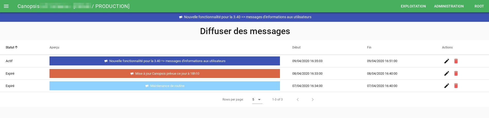

# Notes de version Canopsis 3.40.0

Canopsis 3.40.0 a été publié le 4 mai 2020.

## Procédure d'installation

Suivre la [procédure d'installation de Canopsis](../guide-administration/installation/index.md).

## Procédure de mise à jour

Suivre la [procédure standard de mise à jour de Canopsis](../guide-administration/mise-a-jour/index.md).

Puis, en installation par paquets, exécutez les commandes suivantes :

```sh
grep -q ^canopsis.webcore.services.metaalarmrule /opt/canopsis/etc/webserver.conf || echo "canopsis.webcore.services.metaalarmrule=1" >> /opt/canopsis/etc/webserver.conf
grep -q ^canopsis.webcore.services.broadcast_message /opt/canopsis/etc/webserver.conf || echo "canopsis.webcore.services.broadcast_message=1" >> /opt/canopsis/etc/webserver.conf

canoctl restart
```

En installation Docker, si vous maintenez votre propre volume `webserver.conf`, vous devez aussi y ajouter une ligne `canopsis.webcore.services.metaalarmrule=1` et une ligne `canopsis.webcore.services.broadcast_message=1`.

## Changements entre Canopsis 3.39.0 et 3.40.0

### Diffusion de messages d'annonces

Canopsis 3.40.0 ajoute un nouvel outil dans l'espace d'administration : il est maintenant possible de planifier l'affichage de messages d'annonces auprès de vos utilisateurs, notamment avec une couleur et un horaire donnés.



### Procédure de multi-instanciation des moteurs `engine-che` et `engine-axe`

[Canopsis 3.39.0](3.39.0.md) a apporté la multi-instanciation du moteur `engine-che` ; Canopsis 3.40.0 poursuit cet effort en apportant la multi-instanciation du moteur `engine-axe`.

Ces changements amènent une amélioration des performances et de la résilience de ces moteurs.

Consultez la documentation respective de chacun de ces moteurs ([`engine-che`](../guide-administration/moteurs/moteur-che.md#multi-instanciation), [`engine-axe`](../guide-administration/moteurs/moteur-axe.md#multi-instanciation)) afin d'en savoir plus sur ce mécanisme de multi-instanciation.

### Liste des modifications

*  **Documentation :**
    *  Ajout d'une procédure Docker de multi-instanciation des moteurs `engine-axe` et `engine-che` ([#2317](https://git.canopsis.net/canopsis/canopsis/issues/2317))
    *  Mise à jour de la documentation, afin de prendre en compte une partie [des améliorations de vocabulaire](3.39.0.md#ameliorations-diverses-du-vocabulaire-du-bac-a-alarmes) apportées dans la version précédente ([#2300](https://git.canopsis.net/canopsis/canopsis/issues/2300))
*  **API :**
    *  `pbehavior` : Ajout d'un paramètre `current_active_pbh` aux requêtes `/pbehavior/read`, afin de ne récupérer que les comportements périodiques actifs ([#2274](https://git.canopsis.net/canopsis/canopsis/issues/2274))
*  **Moteurs :**
    *  **Moteurs nouvelle génération (Go) :**
        *  Pro : Ajout d'un nouveau moteur expérimental, `engine-correlation`. Ce moteur n'est pas activé par défaut, et son utilisation sera décrite dans une prochaine version ([#2328](https://git.canopsis.net/canopsis/canopsis/issues/2328))
        *  `engine-axe` : Amélioration de la performance et de la résilience du moteur `engine-axe`, qui peut maintenant être lancé sur de multiples instances ([#204](https://git.canopsis.net/canopsis/go-engines/issues/204))
        *  `engine-webhook` (Pro) : Correction du *trigger* `unsnooze`, qui n'était plus fonctionnel depuis la séparation du traitement des Webhooks dans un moteur dédié dans Canopsis 3.34.0 ([#2236](https://git.canopsis.net/canopsis/canopsis/issues/2236))
    *  **Moteurs ancienne génération (Python) :**
        *  `pbehavior` : Correction de la gestion des `pbhenter` et `pbleave` ([#2342](https://git.canopsis.net/canopsis/canopsis/issues/2342))
*  **UI :**
    *  **Administration :**
        *  Ajout d'un système de diffusion de messages auprès des utilisateurs ([#2215](https://git.canopsis.net/canopsis/canopsis/issues/2215))
    *  **Explorateur de contexte :**
        *  Ajout d'un mode de recherche avancée dans l'Explorateur de contexte, similaire à la recherche avancée du Bac à alarmes ([#2144](https://git.canopsis.net/canopsis/canopsis/issues/2144))
