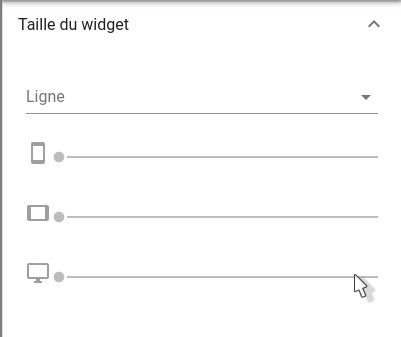
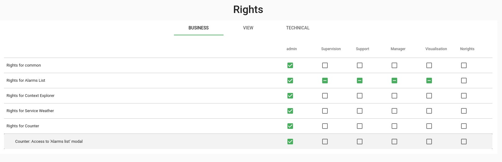

# Notes de version Canopsis 3.43.1

Canopsis 3.43.1 a été publié le 10 juillet 2020. Il n'y a pas de version 3.43.0.

## Procédure d'installation

Suivre la [procédure d'installation de Canopsis](../guide-administration/installation/index.md).

## Procédure de mise à jour

Suivre la [procédure standard de mise à jour de Canopsis](../guide-administration/mise-a-jour/index.md).

## Changements entre Canopsis 3.42.0 et 3.43.1

!!! attention
    Cette version présente un bug dans la fonctionnalité d'enrichissement du moteur `engine-che`. Les périmètres existants ne sont pas concernés et continueront d'être enrichis. En revanche, les nouveaux périmètres, ajoutés après installation ou mise à jour vers cette version, ne pourront pas être enrichis.
      
    Pour plus d'informations, veuillez consulter [l'issue #2559](https://git.canopsis.net/canopsis/canopsis/-/issues/2559).

### Grille d'édition des vues

Le placement des widgets sur une vue se fait maintenant grâce à un système de glisser/déposer.

Il n'est donc plus nécessaire de paramétrer les lignes et les largeurs de widget comme auparavant.

La documentation associée sera disponible prochainement.

### Nouveau type de règle de corrélation

Le type `valueGroup` permet de créer des `meta alarmes` grâce à des regroupements de valeurs.

Voyez pour cela la [documentation du moteur `engine-correlation`](../guide-administration/moteurs/moteur-correlation.md).

### Page d'administration des droits

La page d'administration des droits a été revisitée : catégorisation des droits, tri et ergonomie générale.

### Liste des modifications

*  **Documentation :**
    * L'utilisation du nom du trigger (AlarmChange) dans les payloads de webhooks est maintenant documentée ([#2446](https://git.canopsis.net/canopsis/canopsis/-/issues/2446))
*  **API :**
    * Correction d'un bug qui rendait impossible l'import d'informations d'entité non typées "chaîne de caractères" ([#2457](https://git.canopsis.net/canopsis/canopsis/-/issues/2457))
    * Correction d'un bug qui ne permettait plus l'affichage de certaines tuiles météo ([#2393](https://git.canopsis.net/canopsis/canopsis/-/issues/2393))
*  **UI :**
    *   **Météo de service :**
        * La liste des entités de la modale météo est à présent triée par criticité et par ordre alphabétique ([#2449](https://git.canopsis.net/canopsis/canopsis/-/issues/2449))
    *   **Widgets :**
        * Les vues sont maintenant paramétrables grâce à un système de `drag n drop` de widgets ([#2208](https://git.canopsis.net/canopsis/canopsis/-/issues/2208))
    *   **Profils utilisateurs :**
        * Le mot de passe et l'adresse mail du `Profil utilisateur` ne sont désormais plus auto-complétés par Firefox ([#2460](https://git.canopsis.net/canopsis/canopsis/-/issues/2460))
    *   **Gestion des droits :**
        * La page d'administration des droits bénéficie d'améliorations ergonomiques ([#2421](https://git.canopsis.net/canopsis/canopsis/-/issues/2421))
    *   **Calendrier :**
        * Correction d'un bug qui générait des messages d'erreurs sur le widget calendrier ([#2323](https://git.canopsis.net/canopsis/canopsis/-/issues/2323))
    * **Général :**
        * À présent, au moment de la déconnexion d'un utilisateur de Canopsis, l'URL d'origine n'est plus sauvegardée ([#2475](https://git.canopsis.net/canopsis/canopsis/-/issues/2475))
        * Correction d'un bug concernant le tooltip d'acquittement qui clignotait lorsque le commentaire était trop long ([#2251](https://git.canopsis.net/canopsis/canopsis/-/issues/2251))
        * Les annotations (tooltips) sont désormais réglées pour ne pas occuper toute la largeur de l'écran ([#2472](https://git.canopsis.net/canopsis/canopsis/-/issues/2472))
    *   **Webhook :**
        * Correction du bug qui rendait impossible la suppression des webhooks contenant des espaces ou des slashs dans l'identifiant ([#2452](https://git.canopsis.net/canopsis/canopsis/-/issues/2452))
        * Correction d'un bug sur les horodatages de déclaration de ticket lorsque les triggers `resolve` et `snooze` étaient appelés ([#2237](https://git.canopsis.net/canopsis/canopsis/-/issues/2237))
    *   **Bac à alarmes :**
        * Le nombre d'éléments par page est maintenant contenu dans les préférences utilisateur ([#1825](https://git.canopsis.net/canopsis/canopsis/-/issues/1825)) - ([#2445](https://git.canopsis.net/canopsis/canopsis/-/issues/2245))
        * Les filtres d'informations `dynamic` peuvent à nouveau contenir un joker (cf. [documentation](../guide-utilisation/interface/widgets/bac-a-alarmes/index.md#en-fonction-des-informations-dynamiques)) ([#2485](https://git.canopsis.net/canopsis/canopsis/-/issues/2485))
*  **Moteurs :**
    *   **Engine-Watcher :**
        * Correction d'un bug : Les liens `impact/depends` étaient supprimés après la mise à jour des watchers ([#2459](https://git.canopsis.net/canopsis/canopsis/-/issues/2459))
    *   **Engine-Correlation :**
        * Nouveau type de règle `valuegroup` ([#2273](https://git.canopsis.net/canopsis/canopsis/-/issues/2273))
*  **Connecteurs :**
    *   **Email2Canopsis :**
        * Possibilité à présent de définir plusieurs templates pour un même expéditeur à partir du sujet ([#2469](https://git.canopsis.net/canopsis/canopsis/-/issues/2469))
        * Plusieurs templates peuvent maintenant s'appliquer pour un même expéditeur ([#2315](https://git.canopsis.net/canopsis/canopsis/-/issues/2315))
