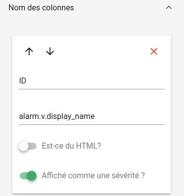
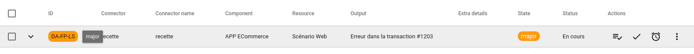
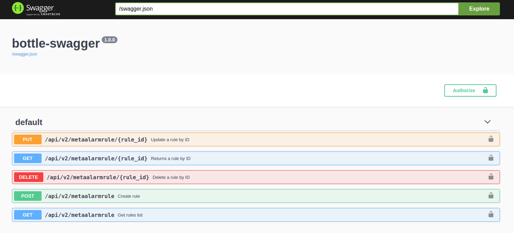
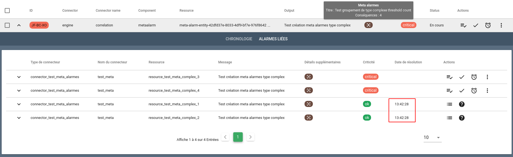

# Notes de version Canopsis 3.44.0

Canopsis 3.44.0 a été publié le 31 juillet 2020.

## Procédure d'installation

Suivre la [procédure d'installation de Canopsis](../guide-administration/installation/index.md).

## Procédure de mise à jour

Suivre la [procédure standard de mise à jour de Canopsis](../guide-administration/mise-a-jour/index.md).

## Changements entre Canopsis 3.43.1 et 3.44.0

!!! attention
    Cette version présente un bug dans la fonctionnalité d'enrichissement du moteur `engine-che`. Les périmètres existants ne sont pas concernés et continueront d'être enrichis. En revanche, les nouveaux périmètres, ajoutés après installation ou mise à jour vers cette version, ne pourront pas être enrichis.

    Ce bug est corrigé dans [Canopsis 3.45.0](3.45.0.md).

### Modification de l'enchaînement des moteurs

Pour permettre l'exploitation des événements de type `pbhenter` et `pbhleave` (entrée et sortie d'un comportement périodique) dans la chronologie des alarmes, une modification dans l'enchaînement des moteurs a été opérée ([#2506](https://git.canopsis.net/canopsis/canopsis/-/issues/2506)).

Si vous utilisez une installation par paquets avec les moteurs Go, l'instruction `next = axe` doit être déplacée de la sorte dans le fichier `/opt/canopsis/etc/amqp2engines.conf` :

```ini hl_lines="3 9"
[engine:event_filter]
# "axe," doit ici être supprimé
next = metric,pbehavior

[engine:pbehavior]
event_processing = canopsis.pbehavior.process.event_processing
beat_processing = canopsis.pbehavior.process.beat_processing
# La ligne suivante doit être ajoutée
next = axe
```

### Bac à alarmes

Afin d'optimiser l'affichage d'un bac à alarmes, il est désormais possible de faire porter l'information de criticité d'une alarme à une colonne particulière.

Cela permet par exemple de ne pas afficher la colonne **Criticité**.

Pour cela, vous devez simplement activer l'option sur la ou les colonnes qui vous intéressent :



La couleur de la criticité sera alors reportée sur les colonnes sélectionnées tout en gardant le texte d'origine.

La valeur « textuelle » de la criticité reste accessible via un tooltip.



### Connecteur Prometheus vers Canopsis

Un connecteur d'événements `prometheus2canopsis` a été publié en toute première version.

Son objectif est de réceptionner les événements transmis par l'alert manager de Prometheus au travers d'un webhook et de publier des événements adéquats vers Canopsis.

Voyez pour cela [la documentation du nouveau connecteur Prometheus](../interconnexions/Supervision/Prometheus.md).

### Swagger

Un chantier de conformité `swagger` a été démarré.
La norme utilisée est [OpenAPI Specification version 2.0](https://github.com/OAI/OpenAPI-Specification/blob/master/versions/2.0.md).

Pour le moment, seule l'API `metaalarmrule` y est disponible. Pour accéder à l'interface associée, vous pouvez utiliser l'URL : **http://IP_Canopsis:port/ui/**



### Corrélation

Les méta alarmes ont fait leur apparition en version [3.41.0](3.41.0.md).  
Certaines corrections/améliorations ont été apportées dans cette version 3.44.0.

* Les conséquences d'une méta alarme sont désormais affichées même si elles sont résolues



* De fait, le nombre de conséquences présenté dans le tooltip est correct

* Une nouvelle option, `auto_resolve`, permet de déterminer dans quelle condition la méta alarme est considérée comme résolue.  
Si `auto_resolve` est vraie, alors la méta alarme se clôture elle-même lorsque toutes ses conséquences sont résolues.  
Si `auto_resolve` est fausse (comportement par défaut), alors la méta alarme devra être clôturée manuellement.

### Liste des modifications

*  **Documentation :**
    * Correction d'une typographie dans la documentation de l'API `idle-rule` ([#2505](https://git.canopsis.net/canopsis/canopsis/-/issues/2505))
*  **API :**
    * L'API `get-alarms` ne retourne plus l'attribut **eids** en provenance des comportements périodiques ([#2498](https://git.canopsis.net/canopsis/canopsis/-/issues/2498))
    * L'API `pbehavior` désactive les comportements périodiques lorsqu'elle est utilisée avec l'option **replace_expired** ([#2496](https://git.canopsis.net/canopsis/canopsis/-/issues/2496))
    * Initialisation du chantier de mise en conformité `swagger` des API ([#2319](https://git.canopsis.net/canopsis/canopsis/-/issues/2319))
*  **UI :**
    *   **Bac à alarmes**
        * Possibilité de faire porter à n'importe quelle colonne l'information de criticité de l'alarme ([#2502](https://git.canopsis.net/canopsis/canopsis/-/issues/2502))
        * Correction d'un bug qui générait un clignotement lors du survol d'un tooltip ([#2486](https://git.canopsis.net/canopsis/canopsis/-/issues/2486))
        * Suppression de l'attribut `infos` de la section **alarm** de l'action `Lister les variables` ([#2476](https://git.canopsis.net/canopsis/canopsis/-/issues/2476))
        * Correction d'un bug qui rendait impossible la recherche avec des caractères accentués ([#2474](https://git.canopsis.net/canopsis/canopsis/-/issues/2474))
        * Correction d'un bug qui pouvait restituer un compteur de méta alarmes faussé ([#2479](https://git.canopsis.net/canopsis/canopsis/-/issues/2479))
        * Les alarmes conséquences d'une méta alarme sont désormais affichées même lorsqu'elles sont **résolues** ([#2477](https://git.canopsis.net/canopsis/canopsis/-/issues/2477))
    *   **Compteurs**
        * Correction du calcul du compteur `total_active` qui, dans certains cas, comptait des éléments en double ([#2489](https://git.canopsis.net/canopsis/canopsis/-/issues/2489))
    *   **Comportements périodiques**
        * Correction d'un bug qui empêchait l'ajout d'un commentaire sur un comportement périodique ([#2510](https://git.canopsis.net/canopsis/canopsis/-/issues/2510))
    *   **Méta alarmes**
        * Correction du formulaire de gestion des méta alarmes qui autorisait l'utilisation de `threshold_rate` dans une règle de type `valuegroup` alors que c'est impossible ([#2471](https://git.canopsis.net/canopsis/canopsis/-/issues/2471))
        * Il est désormais possible de choisir d'activer ou non l'option `auto_resolve` d'une méta alarme ([#2434](https://git.canopsis.net/canopsis/canopsis/-/issues/2434))
    *   **Général :**
        * Le titre de l'onglet Canopsis prend à présent comme valeur le titre de l'application Canopsis défini dans les paramètres de l'interface graphique ([#2503](https://git.canopsis.net/canopsis/canopsis/-/issues/2503))
*  **Moteurs :**
    *   **Engine-pbehavior, Engine-event-filter**
        * La directive `next=axe` a basculé de la section `[engine:event-filter]` à la section `[engine:pbehavior]` ([#2506](https://git.canopsis.net/canopsis/canopsis/-/issues/2506), [#2494](https://git.canopsis.net/canopsis/canopsis/-/issues/2494))
    *   **Engine-pbehavior**
        * Les horodatages des événements d'entrée et de sortie de comportements périodiques s'appliquent maintenant sur l'heure courante ([#2497](https://git.canopsis.net/canopsis/canopsis/-/issues/2497))
    *   **Engine-correlation**
        * Correction du calcul du pire état d'une méta alarme en fonction des états des alarmes conséquences ([#2480](https://git.canopsis.net/canopsis/canopsis/-/issues/2480))
        * Ajout de l'option `auto_resolve` sur les règles qui permet de décider entre la résolution manuelle ou automatique d'une méta alarme ([#2434](https://git.canopsis.net/canopsis/canopsis/-/issues/2434))
        * Correction dans le calcul du nombre de conséquences d'une méta alarme affichées dans le tooltip ([#2479](https://git.canopsis.net/canopsis/canopsis/-/issues/2479))
        * Les alarmes conséquences résolues d'une méta alarme sont désormais affichées dans l'onglet des alarmes conséquences ([#2477](https://git.canopsis.net/canopsis/canopsis/-/issues/2477))
*  **Connecteurs :**
    *   **Email2Canopsis :**
        * Correction de la détection de l'encodage des emails ([#2487](https://git.canopsis.net/canopsis/canopsis/-/issues/2487))
