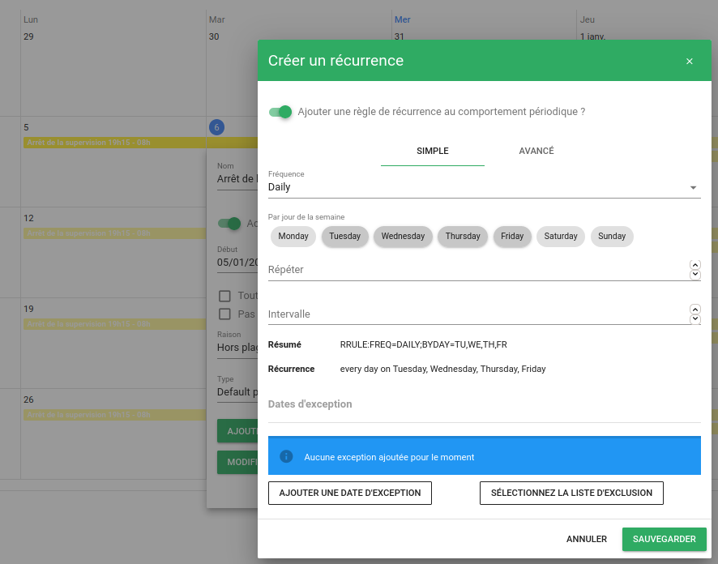
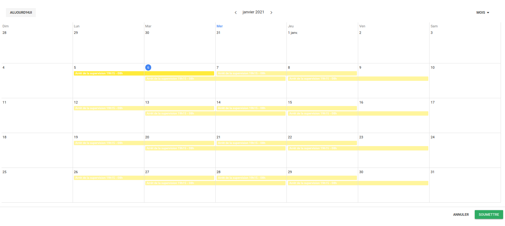
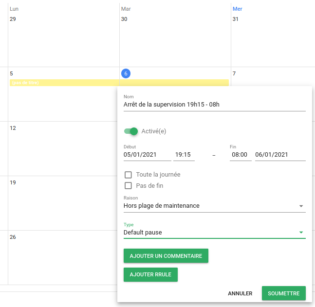
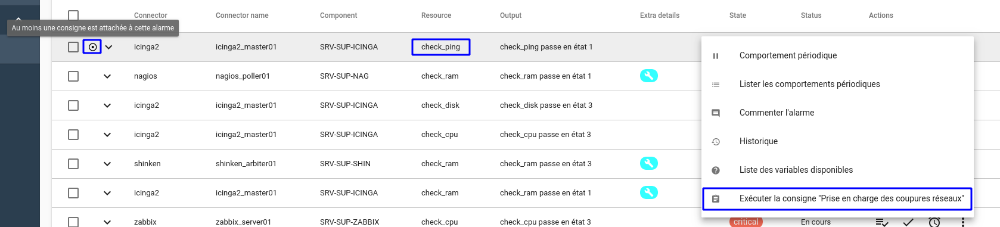
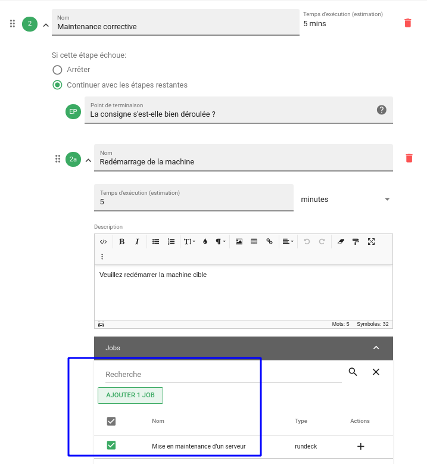
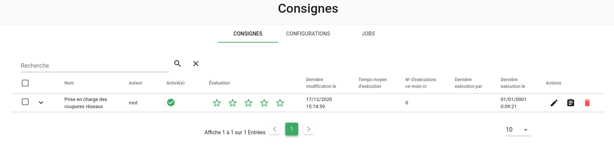

# Notes de version Canopsis 4.0.0

Canopsis 4.0.0 a été publié le 21 janvier 2021.

## Procédure d'installation

Suivre la [procédure d'installation de Canopsis](../guide-administration/installation/index.md).

Notez que cette procédure a été réécrite pour cette nouvelle version de Canopsis.

## Procédure de mise à jour

Canopsis 4.0.0 étant une nouvelle [version majeure](../guide-administration/mise-a-jour/numeros-version-canopsis.md) de Canopsis, la procédure de mise à jour diffère de la procédure habituelle. Le [Guide de migration vers Canopsis 4.0.0](migration/migration-4.0.0.md) doit **obligatoirement** être suivi pour les installations déjà en place.

## Changements entre Canopsis 3.48.0 et 4.0.0

### Planning / Pbehaviors

Dans cette version 4 de Canopsis, la fonctionnalité Comportements périodiques (ou *pbehaviors*) a été repensée pour pallier les problèmes de performance et de fiabilité qu'elle rencontrait.

Le moteur a d'abord été réécrit en langage Go et bénéficie, comme d'autres moteurs, de la possibilité de multi-instanciation. Un trafic d'événements élevé peut à présent être absorbé.
Du point de vue utilisateur, les comportements périodiques sont maintenant traités quasi instantanément lorsqu'ils sont créés ou mis à jour.
Pour finir, nous avons ajouté la possibilité de définir des types de comportements personnalisés.

Vous pouvez consulter la [documentation d'exploitation](../guide-utilisation/cas-d-usage/comportements_periodiques.md) ou encore la [documentation d'administration - lien obsolète]() pour mettre en œuvre cette fonctionnalité.

### Remédiation

Un nouveau module, la Remédiation, fait son apparition dans Canopsis. Il s'agit pour Canopsis de devenir le référentiel de consignes à appliquer face aux alarmes.

Jusque là, Canopsis s'appuyait sur un mécanisme de gestion de liens vers d'autres outils (wiki, base de connaissances…).

À présent, Canopsis peut :

* Présenter la bonne consigne associée à une alarme
* Exécuter des jobs en pilotant des ordonnanceurs de tâches (Rundeck et Awx/Ansible)
* Proposer des indicateurs de suivi

Vous pouvez consulter la [documentation d'exploitation](../guide-utilisation/remediation/index.md) ainsi que la [documentation d'administration](../guide-administration/remediation/index.md) du module de remédiation.

### Liste des modifications

*  **Documentation :**
    * Mise à jour de la documentation des [méthodes d'authentification avancées](../guide-administration/administration-avancee/methodes-authentification-avancees.md) ([#2882](https://git.canopsis.net/canopsis/canopsis/-/issues/2882))
    * Ajout de documentation pour la nouvelle fonctionnalité [Planification - lien obsolète]() ([#2805](https://git.canopsis.net/canopsis/canopsis/-/issues/2805))
    * Amélioration de la documentation des [templates Golang](../guide-utilisation/templates-go/index.md) ([#2189](https://git.canopsis.net/canopsis/canopsis/-/issues/2189))
    * Amélioration de la présentation globale de la documentation ([#2544](https://git.canopsis.net/canopsis/canopsis/-/issues/2544))
*  **UI :**
    * Pour les installations de type Docker, l'interface web est désormais gérée par le conteneur `nginx` ([#2705](https://git.canopsis.net/canopsis/canopsis/-/issues/2705))
    * Résolution d'un bug qui provoquait l'affichage systématique du tutoriel du bac à alarmes ([#2810](https://git.canopsis.net/canopsis/canopsis/-/issues/2810))
    * Ajout d'une page affichant l'enchaînement des moteurs. Cette page est accessible via le menu `Administration/Engines` ([#2385](https://git.canopsis.net/canopsis/canopsis/-/issues/2385))
    * Suppression des widgets de type : Statistiques (histogramme, courbes, tableau, compteur) et Diagramme de Pareto ([#2850](https://git.canopsis.net/canopsis/canopsis/-/issues/2850))
    * Résolution d'un bug lors de la connexion à l'interface de Canopsis en utilisant des identifiants insérés automatiquement (par un gestionnaire de mot de passe, par exemple) ([#2762](https://git.canopsis.net/canopsis/canopsis/-/issues/2762))
    * **Utilisateurs**
        * Ajout des colonnes Nom et Prénom à l'interface de gestion des utilisateurs ([#2799](https://git.canopsis.net/canopsis/canopsis/-/issues/2799))
        * Résolution d'un bug empêchant la suppression d'un utilisateur dont l'identifiant contient des caractères spéciaux ([#2798](https://git.canopsis.net/canopsis/canopsis/-/issues/2798))
    * **Pbehavior**
        * Ajout d'informations supplémentaires sur les comportements périodiques dans leur interface de gestion ([#2795](https://git.canopsis.net/canopsis/canopsis/-/issues/2795))
        * Ajout de la possibilité de faire une recherche dans les patterns des comportements périodiques depuis l'interface de gestion ([#2741](https://git.canopsis.net/canopsis/canopsis/-/issues/2741))
        * Les prochaines périodes des règles de récurrence d'un pbehavior sont maintenant affichées dans l'onglet `RRULE` ([#2556](https://git.canopsis.net/canopsis/canopsis/-/issues/2556))
    * **Explorateur de contexte**
        * Les préférences du widget explorateur de contexte sont maintenant partagées entre les utilisateurs ([#2801](https://git.canopsis.net/canopsis/canopsis/-/issues/2801))
    * **Bac à alarmes**
        * Possibilité de rendre obligatoire le champ note lors de la mise en veille d'une alarme ([#2816](https://git.canopsis.net/canopsis/canopsis/-/issues/2816))
        * Résolution d'un bug du bac à alarme qui pouvait parfois hériter de paramètres en provenance d'un autre bac à alarmes, de manière aléatoire ([#2804](https://git.canopsis.net/canopsis/canopsis/-/issues/2804))
        * Correction d'un bug dans l'affichage des causes des méta-alarmes ([#2708](https://git.canopsis.net/canopsis/canopsis/-/issues/2708))
        * Lors d'une recherche, les conséquences qui correspondent à la recherche sont montrées normalement tandis que les autres sont grisées ([#2841](https://git.canopsis.net/canopsis/canopsis/-/issues/2841))
    * **Weather widget**
        * Résolution d'un bug qui provoquait un dysfonctionnement lors du filtrage sur certaines variables ([#2846](https://git.canopsis.net/canopsis/canopsis/-/issues/2846))
        * Correction d'un bug dans le tri des tuiles du widget météo ([#2844](https://git.canopsis.net/canopsis/canopsis/-/issues/2844))
        * Ajout d'un opérateur `isEmptyArray` dans les filtres de la météo ([#2726](https://git.canopsis.net/canopsis/canopsis/-/issues/2726))
        * Ajout de compteurs sur les tuiles météo ([#2704](https://git.canopsis.net/canopsis/canopsis/-/issues/2704), [#2720](https://git.canopsis.net/canopsis/canopsis/-/issues/2720))
    * **Heartbeat**
        * Résolution d'un problème de suppression de heartbeat ([#2712](https://git.canopsis.net/canopsis/canopsis/-/issues/2712))
    * **Diffusion de messages**
        * Résolution d'un bug du bouton de validation du formulaire qui restait désactivé même après avoir corrigé les erreurs dans le formulaire ([#2836](https://git.canopsis.net/canopsis/canopsis/-/issues/2836))
    * **Actions**
        * Résolution d'un bug empêchant l'édition d'une action ([#2832](https://git.canopsis.net/canopsis/canopsis/-/issues/2832))
    * **Observateurs**
        * Résolution d'un bug du bouton "Play" des observateurs ([#2785](https://git.canopsis.net/canopsis/canopsis/-/issues/2785))
    * **Informations Dynamiques**
        * Ajout de la possibilité de chercher dans les patterns des informations dynamiques depuis l'interface de gestion ([#2741](https://git.canopsis.net/canopsis/canopsis/-/issues/2741))

*  **API :**
    * En installation Pro, l'API SNMP est à nouveau accessible par défaut ([#2681](https://git.canopsis.net/canopsis/canopsis/-/issues/2681))
    * Ajout d'un système de droits sur l'API ([#2361](https://git.canopsis.net/canopsis/canopsis/-/issues/2361))
    * Suppression de l'API d'internationalisation inutilisée ([#2665](https://git.canopsis.net/canopsis/canopsis/-/issues/2665))
    * Suppression de la route API `/api/v2/documentation` ([#2664](https://git.canopsis.net/canopsis/canopsis/-/issues/2664))
*  **Moteurs :**
    * Des changements sont intervenus dans les méthodes d'authentification CAS et LDAP, voir la [Procédure de mise à jour](#procedure-de-mise-a-jour) pour mettre à jour votre configuration ([#2833](https://git.canopsis.net/canopsis/canopsis/-/issues/2833), [#2834](https://git.canopsis.net/canopsis/canopsis/-/issues/2834))
    * **Axe**
        * Ajout de la date d'activation aux variables des alarmes ([#2312](https://git.canopsis.net/canopsis/canopsis/-/issues/2312), [#2675](https://git.canopsis.net/canopsis/canopsis/-/issues/2675))
        * Ajout d'une limite de longueur sur la propriété `long_output` des alarmes ([#2662](https://git.canopsis.net/canopsis/canopsis/-/issues/2662))
    * **CHE**
        * Résolution d'un bug causant une fuite de mémoire ([#318](https://git.canopsis.net/canopsis/go-engines/-/issues/318))
    * **Webhooks**
        * Ajout d'un fichier de configuration par défaut `/opt/canopsis/etc/webhook.conf.toml` ([#2820](https://git.canopsis.net/canopsis/canopsis/-/issues/2820))
        * Ajout de la possibilité de configurer un timeout sur les requêtes des webhooks ([#2780](https://git.canopsis.net/canopsis/canopsis/-/issues/2780))
        * Les numéros de tickets appliqués par des webhooks ont maintenant comme heure de création l'heure d'exécution du webhook ([#2141](https://git.canopsis.net/canopsis/canopsis/-/issues/2141))
    * **Action**
        * Ajout de la possibilité de filtrer les alarmes sur leur propriétés personnalisées ([#2802](https://git.canopsis.net/canopsis/canopsis/-/issues/2802))
        * Amélioration des logs de déboggage ([#2713](https://git.canopsis.net/canopsis/canopsis/-/issues/2713))
    * **pbehavior**
        * Lors de la création d'un comportement périodique, il est maintenant appliqué immédiatement ([#2738](https://git.canopsis.net/canopsis/canopsis/-/issues/2738))
        * Lors de la création d'une alarme, les comportements périodiques lui sont appliqués immédiatement ([#2738](https://git.canopsis.net/canopsis/canopsis/-/issues/2738))
        * Amélioration des performances ([#2694](https://git.canopsis.net/canopsis/canopsis/-/issues/2694))
    * **watchers**
        * Ajout de la possibilité d'utiliser l'attribut `component` dans un pattern ([#2822](https://git.canopsis.net/canopsis/canopsis/-/issues/2822))
    * **correlation (Meta-alarmes)**
        * Résolution d'un bug lors de la suppression d'une règle dont le champ ID contient des caractères spéciaux ([#2840](https://git.canopsis.net/canopsis/canopsis/-/issues/2840))
        * Résolution d'un bug lors de la récupération d'une liste d'alarmes avec la corrélation activée ([#2803](https://git.canopsis.net/canopsis/canopsis/-/issues/2803))
        * Résolution d'un problème de groupement d'alarmes ([#2858](https://git.canopsis.net/canopsis/canopsis/-/issues/2858))
        * Correction d'un bug qui permettait de réactiver une méta alarme résolue ([#2881](https://git.canopsis.net/canopsis/canopsis/-/issues/2881))
*  **Général :**
    * Suppression de `task_shell`, `task_mail`, `task_ack_centreon`, `task_file`, `task_reporting` ([#2750](https://git.canopsis.net/canopsis/canopsis/-/issues/2750))
    * Ajout de l'outil `canopsis-reconfigure` ([#2556](https://git.canopsis.net/canopsis/canopsis/-/issues/2556))
    * Résolution d'un problème dans la version Docker, le conteneur `nginx` redémarrait en boucle tant que les autres conteneurs n'étaient pas prêts ([#2783](https://git.canopsis.net/canopsis/canopsis/-/issues/2783))
    * Suppression de l'outil `calink` ([#2733](https://git.canopsis.net/canopsis/canopsis/-/issues/2733))
    * Ajout d'un système de profilage de mémoire ([#318](https://git.canopsis.net/canopsis/go-engines/-/issues/318))
    * Ajout d'une possibilité de configuration de cookies sécurisés pour les connexions HTTPS ([#2745](https://git.canopsis.net/canopsis/canopsis/-/issues/2745))
