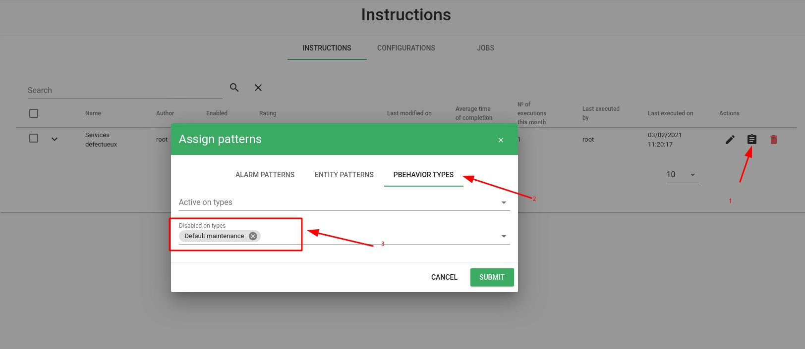

# Notes de version Canopsis 4.1.0

Canopsis 4.1.0 a été publié le 11 mars 2021.

## Procédure d'installation

Suivre la [procédure d'installation de Canopsis](../guide-administration/installation/index.md).

## Procédure de mise à jour

Suivre la [procédure standard de mise à jour de Canopsis](../guide-administration/mise-a-jour/index.md).

## Changements entre Canopsis 4.0.3 et 4.1.0

### Gestion des connexions et reconnexions aux services tiers

Les méthodes de reconnexions aux services `mongodb`, `rabbitmq`, `redis` ont été revues. De nouveaux paramètres ont été introduits.

Vous pouvez consulter la [documentation associée](../guide-administration/administration-avancee/reconnexion-automatique.md).

### Interactions entre les remédiations et les comportements périodiques

Il est désormais possible de faire des assignations de consignes liées à la temporalité.
Plus concrètement, une alarme peut avoir des consignes différentes en fonction de périodes définies grâce aux pbehaviors (exemple : jour/nuit, semaine/weekend…).

### Journalisation des actions utilisateurs

Canopsis inclut une "journalisation" des actions exécutées.
 
Qu'il s'agisse d'une/un :

* création, 
* mise à jour, 
* suppression, 
* export, 
* import

chaque action effectuée fait dorénavant l'objet d'une création de ligne dans les logs du service `canopsis-api`.

Pour cette version 4.1, les objets en rapport avec les pbehaviors et la remédiation sont pris en charge. Les autres types d'objets seront traités dans les versions suivantes.

### Liste des modifications

*  **UI :**
    * **Pbehavior**
        * Résolution d'un bug sur le calendrier des pbehaviors qui empêchait la sélection d'une période ([#3023](https://git.canopsis.net/canopsis/canopsis/-/issues/3023))
        * Renommage du terme `RRULE` en `Recurrence Rule` et `Règle de récurrence` pour plus de clarté ([#3022](https://git.canopsis.net/canopsis/canopsis/-/issues/3022))
        * Les exceptions sont maintenant clairement présentées sur le planning d'un pbehavior ([#2933](https://git.canopsis.net/canopsis/canopsis/-/issues/2933))
        * Le tri sur la colonne `status` n'est pas possible. Il a été désactivé ([#2880](https://git.canopsis.net/canopsis/canopsis/-/issues/2880))
        * Il n'est maintenant plus autorisé de publier un commentaire vide ([#2866](https://git.canopsis.net/canopsis/canopsis/-/issues/2866))
    * **Remédiation**
        * Possibilité d'utiliser d'autres types que les chaînes dans les payloads de job ([#2946](https://git.canopsis.net/canopsis/canopsis/-/issues/2946))
        * Ajout d'un pictogramme montrant l'état du job lorsqu'il a été exécuté ([#2886](https://git.canopsis.net/canopsis/canopsis/-/issues/2886))
        * Il est désormais possible d'assigner une consigne à une alarme en fonction des pbehaviors ([#2778](https://git.canopsis.net/canopsis/canopsis/-/issues/2778))
    * **Bac à alarmes**
        * Résolution d'un bug qui présentait des résultats faux sur la liste des pbehaviors en cours d'une alarme au moment du rafraîchissement ([#2944](https://git.canopsis.net/canopsis/canopsis/-/issues/2944))
        * Résolution d'un bug présent sur le tri des durées d'alarmes ([#2885](https://git.canopsis.net/canopsis/canopsis/-/issues/2885))
        * Résolution d'un bug qui obligeait au double clic pour éditer un pbehavior à partir d'une alarme ([#2875](https://git.canopsis.net/canopsis/canopsis/-/issues/2875))
        * Ajout de la possibilité d'afficher les liens `linkbuilder` directement dans une colonne ([#2819](https://git.canopsis.net/canopsis/canopsis/-/issues/2819))
    * **Weather widget**
        * Ajout de la possibilité de vider la file d'attente des actions réalisées sur une modale de météo ([#2940](https://git.canopsis.net/canopsis/canopsis/-/issues/2940))
    * **Explorateur de contexte**
        * Ajout de la prise en compte des types `Number`, `Boolean`, `List` dans les informations personnalisées ([#2930](https://git.canopsis.net/canopsis/canopsis/-/issues/2930))
    * **Playlist**
        * Résolution d'un bug qui rendait l'affichage des listes dont le nom était trop long non élégant ([#2837](https://git.canopsis.net/canopsis/canopsis/-/issues/2837))
    * **Informations dynamiques**
        * Il n'est désormais plus possible de modifier un _id de règle ([#2857](https://git.canopsis.net/canopsis/canopsis/-/issues/2857))
    * **Webhooks**
        * Résolution d'un bug qui empêchait le scroll de la fenêtre de payload ([#2825](https://git.canopsis.net/canopsis/canopsis/-/issues/2825))
*  **Moteurs :**
    * **Axe**
        * Axe prend maintenant en charge la production des compteurs `ok`, `ko`, `last_ko`, et `last_event` autrefois gérés par engine-stat ([#2887](https://git.canopsis.net/canopsis/canopsis/-/issues/2887))
    * **Custom trap SNMP**
        * La méthode `build_event` renvoie à présent `False` lorsqu'il n'y a eu aucun match ([#2853](https://git.canopsis.net/canopsis/canopsis/-/issues/2853))
*  **API :**
    * **pbehavior**
        * Correction du message d'erreur renvoyé lors de la création d'un pbehavior lorsque son type est inexistant ([#2906](https://git.canopsis.net/canopsis/canopsis/-/issues/2906))
    * **event**
        * Correction d'un bug qui permettait l'utilisation de l'api `event` sans y être autorisé ([#2902](https://git.canopsis.net/canopsis/canopsis/-/issues/2902))
*  **Général :**
    * Les erreurs type `Forbidden` sont maintenant soumises au timeout `Error popup timeout` ([#2905](https://git.canopsis.net/canopsis/canopsis/-/issues/2905))
    * Ajout des droits concernant les entités dans le panneau de gestion ([#2903](https://git.canopsis.net/canopsis/canopsis/-/issues/2903))
    * Les listes présentées par l'interface web ont été harmonisées sur les plans de la pagination, de la possibilité de plier/déplier ([#2787](https://git.canopsis.net/canopsis/canopsis/-/issues/2787))
    * Mise en place de l'interdiction de modifier le champ `_id` d'un objet ([#2824](https://git.canopsis.net/canopsis/canopsis/-/issues/2824))
    * Mise en place d'un système de journalisation des actions utilisateurs et API ([#2755](https://git.canopsis.net/canopsis/canopsis/-/issues/2755))
