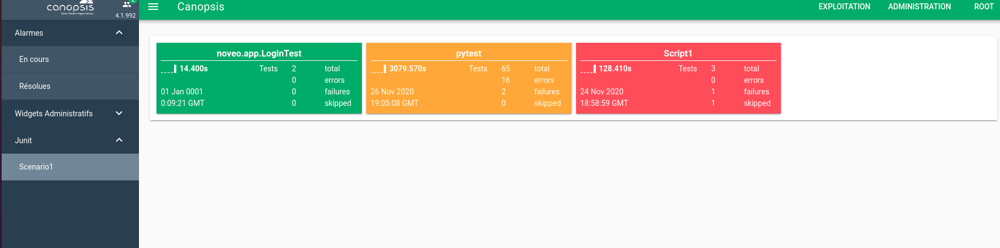
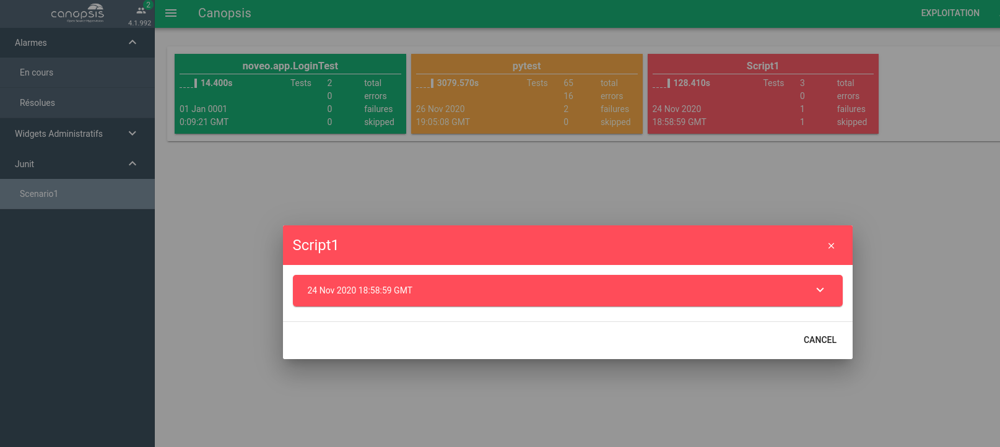
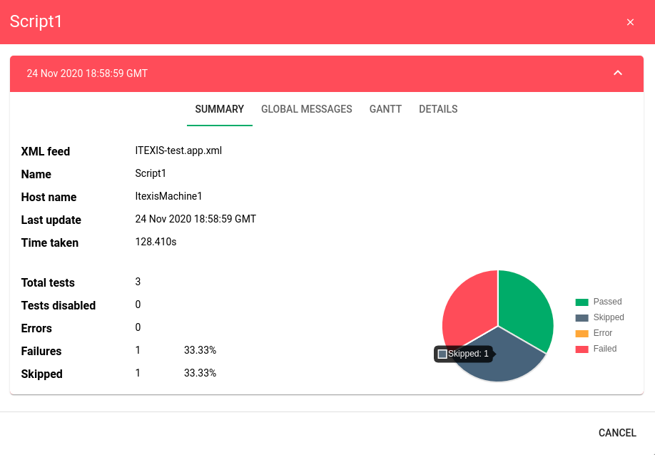
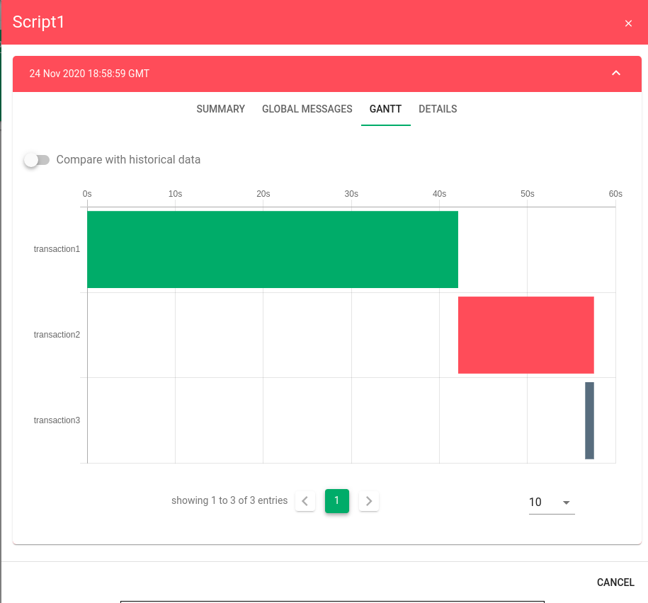
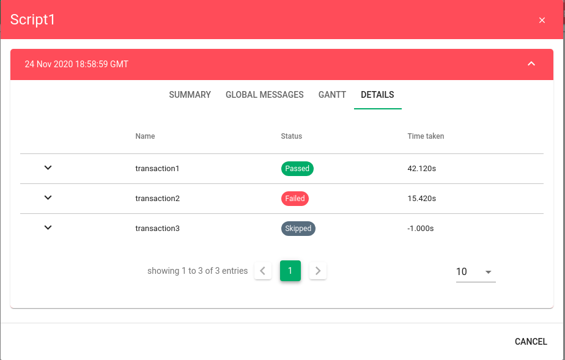

# Notes de version Canopsis 4.3.0

Canopsis 4.3.0 a été publié le 26 août 2021.

## Procédure d'installation

Suivre la [procédure d'installation de Canopsis](../guide-administration/installation/index.md).

## Procédure de mise à jour

Canopsis 4.3.0 apporte des changements importants tant au niveau technique que fonctionnel. À ce titre, le [Guide de migration vers Canopsis 4.3.0](migration/migration-4.3.0.md) doit obligatoirement être suivi pour les mises à jour d'installations déjà en place.

## Problèmes connus

### Plugin d'enrichissement externe `datasource` (`engine-che`) non fonctionnel

Le plugin d'enrichissement externe [`datasource` - lien obsolète]() pour `engine-che` n'est pas fonctionnel avec Canopsis 4.3.0 (bug #3748).

Ce plugin n'est pas activé par défaut. Si vous utilisez cette fonctionnalité, il est recommandé de ne pas mettre à jour vers Canopsis 4.3.0 et d'attendre une nouvelle version résolvant cette incompatibilité.

## Changements entre Canopsis 4.2.0 et 4.3.0

### Transition des watchers aux services

La notion de *watchers* (ou *observateurs*) a été supprimée de Canopsis. Elle a été remplacée par le concept des services et des arbres de dépendances.

### Migration APIv2 vers APIv4

La quasi totalité des API bénéficient d'une montée de version. Le préfixe qui été auparavant `/api/v2` devient `/api/v4`.

L'interface web de Canopsis exploite déjà ces nouvelles API de façon transparente.

Si vous utilisez ces API dans des scripts ou des applications tierces, vous devez obligatoirement les adapter à ces nouvelles API. Notez qu'il ne s'agit pas forcément que d'un changement de préfixe : certaines structures ont également évolué.

Pour réaliser cette transition, vous pouvez vous aider de [la page de documentation Swagger](../guide-developpement/swagger-pro/index.md).

### Refonte des Idle Rules

La fonctionnalité *Idle Rules* a été revue dans cette version. Il s'agit de la possibilité de réagir (exécution d'actions) lorsqu'aucun évènement ou changement n'a lieu sur une alarme ou une entité durant une période.

Quelques cas d'usage :

* Une alarme n'a pas reçu d'acquittement alors qu'elle a été créée il y a 30 minutes : une augmentation de la criticité est exécutée.
* Certaines sources de données ne sont pas en mesure de générer des contre alarmes : si aucune mise à jour d'alarme dans ce cas n'est reçu pendant 10 minutes, Canopsis clôture l'alarme

La documentation de cette fonctionnalité arrive prochainement.

### Nouveau module JUnit (bêta)

!!! information
    Nous n'assurons pas de support pour le moment pour ce module qui est publié en version Bêta.

Canopsis 4.3.0 introduit un module capable de recevoir des résultats d'exécution de scénarios au format XML [JUnit](https://fr.wikipedia.org/wiki/JUnit).

Le module comprend :

* Un récepteur (via API) de fichiers XML au format JUnit.
* Un moteur capable de parser, générer des alarmes à partir des résultats reçus.
* Un widget pour l'interface graphique capable de présenter les résultats sous diverses formes.

La documentation complète sera publiée prochainement.

Voici quelques copies d'écran pour vous donner un aperçu.

{: .link width=80%"}
{: .link width=80%"}

{: .link width=80%"}

{: .link width=80%"}

{: .link width=80%"}

### Liste des modifications

*  **UI :**
    * Les menus Exploitation et Administration ont été réorganisés (#423)
    * **Météo des services**
        * Résolution d'un bug qui empêchait l'affichage correct d'un comportement périodique (#142)
    * **Filtrage d'évènements**
        * Homogénéisation des colonnes affichées dans la liste des règles d'event-filter (#490)
    * **Scénarios**
        * Ajout de l'auteur dans les colonnes de la liste des scénarios (#50)
    * **Comportements périodiques**
        * Prise en charge de la syntaxe `LIKE` dans la fonction de recherche (#217)
    * **Explorateur de contexte**
        * Correction d'un bug qui empêchait l'utilisation de l'opérateur `NOT` dans la recherche (#3747)
    * **Bac à alarmes**
        * Correction d'un bug qui rendait le tri des durées d'alarmes inopérant (#402)
        * Ajout de la prise en charge du HTML dans les tooltips (#148)
        * Dans l'export de fichiers CSV, ajout d'une option de configuration du format des dates, des états et des criticités (#113)
    * **Remédiation**
        * Ajout d'un tooltip de réussite d'exécution d'un job (#145)
        * L'auteur d'une consigne ou d'une configuration de consigne est correctement présenté par son nom au lieu de son ID (#213)
*  **API :**
    * Ajout d'un mécanisme de validation d'ID (#222)
    * Correction d'un bug qui empêchait de supprimer des objets dont l'ID contenait des caractères spéciaux (#58)
    * Suppression de la prise en charge de CORS : cette partie de la configuration est maintenant gérée par Nginx uniquement (#3768)
    * **Event**
        * Ajout de la prise en charge du format `url-encoded` (#263)
    * **Pbehavior**
        * Ajout d'un mécanisme d'avertissement du nombre d'entités impactées par un filtre de pbehavior (#139)
    * **Scenarios**
        * Support de l'action `changestate` vers la criticité « Info »  (#53)
        * Il est maintenant possible de spécifier un identifiant (`_id`) dans un payload de règles (#3750)
        * Ajout de la prise en charge des réponses vides dans les webhooks (#55)
*  **Moteurs :**
    * Mise à jour de Go 1.15 vers [Go 1.16](https://golang.org/doc/go1.16) (#159)
    * `engine-che` : Mise à disposition de deux nouvelles actions d'enrichissement : `copy_to_entity_info` et `set_entity_info` (#212)
    * `engine-fifo` : Début de support des statistiques de traitement d'évènements (#127)
    * `engine-correlation` : La politique des dates `last_update_date` et `last_event_date` des méta alarmes a été revue (#352)
    * `engine-service` : Remplace l'ancien `engine-watcher`. Le nouveau moteur accepte la multi-instanciation
*  **Général :**
    * Il est maintenant possible de connaitre l'origine d'une action ; un attribut `initiator` fait son apparition (#136)
    * Les fonctions des [templates Go](../guide-utilisation/templates-go/index.md), notamment `uppercase` et `lowercase`, sont maintenant disponibles de manière homogène dans Canopsis (#3717)
*  **Images Docker/paquets :**
    * Nginx : mise à jour vers Nginx 1.20.1, uniformisation entre Docker et les paquets RPM, correction de la prise en charge des espaces et de certains caractères spéciaux dans les URL renvoyées à l'API Canopsis, réduction du cache des requêtes DNS lors de l'utilisation du résolveur interne à Docker (#108)
    * SELinux est maintenant accepté en mode Permissif (#119)
    * Correction de la protection des fichiers de configuration dans les paquets RPM lors d'une mise à jour ; régression introduite dans Canopsis 4.0.0 (#134)
