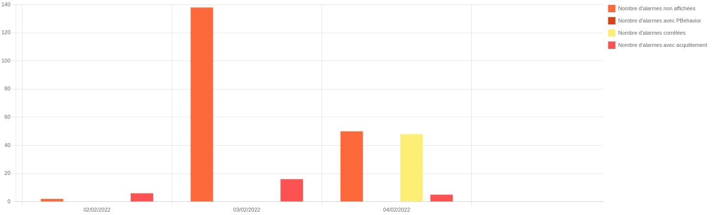
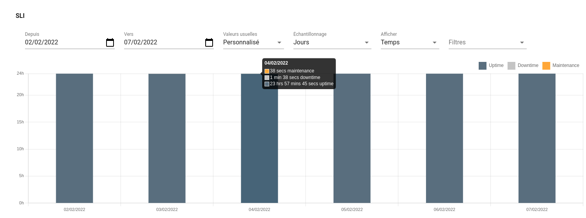

# Notes de version Canopsis 4.5.0

Canopsis 4.5.0 a été publié le 18 février 2022.

## Procédure d'installation

Suivre la [procédure d'installation de Canopsis](../guide-administration/installation/index.md).

Notez que la [matrice des flux réseau](../guide-administration/matrice-des-flux-reseau/index.md) a été ajustée pour cette version (suppression d'InfluxDB, ajout de PostgreSQL/TimescaleDB).

## Procédure de mise à jour

Canopsis 4.5.0 apporte des changements importants tant au niveau technique que fonctionnel. À ce titre, le [Guide de migration vers Canopsis 4.5.0](migration/migration-4.5.0.md) doit obligatoirement être suivi pour les mises à jour d'installations déjà en place.

## Problèmes connus

### Plugin d'enrichissement externe `datasource` (`engine-che`) non fonctionnel

Le plugin d'enrichissement externe [`datasource`](../guide-administration/moteurs/moteur-che.md#activation-des-plugins-denrichissement-externe-datasource) pour `engine-che` n'est pas fonctionnel avec Canopsis 4.3.0 (bug #3748).

Ce plugin n'est pas activé par défaut. Si vous utilisez cette fonctionnalité, il est recommandé de ne pas mettre à jour vers Canopsis 4.5.0 et d'attendre une nouvelle version résolvant cette incompatibilité.

## Changements entre Canopsis 4.4.x et 4.5.0

### KPI/Indicateurs clés/Retour sur investissement

Canopsis 4.5.0 est livré avec un module d'indicateurs clés permettant de calculer le retour sur investissement sur l'utilisation même de Canopsis.  
Ce module est disponible dans l'édition PRO de Canopsis.

{: .link width=80%"}
{: .link width=80%"}

### Liste des modifications

*  **UI :**
    * Ajout d'un helper Handlebars `replace` (#4004)
    * Le droit technique pour `Actions` est maintenant classé dans la catégorie `Exploitation` (#4074)
    * Correction d'une erreur qui survenait lors d'une navigation trop rapide de vue en vue (#4139)
    * Correction d'un bug qui présentait une page blanche après un rafraîchissement de l'UI (#4222)
    * Il est à présent possible de désactiver des actions durant une comportement périodique de type `Inactive` (#4141)
    * **Exploitation**
        * Ajout d'une zone de commentaire sur les webhooks dans les scénarios (#3995)
        * Ajout de la possibilité de visualiser une règle de récurrence sur un calendrier (#130)
        * La gestion des règles SNMP est à nouveau opérationnelle (#4125)
    * **Administration**
        * Ajout d'un menu `Bilan de santé` présentant les informations de healthcheck (#3807)
    * **Bac à alarmes**
        * Correction du freeze qui pouvait avoir lieu lors du scroll vertical du bac à alarmes (#3889)
        * Maintient de l'entête (nom des colonnes) du tableau d'alarmes (#3889, #227)
        * Il est maintenant possible de choisir l'attribut de temps appliqué dans la fonction "live reporting" (#138)
    * **Explorateur de contexte**
        * La suppression de masse est à nouveau disponible pour les entités (#3861)
        * Mise à disposition d'attributs complémentaires : Nombre OK/KO, Pbehaviors, Etat (#3769)
    * **Junit**
        * Le diagramme de Gantt embarque à présent une étape contenant le temps total d'exécution (#3968)
        * Possibilité de définir des seuils de valeur 0 (#3967)
    * **Météo des services**
        * Possibilité d'exécuter une remédiation depuis la modale d'une météo de services (#3964)
        * Correction d'un bug qui affichait 2 icones d'état sur des ressources dans certains cas (#4135)
        * Correction de plusieurs bugs qui entrainaient un mauvais calcul de sévérité et de compteurs sur les tuiles de météo (#4181)
*  **API :**
    * L'API est maintenant capable de mettre à jour les valeurs de Timezone et UserInterface chaque minute (#3985)
    * Correction d'un bug qui dupliquait l'événement émis lors de la mise à jour d'un comportement périodique (#4088)
    * Ajout de mode `Bulk` pour certaines API (entityservices, eventfilters, idle-rules, pbehaviors, scenarios, users, view-groups, views) (#4024)
    * **Healthcheck**
        * Correction d'un bug qui présentait le module de healthcheck en erreur en version Community (#4127)
    * **Authentfication SAML**
        * Ajout de la possibilité de 'mapper' les rôles de l'Idp sur les rôles de Canopsis (#4035)
*  **Moteurs :**
    * **Webhook**
        * Ajout de messages de log (niveau WRN) lorsqu'une tentative échoue (#4049)
    * **Axe**
        * Correction d'un crash du moteur entrainé par la publication d'un snooze sans durée (#4078)
        * Correction d'un bug qui empêchait la mise à jour des règles de bagot en mode multi-instances (#4107)
    * **Che**
        * Correction d'une gestion de cache pour des services qui pouvait ne pas être mis à jour correctement (#4109)
    * **Remediation**
        * Correction d'un bug qui faisait échouer une remédiation au timeout de l'expiration d'un lock (#4096)
        * Correction d'un bug qui ajoutait des étapes de timeline sur une mauvaise alarme (#4099)
    * **Dynamic-Infos**
        * Correction d'un bug qui empêchait l'utilisation des templates Go dans une valeur d'information dynamique (#4122)
*  **Général :**
    * Passage de MongoDB 3.6 à MongoDB 4.2 (#3756)
    * Remplacement d'InfluxDB par TimescaleDB (#4032)
    * Correction d'un bug qui empêchait le bon fonctionnement du `random-feeder` (#4082)
