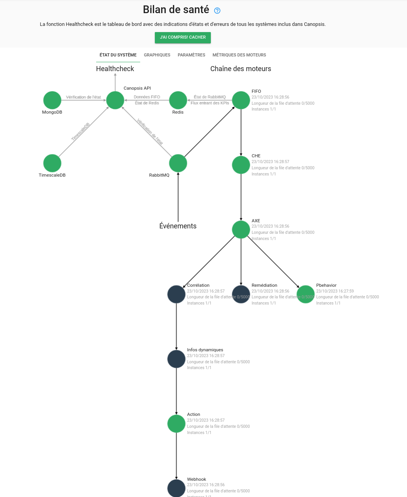

# Guide de migration vers Canopsis 23.10.0

Ce guide donne les instructions vous permettant de mettre à jour Canopsis 23.04 (dernière version disponible) vers [la version 23.10.0](../23.10.0.md).

## Prérequis

L'ensemble de cette procédure doit être lu avant son exécution.

Ce document ne prend en compte que Canopsis Community et Canopsis Pro : tout développement personnalisé dont vous pourriez bénéficier ne fait pas partie du cadre de ce Guide de migration.

Les fichiers de référence qui sont mentionnés dans ce guide sont disponibles à ces adresses

| Édition           | Sources                                                                                                                              |
| ----------------- | ------------------------------------------------------------------------------------------------------------------------------------ |
| Édition Community | [https://git.canopsis.net/canopsis/canopsis-community/-/releases](https://git.canopsis.net/canopsis/canopsis-community/-/releases)   |
| Édition pro       | [https://git.canopsis.net/sources/canopsis-pro-sources/-/releases](https://git.canopsis.net/sources/canopsis-pro-sources/-/releases) |

[TOC]

## Procédure de mise à jour

### Réalisation d'une sauvegarde

Des sauvegardes sont toujours recommandées, qu'elles soient régulières ou lors de modifications importantes.

La restructuration apportée dans les bases de données pour cette version de Canopsis nous amène à insister d'autant plus sur ce point. Il est donc fortement recommandé de réaliser une **sauvegarde complète** des VM hébergeant vos services Canopsis, avant cette mise à jour.


### Arrêt de l'environnement en cours de lancement

Vous devez prévoir une interruption du service afin de procéder à la mise à jour qui va suivre.

=== "Docker Compose"

    ```sh
    CPS_EDITION=pro docker compose down
    ```

=== "Paquets RHEL 8"

    ```sh
    systemctl stop canopsis
    systemctl stop mongod
    systemctl stop postgresql-13
    systemctl stop rabbitmq-server
    systemctl stop redis
    ```

## Environnement SNMP

Depuis la version 22.10, le moteur SNMP n'était plus intégré nativement dans Canopsis. 
Pour pouvoir continuer à l'utiliser, nous vous avions recommandé [d'utiliser une version ancienne](./migration-23.04.0.md#moteur-snmp-et-linkbuilder).  
Cela n'est plus nécessaire, le moteur SNMP a été réintégré dans Canopsis 23.10.  

**Suppression de l'environnement obsolète**

```sh
cd canopsis-pro-sources-release-23.04-pro-mock-external-services-snmp-docker
cd mock/external-services/snmp/docker
docker compose down
```

**Intégration du nouvel environnement**

=== "Docker Compose"

    Le moteur SNMP ainsi que la gestion des règles SNMP sont à présent nativement intégrés à Canopsis. Vous n'avez rien à faire.

=== "Paquets RHEL 8"

    Activation du service :

    ```sh
    systemctl enable --now canopsis-engine-python-snmp.service
    ```

## Conversion de MongoDB noeud unique en MongoDB replicaset

Canopsis 23.10 IMPOSE à présent d'utiliser MongoDB en [replicaset](https://www.mongodb.com/docs/manual/replication/).  
Si votre installation utilise un noeud unique MongoDB, vous devez le migrer vers un replicaset.  

!!! warning "Avesrtissement"
    Ce guide de migration vous propose une procédure vous permettant de convertir votre mongoDB standalone en replicaset à UN SEUL NOEUD.  
    En aucun cas vous ne devez utiliser cela sur votre système de production.


=== "Docker Compose"

    Voici les différentes étapes de la procédure
    
    1. Réalisation d'un `dump` MongoDB
    1. Suppression du volume accueillant les données MongoDB
    1. Démarrage de MongoDB en mode replicaset
    1. Import du dump précédemment réalisé

    Démarrez le conteneur `mongodb` :

    ```sh
    CPS_EDITION=pro docker compose start mongodb
    ```

    Réalisez un dump dans le conteneur puis rappatriez-le :

    ```sh
    CPS_EDITION=pro docker compose exec mongodb mongodump --uri $CPS_MONGO_URL --gzip --archive="/tmp/backup_mongodb_canopsis_23.04.gz"
    CPS_EDITION=pro docker compose cp mongodb:/tmp/backup_mongodb_canopsis_23.04.gz /tmp
    CPS_EDITION=pro docker compose stop mongodb
    ```

    * Supprimez le volume associé au conteneur MongoDB

    **On repère le conteneur qui utilise le volume et on le supprime**

    ```sh
    docker ps -a|grep mongodb
    ```
    
    **On utilise l'identifiant renvoyé et on exécute la commande de suppression du conteneur**

    ```sh
    docker rm 208fdd8ce5f3
    ```

    **Enfin, on identifie le volume et on le supprime**

    ```sh
    docker volume inspect canopsis-pro_mongodbdata
    docker volume rm canopsis-pro_mongodbdata
    ```

    Les opérations de démarrage de mongoDB en mode replicaset et d'import nécessitent de récupérer les configurations de références livrées avec Canopsis 23.10.  
    Elles sont décrites dans le chapitre suivant.


=== "Paquets RHEL 8"

    Voici les différentes étapes de la procédure
    
    1. Réalisation d'un `dump` MongoDB
    1. Initialisation de MongoDB en mode replicaset
    1. Vérifications

    **Dump MongoDB**

    Démarrez le service `mongodb` :

    ```sh
    systemctl start mongod
    ```

    Réalisez un dump :

    ```sh
    set -o allexport; source /opt/canopsis/etc/go-engines-vars.conf
    mongodump --uri $CPS_MONGO_URL --gzip --archive="/tmp/backup_mongodb_canopsis_23.04.gz"
    ```

    **Migration vers un replicaset**

    Création d'une clé :

    ```sh
    openssl rand -base64 756 > /etc/mongodb-keyfile
    chmod 400 /etc/mongodb-keyfile
    chown mongod:root /etc/mongodb-keyfile
    ```

    Adaptation du fichier de configuration mongoDB :

    ```
    security:
      authorization: enabled
      keyFile: /etc/mongodb-keyfile
      
    replication:
      oplogSizeMB: 1024
      replSetName: rs0 
    ```

    Redémarrage du service :

    ```
    systemctl restart mongod
    ```

    Initialisation du replicaset :

    ```sh
    mongo admin -u UTILISATEUR_ADMIN -p
    > rs.initiate()
    ```

    **Vérifications**

    Le prompt suivant doit vous indiquer que vous êtes sur le noeud primaire `rs0:PRIMARY` :

    ```sh
    > rs.status()
    ```

    Vous devez pouvoir accéder à la base de données Canopsis :

    ```sh
    > use canopsis
    > show collections
    ```


## Mise à jour Canopsis

!!! information "Information"

    Canopsis 23.10 est livré avec un nouveau jeu de configurations de référence.
    Vous devez télécharger ces configurations et y reporter vos personnalisations.  


!!! warning "Avertissement"

    Les changements notables les plus importants sont :  

    * Suppression du moteur `engine-service`. Les calculs effectués par ce moteur sont à présent répartis entre `engine-che` et `engine-axe`.
    * Suppression du paramètre `EnableLastEventDate` du fichier canopsis.toml. Ce paramètre est désormais appliqué quoi qu'il arrive.
    * Les paramètres `launch_job_retries_*` et  `wait_job_complete_retries_*` de la section [Remédiation](../../../guide-administration/administration-avancee/modification-canopsis-toml/#section-remediation) n'existent plus.

=== "Docker Compose"

    Si vous êtes utilisateur de l'édition `community`, voici les étapes à suivre.

    Télécharger le paquet de la version 23.10.0 (canopsis-community-docker-compose-23.10.0.tar.gz) disponible à cette adresse [https://git.canopsis.net/canopsis/canopsis-community/-/releases](https://git.canopsis.net/canopsis/canopsis-community/-/releases).

    ```sh
    export CPS_EDITION=community
    tar xvfz canopsis-community-docker-compose-23.10.0.tar.gz
    cd canopsis-community-docker-compose-23.10.0
    ```

    Si vous êtes utilisateur de l'édition `pro`, voici les étapes à suivre.

    Télécharger le paquet de la version 23.10.0 (canopsis-pro-docker-compose-23.10.0.tar.gz) disponible à cette adresse [https://git.canopsis.net/sources/canopsis-pro-sources/-/releases](https://git.canopsis.net/sources/canopsis-pro-sources/-/releases).

    ```sh
    export CPS_EDITION=pro
    tar xvfz canopsis-pro-docker-compose-23.10.0.tar.gz
    cd canopsis-pro-docker-compose-23.10.0
    ```

    À ce stade, vous devez synchroniser les modifications réalisées sur vos anciens fichiers de configuration `docker-compose` avec les fichiers `docker-compose.yml` et/ou `docker-compose.override.yml`.

=== "Paquets RHEL 8"

    Non concerné car ces configurations sont livrées directemement dans les paquets RPM.

### Lancement de MongoDB en mode Replicaset

=== "Docker Compose"

    Démarrez les conteneurs `mongodb-rs-init` et `mongodb` :

    ```sh
    CPS_EDITION=pro docker compose up -d mongodb-rs-init
    ```
   
    À ce stade, MongoDB est démarré en Replicaset. Il reste à importer le dump réalisé précédemment :

    ```sh
    CPS_EDITION=pro docker compose cp /tmp/backup_mongodb_canopsis_23.04.gz mongodb:/tmp
    CPS_EDITION=pro docker compose exec mongodb mongorestore --uri $CPS_MONGO_URL --drop --gzip --db canopsis --archive=/tmp/backup_mongodb_canopsis_23.04.gz
    ```

=== "Paquets RHEL 8"

    Non concerné car MongoDB a déjà été démarré en replicaset dans le chapitre précédent.

### Mise à jour de RabbitMQ

Dans cette version de Canopsis, le bus rabbitMQ passe à la version 3.12.x.  

Par ailleurs, Les exchanges suivants doivent être supprimés car ils ne sont plus utilisés par Canopsis :

* canopsis.incidents
* canopsis.alerts
* canopsis

Vous pouvez effectuer cette opération en utilisant l'interface graphique de management de RabbitMQ.


=== "Docker Compose"

    Il suffit de démarrer le conteneur

    ```sh
    CPS_EDITION=pro docker compose up -d rabbitmq
    ```

=== "Paquets RHEL 8"

    Passage en version 3.12 puis lancement du service `rabbitmq-server` :

    ```sh
    dnf install --repo rabbitmq_erlang --repo rabbitmq_server erlang rabbitmq-server-3.12.7
    systemctl restart rabbitmq-server
    ```

### Remise à 0 du cache Redis

Dans cette version de Canopsis, le cache de Canopsis doit repartir à 0.

=== "Docker Compose"

    ```sh
    CPS_EDITION=pro docker compose up -d redis
    CPS_EDITION=pro docker compose exec redis /usr/local/bin/redis-cli -a canopsis flushall
    OK
    ```

=== "Paquets RHEL 8"

    ```sh
    systemctl start redis
    /bin/redis-cli -a canopsis flushall
    ```

### Lancement du provisioning `canopsis-reconfigure`

#### Synchronisation du fichier de configuration `canopsis.toml` ou fichier de surcharge

Si vous avez modifié le fichier `canopsis.toml` (vous le voyez via une définition de volume dans votre fichier docker-compose.yml), vous devez vérifier qu'il soit bien à jour par rapport au fichier de référence.  

* [`canopsis.toml` pour Canopsis Community 23.10.0](https://git.canopsis.net/canopsis/canopsis-community/-/blob/23.10.0/community/go-engines-community/cmd/canopsis-reconfigure/canopsis-community.toml)
* [`canopsis.toml` pour Canopsis Pro 23.10.0](https://git.canopsis.net/canopsis/canopsis-community/-/blob/23.10.0/community/go-engines-community/cmd/canopsis-reconfigure/canopsis-pro.toml)

!!! information "Information"

    Pour éviter ce type de synchronisation fastidieuse, la bonne pratique est d'utiliser [un fichier de surcharge de cette configuration](../../../guide-administration/administration-avancee/modification-canopsis-toml/). 


Si vous avez utilisé un fichier de surcharge, alors vous n'avez rien à faire, uniquement continuer à le présenter dans un volume.

#### Reconfiguration de Canopsis

=== "Docker Compose"

    !!! Attention

    Si vous avez personnalisé la ligne de commande de l'outil `canopsis-reconfigure`, nous vous conseillons de supprimer cette personnalisation.
    L'outil est en effet pré paramétré pour fonctionner naturellement.

    ```sh
    CPS_EDITION=pro docker compose up -d reconfigure
    ```

    !!! information "Information"

        Cette opération peut prendre plusieurs minutes pour s'exécuter.

    Vous pouvez ensuite vérifier que le mécanisme de provisioning/reconfigure s'est correctement déroulé. Le conteneur doit présenté un "exit 0"

    ```sh
    CPS_EDITION=pro docker compose ps -a|grep reconfigure
    canopsis-pro-reconfigure-1            "/canopsis-reconfigu…"   reconfigure            exited (0)
    ```

=== "Paquets RHEL 8"

    La commande `canopsis-reconfigure` doit être exécutée après mise à jour de Canopsis dans le cadre d'installation par paquets RPM.

### Mise à jour et démarrage final de Canopsis

Enfin, il vous reste à mettre à jour et à démarrer tous les composants applicatifs de Canopsis

=== "Docker Compose"

    ```sh
    CPS_EDITION=pro docker compose up -d
    ```

    Vous pouvez ensuite vérifier que l'ensemble des conteneurs soient correctement exécutés.

    ```sh
    CPS_EDITION=pro docker compose ps
    NAME                                  COMMAND                  SERVICE                STATUS              PORTS
    canopsis-pro-action-1                 "/engine-action -wit…"   action                 running             
    canopsis-pro-api-1                    "/canopsis-api -docs"    api                    running (healthy)   0.0.0.0:8082->8082/tcp, :::8082->8082/tcp
    canopsis-pro-axe-1                    "/engine-axe -publis…"   axe                    running             
    canopsis-pro-che-1                    "/engine-che"            che                    running             
    canopsis-pro-connector-junit-1        "/bin/sh -c /${CMD}"     connector-junit        running             
    canopsis-pro-correlation-1            "/bin/sh -c /${CMD}"     correlation            running             
    canopsis-pro-dynamic-infos-1          "/bin/sh -c /${CMD}"     dynamic-infos          running             
    canopsis-pro-fifo-1                   "/bin/sh -c /${CMD}"     fifo                   running             
    canopsis-pro-mongodb-1                "docker-entrypoint.s…"   mongodb                running (healthy)   0.0.0.0:27017->27017/tcp, :::27017->27017/tcp
    canopsis-pro-nginx-1                  "/bin/sh -c /entrypo…"   nginx                  running             80/tcp, 0.0.0.0:80->8080/tcp, :::80->8080/tcp, 0.0.0.0:443->8443/tcp, :::443->8443/tcp
    canopsis-pro-pbehavior-1              "/bin/sh -c /${CMD}"     pbehavior              running             
    canopsis-pro-rabbitmq-1               "docker-entrypoint.s…"   rabbitmq               running (healthy)   4369/tcp, 5671/tcp, 0.0.0.0:5672->5672/tcp, :::5672->5672/tcp, 15671/tcp, 15691-15692/tcp, 25672/tcp, 0.0.0.0:15672->15672/tcp, :::15672->15672/tcp
    canopsis-pro-reconfigure-1            "/canopsis-reconfigu…"   reconfigure            exited (0)          
    canopsis-pro-redis-1                  "docker-entrypoint.s…"   redis                  running (healthy)   0.0.0.0:6379->6379/tcp, :::6379->6379/tcp
    canopsis-pro-remediation-1            "/bin/sh -c /${CMD}"     remediation            running             
    canopsis-pro-timescaledb-1            "docker-entrypoint.s…"   timescaledb            running (healthy)   0.0.0.0:5432->5432/tcp, :::5432->5432/tcp
    ```

=== "Paquets RHEL 8"

    Mise à jour de Canopsis

    ```sh
    dnf install canopsis-pro-23.10.0 canopsis-webui-23.10.0
    ```

    Reconfiguration de Canopsis

    !!! Attention

        Si vous avez personnalisé la ligne de commande de l'outil `canopsis-reconfigure`, nous vous conseillons de supprimer cette personnalisation.
        L'outil est en effet pré paramétré pour fonctionner naturellement.


    Si vous utilisez un fichier d'override du canopsis.toml, veuillez ajouter à la ligne de commande suivante l'option `-override` suivie du chemin du fichier en question.

    ```sh
    systemctl start postgresql-13
    set -o allexport ; source /opt/canopsis/etc/go-engines-vars.conf
    /opt/canopsis/bin/canopsis-reconfigure -migrate-postgres=true -migrate-mongo=true -edition pro
    ```

    !!! information "Information"

        Cette opération peut prendre plusieurs minutes pour s'exécuter.

    Vous pouvez ensuite vérifier que le mécanisme de reconfigure s'est correctement déroulé en lisant les logs sur la sortie standard de la commande.

    Redémarrage de Canopsis

    ```sh
    systemctl disable canopsis-engine-go@engine-service.service
    systemctl restart canopsis
    ```

    Vous pouvez ensuite vérifier que l'ensemble des services soient correctement exécutés.

    ```sh
    systemctl status canopsis
    ```

Par ailleurs, le mécanisme de bilan de santé intégré à Canopsis ne doit pas présenter d'erreur.  



