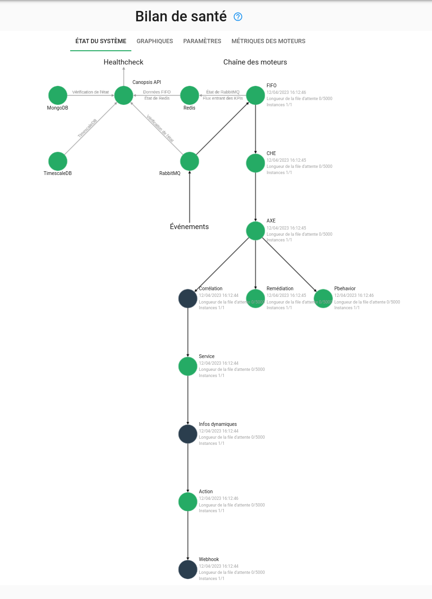

# Guide de migration vers Canopsis 23.10.0

Ce guide donne des instructions vous permettant de mettre à jour Canopsis 23.04 (dernière version disponible) vers [la version 23.10.0](../23.10.0.md).

## Prérequis

L'ensemble de cette procédure doit être lu avant son exécution.

Ce document ne prend en compte que Canopsis Community et Canopsis Pro : tout développement personnalisé dont vous pourriez bénéficier ne fait pas partie du cadre de ce Guide de migration.

Les fichiers de référence qui sont mentionnés dans ce guide sont disponibles à ces adresses

| Édition           | Sources                                                                                                                              |
| ----------------- | ------------------------------------------------------------------------------------------------------------------------------------ |
| Édition Community | [https://git.canopsis.net/canopsis/canopsis-community/-/releases](https://git.canopsis.net/canopsis/canopsis-community/-/releases)   |
| Édition pro       | [https://git.canopsis.net/sources/canopsis-pro-sources/-/releases](https://git.canopsis.net/sources/canopsis-pro-sources/-/releases) |

## Procédure de mise à jour

### Réalisation d'une sauvegarde

Des sauvegardes sont toujours recommandées, qu'elles soient régulières ou lors de modifications importantes.

La restructuration apportée dans les bases de données pour cette version de Canopsis nous amène à insister d'autant plus sur ce point. Il est donc fortement recommandé de réaliser une **sauvegarde complète** des VM hébergeant vos services Canopsis, avant cette mise à jour.


### Arrêt de l'environnement en cours de lancement

Vous devez prévoir une interruption du service afin de procéder à la mise à jour qui va suivre.

=== "Docker Compose"

    ```sh
    CPS_EDITION=pro docker compose down
    ```

=== "Paquets RHEL 8"

    ```sh
    systemctl stop canopsis
    systemctl stop mongod
    systemctl stop postgresql-13
    systemctl stop rabbitmq-server
    systemctl stop redis
    ```

### Mise à jour Canopsis

!!! information "Information"

    Canopsis 23.04 est livré avec un nouveau jeu de configurations de référence.
    Vous devez télécharger ces configurations et y reporter vos personnalisations.  


=== "Docker Compose"

    Si vous êtes utilisateur de l'édition `community`, voici les étapes à suivre.

    Télécharger le paquet de la version 23.10.0 (canopsis-community-docker-compose-23.10.0.tar.gz) disponible à cette adresse [https://git.canopsis.net/canopsis/canopsis-community/-/releases](https://git.canopsis.net/canopsis/canopsis-community/-/releases).

    ```sh
    export CPS_EDITION=community
    tar xvfz canopsis-community-docker-compose-23.10.0.tar.gz
    cd canopsis-community-docker-compose-23.10.0
    ```

    Si vous êtes utilisateur de l'édition `pro`, voici les étapes à suivre.

    Télécharger le paquet de la version 23.10.0 (canopsis-pro-docker-compose-23.10.0.tar.gz) disponible à cette adresse [https://git.canopsis.net/sources/canopsis-pro-sources/-/releases](https://git.canopsis.net/sources/canopsis-pro-sources/-/releases).

    ```sh
    export CPS_EDITION=pro
    tar xvfz canopsis-pro-docker-compose-23.10.0.tar.gz
    cd canopsis-pro-docker-compose-23.10.0
    ```

    À ce stade, vous devez synchroniser les modifications réalisées sur vos anciens fichiers de configuration `docker-compose` avec les fichiers `docker-compose.yml` et/ou `docker-compose.override.yml`.

=== "Paquets RHEL 8"

    À venir

### Mise à jour de RabbitMQ

Dans cette version de Canopsis, le bus rabbitMQ passe à la version 3.12.x.  

=== "Docker Compose"

    Passage en version 3.12 puis lancement du conteneur `rabbitmq` :

    ```sh
    sed -i "s/RABBITMQ_TAG=.*-management$/RABBITMQ_TAG=3.12-management/g" .env
    CPS_EDITION=pro docker compose up -d rabbitmq
    ```

=== "Paquets RHEL 8"

    Passage en version 3.12 puis lancement du service `rabbitmq-server` :

    ```sh
    dnf install --repo rabbitmq_erlang --repo rabbitmq_server erlang rabbitmq-server-3.12
    systemctl restart rabbitmq-server
    ```

### Remise à 0 du cache Redis

Dans cette version de Canopsis, le cache de Canopsis doit repartir à 0.

=== "Docker Compose"

    ```sh
    CPS_EDITION=pro docker compose up -d redis
    CPS_EDITION=pro docker compose exec redis /usr/local/bin/redis-cli flushall
    OK
    ```

=== "Paquets RHEL 8"

    ```sh
    systemctl start redis
    /bin/redis-cli flushall
    ```

### Lancement du provisioning `canopsis-reconfigure`

#### Synchronisation du fichier de configuration `canopsis.toml` ou fichier de surcharge

Si vous avez modifié le fichier `canopsis.toml` (vous le voyez via une définition de volume dans votre fichier docker-compose.yml), vous devez vérifier qu'il soit bien à jour par rapport au fichier de référence.  

* [`canopsis.toml` pour Canopsis Community 23.10.0](https://git.canopsis.net/canopsis/canopsis-community/-/blob/23.10.0/community/go-engines-community/cmd/canopsis-reconfigure/canopsis-community.toml)
* [`canopsis.toml` pour Canopsis Pro 23.10.0](https://git.canopsis.net/canopsis/canopsis-community/-/blob/23.10.0/community/go-engines-community/cmd/canopsis-reconfigure/canopsis-pro.toml)

!!! information "Information"

    Pour éviter ce type de synchronisation fastidieuse, la bonne pratique est d'utiliser [un fichier de surcharge de cette configuration](../../../guide-administration/administration-avancee/modification-canopsis-toml/). 


Si vous avez utilisé un fichier de surcharge, alors vous n'avez rien à faire, uniquement continuer à le présenter dans un volume.

#### Reconfiguration de Canopsis

=== "Docker Compose"

    !!! Attention

    Si vous avez personnalisé la ligne de commande de l'outil `canopsis-reconfigure`, nous vous conseillons de supprimer cette personnalisation.
    L'outil est en effet pré paramétré pour fonctionner naturellement.

    ```sh
    CPS_EDITION=pro docker compose up -d reconfigure
    ```

    !!! information "Information"

        Cette opération peut prendre plusieurs minutes pour s'exécuter.

    Vous pouvez ensuite vérifier que le mécanisme de provisioning/reconfigure s'est correctement déroulé. Le conteneur doit présenté un "exit 0"

    ```sh
    CPS_EDITION=pro docker compose ps -a|grep reconfigure
    canopsis-pro-reconfigure-1            "/canopsis-reconfigu…"   reconfigure            exited (0)
    ```

=== "Paquets RHEL 8"

    La commande `canopsis-reconfigure` doit être exécutée après mise à jour de Canopsis dans le cadre d'installation par paquets RPM.

#### Mise à jour et démarrage final de Canopsis

Enfin, il vous reste à mettre à jour et à démarrer tous les composants applicatifs de Canopsis

=== "Docker Compose"

    ```sh
    CPS_EDITION=pro docker compose up -d
    ```

    Vous pouvez ensuite vérifier que l'ensemble des conteneurs soient correctement exécutés.

    ```sh
    CPS_EDITION=pro docker compose ps
    NAME                                  COMMAND                  SERVICE                STATUS              PORTS
    canopsis-pro-action-1                 "/engine-action -wit…"   action                 running             
    canopsis-pro-api-1                    "/canopsis-api -docs"    api                    running (healthy)   0.0.0.0:8082->8082/tcp, :::8082->8082/tcp
    canopsis-pro-axe-1                    "/engine-axe -publis…"   axe                    running             
    canopsis-pro-che-1                    "/engine-che"            che                    running             
    canopsis-pro-connector-junit-1        "/bin/sh -c /${CMD}"     connector-junit        running             
    canopsis-pro-correlation-1            "/bin/sh -c /${CMD}"     correlation            running             
    canopsis-pro-dynamic-infos-1          "/bin/sh -c /${CMD}"     dynamic-infos          running             
    canopsis-pro-fifo-1                   "/bin/sh -c /${CMD}"     fifo                   running             
    canopsis-pro-migrate-metrics-meta-1   "/bin/true /migrate-…"   migrate-metrics-meta   exited (0)          
    canopsis-pro-mongodb-1                "docker-entrypoint.s…"   mongodb                running (healthy)   0.0.0.0:27027->27017/tcp, :::27027->27017/tcp
    canopsis-pro-nginx-1                  "/bin/sh -c /entrypo…"   nginx                  running             80/tcp, 0.0.0.0:80->8080/tcp, :::80->8080/tcp, 0.0.0.0:443->8443/tcp, :::443->8443/tcp
    canopsis-pro-pbehavior-1              "/bin/sh -c /${CMD}"     pbehavior              running             
    canopsis-pro-rabbitmq-1               "docker-entrypoint.s…"   rabbitmq               running (healthy)   4369/tcp, 5671/tcp, 0.0.0.0:5672->5672/tcp, :::5672->5672/tcp, 15671/tcp, 15691-15692/tcp, 25672/tcp, 0.0.0.0:15672->15672/tcp, :::15672->15672/tcp
    canopsis-pro-reconfigure-1            "/canopsis-reconfigu…"   reconfigure            exited (0)          
    canopsis-pro-redis-1                  "docker-entrypoint.s…"   redis                  running (healthy)   0.0.0.0:6379->6379/tcp, :::6379->6379/tcp
    canopsis-pro-remediation-1            "/bin/sh -c /${CMD}"     remediation            running             
    canopsis-pro-service-1                "/engine-service -pu…"   service                running             
    canopsis-pro-timescaledb-1            "docker-entrypoint.s…"   timescaledb            running (healthy)   0.0.0.0:5432->5432/tcp, :::5432->5432/tcp
    ```

=== "Paquets RHEL 8"

    Mise à jour de Canopsis

    ```sh
    dnf install canopsis-pro-23.10.0 canopsis-webui-23.10.0
    ```

    Reconfiguration de Canopsis

    !!! Attention

        Si vous avez personnalisé la ligne de commande de l'outil `canopsis-reconfigure`, nous vous conseillons de supprimer cette personnalisation.
        L'outil est en effet pré paramétré pour fonctionner naturellement.


    Si vous utilisez un fichier d'override du canopsis.toml, veuillez ajouter à la ligne de commande suivante l'option `-override` suivie du chemin du fichier en question.

    ```sh
    set -o allexport ; source /opt/canopsis/etc/go-engines-vars.conf
    /opt/canopsis/bin/canopsis-reconfigure -migrate-postgres=true -migrate-mongo=true -edition pro
    ```

    !!! information "Information"

        Cette opération peut prendre plusieurs minutes pour s'exécuter.

    Vous pouvez ensuite vérifier que le mécanisme de reconfigure s'est correctement déroulé en lisant les logs sur la sortie standard de la commande.

    Redémarrage de Canopsis

    ```sh
    systemctl restart canopsis
    ```

    Vous pouvez ensuite vérifier que l'ensemble des services soient correctement exécutés.

    ```sh
    systemctl status canopsis
    ```

Par ailleurs, le mécanisme de bilan de santé intégré à Canopsis ne doit pas présenter d'erreur.  




# A documenter

## Supprimer les exchanges inutiles

Les exchanges suivants doivent être supprimés car ils ne sont plus utilisés par Canopsis :

* canopsis.incidents
* canopsis.alerts
* canopsis

https://git.canopsis.net/canopsis/canopsis-pro/-/issues/4992


## Supression du moteur service

## Mongo passe en replicaset

https://git.canopsis.net/canopsis/canopsis-pro/-/issues/5042

Ne pas utiliser l'URI avec le replciaset

## Suppression du paramètre EnableLastEventDate

https://git.canopsis.net/canopsis/canopsis-pro/-/issues/5027
