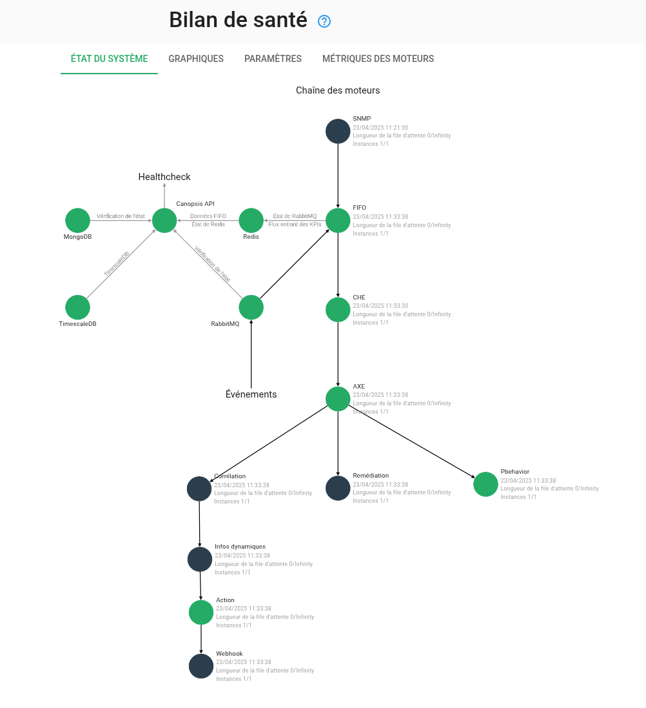

# Guide de migration vers Canopsis 25.04.0

Ce guide donne les instructions vous permettant de mettre à jour Canopsis 24.10 (dernière version disponible) vers [la version 25.04.0](../25.04.0.md).

## Prérequis

L'ensemble de cette procédure doit être lu avant son exécution.

Ce document ne prend en compte que Canopsis Community et Canopsis Pro : tout développement personnalisé dont vous pourriez bénéficier ne fait pas partie du cadre de ce Guide de migration.

Les fichiers de référence qui sont mentionnés dans ce guide sont disponibles à ces adresses

| Édition           | Sources                                                                                                                              |
| ----------------- | ------------------------------------------------------------------------------------------------------------------------------------ |
| Édition Community | [https://git.canopsis.net/canopsis/canopsis-community/-/releases](https://git.canopsis.net/canopsis/canopsis-community/-/releases)   |
| Édition pro       | [https://git.canopsis.net/sources/canopsis-pro-sources/-/releases](https://git.canopsis.net/sources/canopsis-pro-sources/-/releases) |

[TOC]

## Procédure de mise à jour

### Réalisation d'une sauvegarde

Des sauvegardes sont toujours recommandées, qu'elles soient régulières ou lors de modifications importantes.

La restructuration apportée dans les bases de données pour cette version de Canopsis nous amène à insister d'autant plus sur ce point. Il est donc fortement recommandé de réaliser une **sauvegarde complète** des VM hébergeant vos services Canopsis, avant cette mise à jour.

### Vérification MongoDB

!!! warning "Vérification"

    Avant de démarrer la procédure de mise à jour, vous devez vérifier que la valeur de `featureCompatibilityVersion` est bien positionnée à **7.0**  

    === "Docker Compose"
        ```sh
        CPS_EDITION=pro docker compose exec mongodb bash
        mongosh -u root -p root
        > db.adminCommand( { getParameter: 1, featureCompatibilityVersion: 1 } )
        > exit
        ```

    === "Paquets RHEL"

        ```sh
        mongosh -u root -p root
        > db.adminCommand( { getParameter: 1, featureCompatibilityVersion: 1 } )
        > exit
        ```

    === "Helm"

        Les commandes ci-dessous s'appliquent uniquement si votre instance MongoDB est hébergée sur votre cluster Kubernetes.
        Dans le cas contraire, veuillez vous référer à l'onglet "Paquets RHEL 8".

        ```sh
        export MONGODB_ROOT_PASSWORD=$(kubectl get secret canopsis-mongodb -o jsonpath='{.data.mongodb-root-password}' | base64 --decode)
        
        kubectl exec canopsis-mongodb-0 -- mongosh -u root -p $MONGODB_ROOT_PASSWORD --eval 'db.adminCommand({ getParameter: 1, featureCompatibilityVersion: 1 })'
        ```

        Le retour doit être de la forme `{ "featureCompatibilityVersion" : { "version" : "7.0" }, "ok" : 1 }`
        Si ce n'est pas le cas, vous ne pouvez pas continuer la mise à jour.


### Arrêt de l'environnement en cours de lancement

Vous devez prévoir une interruption du service afin de procéder à la mise à jour qui va suivre.

=== "Docker Compose"

    ```sh
    CPS_EDITION=pro docker compose down
    ```

=== "Paquets RHEL"

    ```sh
    systemctl stop canopsis
    systemctl stop mongod
    systemctl stop postgresql-15
    systemctl stop rabbitmq-server
    systemctl stop redis
    systemctl stop nginx
    ```

=== "Helm"

    ```sh
    kubectl delete deployments --all
    ```


## Mise à jour Canopsis

!!! information "Information"

    Canopsis 25.04 est livré avec un nouveau jeu de configurations de référence.
    Vous devez télécharger ces configurations et y reporter vos personnalisations.  

=== "Docker Compose"

    Si vous êtes utilisateur de l'édition `community`, voici les étapes à suivre.

    Télécharger le paquet de la version 25.04.0 (canopsis-community-docker-compose-25.04.0.tar.gz) disponible à cette adresse [https://git.canopsis.net/canopsis/canopsis-community/-/releases](https://git.canopsis.net/canopsis/canopsis-community/-/releases).

    ```sh
    export CPS_EDITION=community
    tar xvfz canopsis-community-docker-compose-25.04.0.tar.gz
    cd canopsis-community-docker-compose-25.04.0
    ```

    Si vous êtes utilisateur de l'édition `pro`, voici les étapes à suivre.

    Télécharger le paquet de la version 25.04.0 (canopsis-pro-docker-compose-25.04.0.tar.gz) disponible à cette adresse [https://git.canopsis.net/sources/canopsis-pro-sources/-/releases](https://git.canopsis.net/sources/canopsis-pro-sources/-/releases).

    ```sh
    export CPS_EDITION=pro
    tar xvfz canopsis-pro-docker-compose-25.04.0.tar.gz
    cd canopsis-pro-docker-compose-25.04.0
    ```

    À ce stade, vous devez synchroniser les modifications réalisées sur vos anciens fichiers de configuration `docker-compose` avec les fichiers `docker-compose.yml` et/ou `docker-compose.override.yml`.

=== "Paquets RHEL 8"

    Non concerné car ces configurations sont livrées directemement dans les paquets RPM.

=== "Helm"

    Non concerné car ces configurations sont livrées directement dans les charts Helm.

### Mise à jour de RabbitMQ

Dans cette version de Canopsis, le bus de données RabbitMQ passe de la version 3 à 4.  
La complexité de la procédure officielle de migration nous incite à proposer la suppression pure et simple du volume accueillant les données RabbitMQ.  
Dans Canopsis, RabbitMQ traite toutes les données en mémoire sauf dans certaines situations où les moteurs Canopsis ne sont plus en mesure de traiter les messages. Il n'y a donc pas de craintes de perte de données dans ce processus.


!!! warning "Avertissement"

    Si votre installation RabbitMQ est clusterisée, veuillez contacter notre service de support.  
    La notion de "Mirrored Classic Queues" a été remplacée par les "Quorum Queues".  
    Des opérations spécifiques sont nécessaires.
    Procédure officielle de migration : [https://www.rabbitmq.com/docs/3.13/migrate-mcq-to-qq](https://www.rabbitmq.com/docs/3.13/migrate-mcq-to-qq)

=== "Docker Compose"

    Repérer le volume associé à RabbitMQ : `rabbitmqdata`

    ```sh
    docker volume ls|grep canopsis-pro_rabbitmqdata
    ```

    Cette commande devrait vous renvoyer un résultat similaire à 

    ```sh
    local     canopsis-pro_rabbitmqdata
    ```

    Suppression du volume

    ```sh
    docker volume rm canopsis-pro_rabbitmqdata
    ```

    Démarrage du conteneur

    ```sh
    CPS_EDITION=pro docker compose up -d rabbitmq
    ```

=== "Paquets RHEL"

    Supprimer rabbitmq-server

    ```sh
    dnf remove rabbitmq-server erlang
    rm -rf /var/lib/rabbitmq
    ```

    Suspendre le versionlock des paquets `rabbitmq-server` et `erlang-26*`

    ```sh
    dnf versionlock delete 'rabbitmq-server-3.*'
    dnf versionlock delete 'erlang-26.*'
    ```

    Installation de rabbitmq-server 4.1.x 

    ```sh
    dnf install rabbitmq-server-4.1.0
    ```

    Définir des versionlock pour les paquets `rabbitmq-server-4*` et `erlang-27*`

    ```sh
    dnf versionlock add --raw 'rabbitmq-server-4.*'
    dnf versionlock add --raw 'erlang-27.*'
    ```

    Démarrage du service

    ```sh
    systemctl enable --now rabbitmq-server.service
    ```

    Activation de de l'interface de management et création des objets de base

    ```sh
    rabbitmq-plugins enable rabbitmq_management
    systemctl restart rabbitmq-server.service
    rabbitmqctl add_vhost canopsis
    rabbitmqctl add_user cpsrabbit canopsis
    rabbitmqctl set_user_tags cpsrabbit administrator
    rabbitmqctl set_permissions --vhost canopsis cpsrabbit '.*' '.*' '.*'
    ```

=== "Helm"

    Répérer le statefulset RabbitMQ

    ```sh
    kubectl get statefulset | grep rabbitmq
    ```

    L’exécution de cette commande renverra quelque chose comme

    ```sh
    canopsis-prod-rabbitmq       1/1     11m
    ```

    Suppression du statefulset RabbitMQ

    ```sh
    kubectl delete statefulset canopsis-prod-rabbitmq
    ```

    Repérer le volume associé à RabbitMQ

    ```sh
    kubectl get pvc | grep rabbitmq
    ```

    Cette commande devrait vous renvoyer un résultat similaire à

    ```sh
    data-canopsis-prod-rabbitmq-0   Bound pvc-ad1f6b85-042d-4019-a406-d2fe09acc60c   8Gi        RWO            standard       <unset>                 40h
    ```

    Suppression du volume

    ```sh
    kubectl delete pvc data-canopsis-prod-rabbitmq-0
    ```

### Passage de Redis à Valkey

Vis-à-vis du changement de licence de Redis, Canopsis a décidé de migrer de Redis à [Valkey](https://valkey.io/).

=== "Docker Compose"

    Vous n'avez rien de particulier à prévoir, les configurations de référence livrées par Canopsis embarquent ce changement naturellement.

=== "Paquets RHEL"

    Supprimer redis

    ```sh
    dnf remove redis
    rm -rf /var/lib/redis
    rm -rf /etc/redis
    dnf module reset redis
    dnf module disable redis
    ```

    Activer les dépôts EPEL qui proposent le paquet Valkey

    ```sh
    dnf install epel-release
    ```

    Installation de valkey

    ```sh
    dnf install valkey-8.0.2
    ```

    Définir des versionlock pour le paquet `valkey-8.*`

    ```sh
    dnf versionlock add --raw 'valkey-8.*'
    ```

    Ajouter un mot de passe Valkey

    ```sh
    sed -i 's/^# requirepass.*/requirepass canopsis/' /etc/valkey/valkey.conf
    ```

    Démarrage du service

    ```sh
    systemctl enable --now valkey.service
    ```

=== "Helm"

    Vous n'avez rien de particulier à prévoir, les configurations de référence livrées par Canopsis embarquent ce changement naturellement.


### Mise à jour de Nginx

Dans les versions précédentes de Canopsis, il était recommandé d'effectuer l'installation de nginx à travers les modules EL. Cependant ceux-ci ne sont pas régulièrement mis à jour et les versions disponibles peuvent être obsolètes et non maintenues par l'éditeur (que ça soit au niveau fonctionnel comme sécurité). Nous avons donc décidé de mettre à jour nos documentations afin d'utiliser le dépôt éditeurs.

Les actions ci-dessous vous permettrons de réaliser les changements de dépôts sans prendre le risque de perdre vos configurations nginx si vous les aviez modifiées.

=== "Docker Compose"

    Vous n'avez rien de particulier à prévoir, les configurations de référence livrées par Canopsis embarquent ce changement naturellement.

=== "Paquets RHEL"

    !!! warning "Avertissement"

        Cette procédure ne doit être appliquée que si votre installation utilise les paquets nginx de la distribution RHEL. Si vous utilisez déjà les dépôts éditeurs de nginx, vous n'êtes pas concernés. (Vous pouvez le vérifier par la présence ou non du fichier /etc/yum.repos.d/nginx.repo)

    Stopper l'interface graphique
    
    ```sh
    systemctl stop nginx
    systemctl disable nginx
    ```
    
    Sauvegarde de la configuration existante
    
    ```sh
    mkdir /root/backupnginx
    cp /etc/nginx/conf.d/* /root/backupnginx/
    ```
    
    !!! info "Information"
        Nous utilisons le dossier `/root/backupnginx` dans notre exemple mais il est possible d'utiliser n'importe quel répertoire dans lequel vous avez les droits.  
        Il est aussi important de répéter cette commande avec l'ensemble des fichiers que vous auriez pu modifier. Même si ici nous nous concentrons sur le fichier propre au virtualhost de Canopsis.
    
    Déinstallation de Nginx (Cette déinstallation entraine la déinstallation de l'interface graphique de Canopsis)
    
    ```sh
    dnf -y remove nginx 
    dnf -y module disable nginx
    ```
    
    Configuration du dépôt Nginx
    
    ```sh
    cat << EOF > /etc/yum.repos.d/nginx.repo
    [nginx-stable]
    name=nginx stable repo
    baseurl=http://nginx.org/packages/centos/$releasever/$basearch/
    gpgcheck=1
    enabled=1
    gpgkey=https://nginx.org/keys/nginx_signing.key
    module_hotfixes=true
    EOF
    ```
    
    Fabrication du cache
    
    ```sh
    dnf makecache
    ```
    
    Une fois que vous aurez réappliqué vos configurations, vous pourrez remettre le service en marche:
    
    ```
    systemctl enable --now nginx
    ```

=== "Helm"

    Vous n'avez rien de particulier à prévoir, les configurations de référence livrées par Canopsis embarquent ce changement naturellement.


### Lancement du provisioning `canopsis-reconfigure`

#### Synchronisation du fichier de configuration `canopsis.toml` ou fichier de surcharge

Si vous avez modifié le fichier `canopsis.toml` (vous le voyez via une définition de volume dans votre fichier docker-compose.yml), vous devez vérifier qu'il soit bien à jour par rapport au fichier de référence.  

* [`canopsis.toml` pour Canopsis Community 25.04.0](https://git.canopsis.net/canopsis/canopsis-community/-/blob/25.04.0/community/go-engines-community/cmd/canopsis-reconfigure/canopsis-community.toml)
* [`canopsis.toml` pour Canopsis Pro 25.04.0](https://git.canopsis.net/canopsis/canopsis-community/-/blob/25.04.0/community/go-engines-community/cmd/canopsis-reconfigure/canopsis-pro.toml)

!!! information "Information"

    Pour éviter ce type de synchronisation fastidieuse, la bonne pratique est d'utiliser [un fichier de surcharge de cette configuration](../../../guide-administration/administration-avancee/modification-canopsis-toml/). 

Si vous avez utilisé un fichier de surcharge, alors vous n'avez rien à faire, uniquement continuer à le présenter dans un volume.

#### Séparation des flux d’événements par initiateur

À partir de la version 25.04, les moteurs Canopsis traitent les événements selon trois flux distincts, en fonction de la valeur du champ initiator :

* user : événements générés par les utilisateurs via l’interface (UI)
* system : événements internes du moteur (ex. : PBH, triggers, alarm updates…)
* external : événements émis par les connecteurs

Chaque moteur dispose désormais de processeurs dédiés à chacun de ces flux, permettant leur exécution en parallèle. De plus, chaque processeur embarque un pool de workers permettant un traitement concurrent efficace.

**Objectif :** éviter que les événements système ne bloquent les actions utilisateurs ou les événements de connecteurs. Par exemple, même en cas de nombreux pbh_enter, l’interface reste réactive et les nouvelles alarmes peuvent être créées sans latence.

Les flags suivants sont désormais obsolètes, nous vous invitons à supprimer toute référence dans vos configurations :

* -publishQueue
* -consumeQueue
* -workers (remplacé par des flags spécifiques à chaque type de flux)

| Moteur               | Flags nouveaux     | Valeur par défaut | Flags obsolètes                             |
|----------------------|--------------------|-------------------|---------------------------------------------|
| engine-fifo          | -workers           | 10                | -publishQueue, -consumeQueue                |
| engine-che           | -externalWorkers   | 4                 | -workers, -publishQueue, -consumeQueue      |
|                      | -systemWorkers     | 4                 |                                             |
|                      | -userWorkers       | 2                 |                                             |
| engine-axe           | -externalWorkers   | 4                 | -workers, -publishQueue                     |
|                      | -systemWorkers     | 4                 |                                             |
|                      | -userWorkers       | 2                 |                                             |
|                      | -rpcWorkers        | 4                 |                                             |
| engine-correlation   | -externalWorkers   | 4                 | -workers, -publishQueue, -consumeQueue      |
|                      | -systemWorkers     | 4                 |                                             |
|                      | -userWorkers       | 2                 |                                             |
|                      | -rpcWorkers        | 4                 |                                             |
| engine-dynamic-infos | -externalWorkers   | 4                 | -workers, -publishQueue                     |
|                      | -systemWorkers     | 4                 |                                             |
|                      | -userWorkers       | 2                 |                                             |
|                      | -rpcWorkers        | 4                 |                                             |
| engine-action        | -externalWorkers   | 4                 | -workers                                    |
|                      | -systemWorkers     | 4                 |                                             |
|                      | -userWorkers       | 2                 |                                             |
|                      | -rpcWorkers        | 4                 |                                             |


#### Reconfiguration de Canopsis

=== "Docker Compose"

    !!! Attention

        Si vous avez personnalisé la ligne de commande de l'outil `canopsis-reconfigure`, nous vous conseillons de supprimer cette personnalisation.
        L'outil est en effet pré paramétré pour fonctionner naturellement.

    ```sh
    CPS_EDITION=pro docker compose up -d reconfigure
    ```

    !!! information "Information"

        Cette opération peut prendre plusieurs minutes pour s'exécuter.

    Vous pouvez ensuite vérifier que le mécanisme de provisioning/reconfigure s'est correctement déroulé. Le conteneur doit présenté un "exit 0"

    ```sh
    CPS_EDITION=pro docker compose ps -a|grep reconfigure
    canopsis-pro-reconfigure-1            "/canopsis-reconfigu…"   reconfigure            exited (0)
    ```

=== "Paquets RHEL"

    La commande `canopsis-reconfigure` doit être exécutée après mise à jour de Canopsis dans le cadre d'installation par paquets RPM.

=== "Helm"

   Non concerné, `canopsis-reconfigure` est lancé automatiquement lors de l'upgrade.

### Mise à jour et démarrage final de Canopsis

Enfin, il vous reste à mettre à jour et à démarrer tous les composants applicatifs de Canopsis

=== "Docker Compose"

    ```sh
    CPS_EDITION=pro docker compose up -d
    ```

    Vous pouvez ensuite vérifier que l'ensemble des conteneurs soient correctement exécutés.

    ```sh
    CPS_EDITION=pro docker compose ps
    ```

=== "Paquets RHEL"

    Suspendre le versionlock des paquets Canopsis

    ```sh
    dnf versionlock delete 'canopsis-pro-24.10.*'
    dnf versionlock delete 'canopsis-webui-24.10.*'
    ```

    Mise à jour de Canopsis

    ```sh
    dnf install canopsis-pro-25.04.0 canopsis-webui-25.04.0
    ```

    Réactiver les versionlock des paquets Canopsis

    ```sh
    dnf versionlock add --raw 'canopsis-pro-25.04.*'
    dnf versionlock add --raw 'canopsis-webui-25.04.*'
    ```

    Reconfiguration de Canopsis

    !!! Attention

        Si vous avez personnalisé la ligne de commande de l'outil `canopsis-reconfigure`, nous vous conseillons de supprimer cette personnalisation.
        L'outil est en effet pré paramétré pour fonctionner naturellement.


    Si vous utilisez un fichier d'override du canopsis.toml, veuillez ajouter à la ligne de commande suivante l'option `-override` suivie du chemin du fichier en question.

    ```sh
    systemctl start postgresql-15 mongod
    set -o allexport ; source /opt/canopsis/etc/go-engines-vars.conf
    /opt/canopsis/bin/canopsis-reconfigure -migrate-postgres=true -migrate-tech-postgres=true -migrate-mongo=true -edition pro
    ```

    !!! information "Information"

        Cette opération peut prendre plusieurs minutes pour s'exécuter.

    Vous pouvez ensuite vérifier que le mécanisme de reconfigure s'est correctement déroulé en lisant les logs sur la sortie standard de la commande.

    Redémarrage de Canopsis

    ```sh
    systemctl restart canopsis
    ```

    Vous pouvez ensuite vérifier que l'ensemble des services soient correctement exécutés.

    ```sh
    systemctl status canopsis
    ```

=== "Helm"

    Définir le nom de votre instance
    
    ```sh
    export RELEASE_NAME="canopsis-prod"
    ```

    Mise à jour des repos helm

    ```sh
    helm repo update
    ```

    Mise à jour de Canopsis

    ```sh
    helm upgrade ${RELEASE_NAME} canopsis/canopsis-pro -f customer-values.yaml
    ```

Par ailleurs, le mécanisme de bilan de santé intégré à Canopsis ne doit pas présenter d'erreur.  



