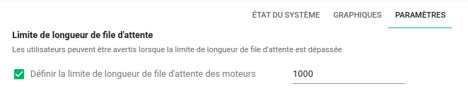

# Guide de migration vers Canopsis 4.4.0

Ce guide donne des instructions vous permettant de mettre à jour Canopsis 4.3 vers [la version 4.4.0](../4.4.0.md).

## Prérequis

L'ensemble de cette procédure doit être lu avant son exécution.

Ce document ne prend en compte que Canopsis Community et Canopsis Pro : tout développement personnalisé dont vous pourriez bénéficier ne fait pas partie du cadre de ce Guide de migration.

## Docker : migration de Dockerhub vers `docker.canopsis.net`

Les conteneurs Docker de Canopsis étaient jusqu'à présents hébergés sur [Dockerhub](https://hub.docker.com/u/canopsis/).

À partir de Canopsis 4.4.0, les images doivent être récupérées depuis le registre `docker.canopsis.net`, réparti entre une section Community (publique) et Pro (privée).

Si vous bénéficiez d'une souscription à Canopsis Pro, un compte de service (lié au service Gitlab [git.canopsis.net](https://git.canopsis.net)) a normalement déjà été mis en place afin que vous puissiez récupérer ces images. Sinon, rapprochez-vous de votre contact habituel.

Les nouveaux fichiers de référence Docker Compose (décrits plus bas) comportent de nouvelles variables permettant de gérer cette nouvelle organisation :

```yaml
axe:
  image: ${DOCKER_REPOSITORY}${COMMUNITY_BASE_PATH}engine-axe:${CANOPSIS_IMAGE_TAG}
```

Pour récupérer ces images, assurez-vous que les flux réseau HTTPS (TCP/443) vers `docker.canopsis.net` soient bien autorisés, puis connectez-vous avec votre compte de service Gitlab avec la commande suivante :

```sh
docker login docker.canopsis.net
```

Vous devriez ensuite pouvoir récupérer les conteneurs Canopsis avec [les commandes habituelles](../../guide-administration/mise-a-jour/index.md#mise-a-jour-en-environnement-docker-compose).

!!! note "Notes"
    * Les conteneurs des services tiers (tels que MongoDB, RabbitMQ, Redis…) restent hébergés sur Dockerhub.
    * Les versions de Canopsis antérieures à Canopsis 4.4.0 ont aussi été importées dans le registre `docker.canopsis.net`.
    * À partir de Canopsis 4.5.0, plus aucune nouvelle version de Canopsis ne sera publiée sur Dockerhub. À terme, le projet Canopsis ne sera plus du tout disponible sur Dockerhub.
    * Les accès à `repositories.canopsis.net` (pour les paquets RPM) ne sont pas concernés pas ces modifications et leur utilisation reste donc inchangée.

## Procédure de mise à jour

### Arrêt de l'environnement en cours de lancement

Vous devez prévoir une interruption du service afin de procéder à la mise à jour qui va suivre.

=== "Paquets CentOS 7"

    ```sh
    canoctl stop
    ```

=== "Docker Compose"

    ```sh
    docker-compose down
    ```

### Suppression de composants obsolètes

Les moteurs `engine-heartbeat` ainsi que les composants `scheduler` et `importctx` ne sont plus pris en charge à partir de cette version. Ils doivent donc être supprimés.

=== "Paquets CentOS 7"

    Exécutez la commande suivante pour désactiver ces services :

    ```sh
    systemctl list-units -a --type=service --plain --no-legend "canopsis*" | awk '/heartbeat/ || /scheduler/ || /importctx/ { print $1 }' | xargs -r systemctl disable
    ```

=== "Docker Compose"

    Supprimez toute éventuelle section `heartbeat` `scheduler` ou `task_importctx` de votre fichier Docker Compose. Toute référence à un éventuel volume `importctxdata` peut aussi être supprimée.

### Passage de `external-job-executor` à `engine-remediation` (Pro)

Si vous utilisez Canopsis Pro, la fonctionnalité de remédiation n'est plus exécutée par le service `external-job-executor` mais par le nouveau moteur `engine-remediation`.

Le moteur `engine-axe` doit aussi être lancé avec l'option `-withRemediation=true` pour bénéficier de cette fonctionnalité.

=== "Paquets CentOS 7"

    Exécutez les commandes suivantes :

    ```sh
    systemctl disable canopsis-service@external-job-executor.service
    systemctl enable canopsis-engine-go@engine-remediation.service

    mkdir -p /etc/systemd/system/canopsis-engine-go@engine-axe.service.d
    cat > /etc/systemd/system/canopsis-engine-go@engine-axe.service.d/axe.conf << EOF
    [Service]
    ExecStart=
    ExecStart=/usr/bin/env /opt/canopsis/bin/%i -publishQueue Engine_correlation -withRemediation=true
    EOF
    systemctl daemon-reload
    ```

=== "Docker Compose"

    Dans votre Docker Compose, supprimez toute section `external-job-executor` similaire à la suivante :

    ```yaml
    external-job-executor:
      image: ${DOCKER_REPOSITORY}${PRO_BASE_PATH}external-job-executor:${CANOPSIS_IMAGE_TAG}
      env_file:
        - compose.env
      restart: unless-stopped
      command: /external-job-executor
    ```

    et remplacez-la par la nouvelle section `remediation` suivante :

    ```yaml
    remediation:
      image: ${DOCKER_REPOSITORY}${PRO_BASE_PATH}engine-remediation:${CANOPSIS_IMAGE_TAG}
      env_file:
        - compose.env
      restart: unless-stopped
      command: /engine-remediation
    ```

    Puis, assurez-vous que le moteur `engine-axe` soit bien lancé avec l'option `-withRemediation=true` :

    ```yaml hl_lines="3"
    axe:
      # ...
      command: /engine-axe -publishQueue Engine_correlation -withRemediation=true
    ```

### Mise à jour de Canopsis

=== "Paquets CentOS 7"

    Appliquez la mise à jour des paquets Canopsis :

    ```sh
    yum --disablerepo="*" --enablerepo="canopsis*" update
    ```

=== "Docker Compose"

    Les fichiers de référence Docker Compose ont été complétement revus dans cette version.

    L'environnement Docker Compose a notamment été découpé en 3 parties successives :

    1. `00-data` pour les données persistantes et les briques externes (MongoDB, RabbitMQ, Redis…) ;
    2. `01-prov` pour le provisioning ;
    3. `02-app` pour l'application Canopsis en elle-même.

    De nouvelles variables, telles que `DOCKER_REPOSITORY` ou `CPS_SERVER_NAME` ont été introduites. Certains conteneurs ont aussi été renommés, ou déplacés entre Community et Pro.

    Les changements étant nombreux, il vous est recommandé d'utiliser directement le nouveau référentiel :  
    <https://git.canopsis.net/canopsis/canopsis-pro/-/tree/release-4.4/pro/deployment/canopsis/docker>

    et d'y appliquer, au besoin, toute modification locale que vous faisiez jusqu'à présent. En cas de nécessité, rapprochez-vous de votre contact habituel pour un accompagnement.

    Une fois ces changements effectués, lancez seulement la partie `00-data` pour le moment :

    ```sh
    docker-compose -f 00-data.docker-compose.yml up -d
    ```

    Ou bien, relancez seulement les conteneurs `mongo`, `rabbitmq`, `redis` et `influxdb`.

### Lancement des scripts de migration

Sur une machine disposant d'un accès à `git.canopsis.net` ainsi que d'un client MongoDB, assurez-vous que le service MongoDB soit bien lancé et exécutez les commandes suivantes, en adaptant les identifiants MongoDB ci-dessous si nécessaire :

```sh
git clone --depth 1 --single-branch -b release-4.4 https://git.canopsis.net/canopsis/canopsis-community.git
cd canopsis-community/community/go-engines-community/database/migrations
for file in $(find release4.4 -type f -name "*.js" | sort -n); do
   mongo -u cpsmongo -p canopsis canopsis < "$file"
done
```

!!! attention
    Ces scripts essaient de gérer le plus de cas d'usage possible, mais la bonne exécution de ces scripts en toute condition ne peut être garantie.

    Ils doivent obligatoirement être lancés **avant** le lancement des scripts de provisioning lors de l'étape suivante.

    N'hésitez pas à nous signaler tout problème d'exécution que vous pourriez rencontrer lors de cette étape.

### Synchronisation du fichier de configuration `canopsis.toml`

Vérifiez que votre fichier `canopsis.toml` soit bien à jour par rapport au fichier de référence, notamment dans le cas où vous auriez apporté des modifications locales à ce fichier :

* [`canopsis.toml` pour Canopsis Community 4.4.0](https://git.canopsis.net/canopsis/canopsis-community/-/blob/4.4.0/community/go-engines-community/cmd/canopsis-reconfigure/canopsis-community.toml)
* [`canopsis.toml` pour Canopsis Pro 4.4.0](https://git.canopsis.net/canopsis/canopsis-community/-/blob/4.4.0/community/go-engines-community/cmd/canopsis-reconfigure/canopsis-pro.toml)

=== "Paquets CentOS 7"

    Le fichier à synchroniser est `/opt/canopsis/etc/canopsis.toml`.

=== "Docker Compose"

    Si vous n'avez pas apporté de modification locale, ce fichier est directement intégré et mise à jour dans les conteneurs, et vous n'avez donc pas de modification à apporter.

    Si vous modifiez ce fichier à l'aide d'un volume surchargeant `canopsis.toml`, c'est ce fichier local qui doit être synchronisé.

### Ajustement du binaire `canopsis-api` (paquets)

=== "Paquets CentOS 7"

    Cette partie s'applique seulement aux installations de paquets RPM.

    Après mise à jour, le lien symbolique `/opt/canopsis/bin/canopsis-api` doit pointer vers une version Community ou Pro, en fonction de votre type d'installation :

    ```sh
    rm -f /opt/canopsis/bin/canopsis-api

    # si Canopsis Community :
    ln -sf /opt/canopsis/bin/canopsis-api-community /opt/canopsis/bin/canopsis-api
    # OU si Canopsis Pro :
    ln -sf /opt/canopsis/bin/canopsis-api-pro /opt/canopsis/bin/canopsis-api
    ```

=== "Docker Compose"

    Aucune manipulation n'est nécessaire ici.

### Mise à jour de la configuration de Nginx

!!! information
    Canopsis 4.4.0 propose maintenant une configuration HTTPS, non activée par défaut. Consultez le [Guide d'activation de HTTPS](../../guide-administration/administration-avancee/configuration-composants/reverse-proxy-nginx-https.md) pour en savoir plus.

Plusieurs changements ont été apportés à la configuration de Nginx.

=== "Paquets CentOS 7"

    Exécutez les commandes suivantes afin de prendre en compte ces changements :

    ```sh
    cp -f /opt/canopsis/deploy-ansible/playbook/roles/canopsis/templates/nginx/cors.j2 /etc/nginx/cors.inc
    cp -f /opt/canopsis/deploy-ansible/playbook/roles/canopsis/templates/nginx/https.j2 /etc/nginx/https.inc
    sed -e 's,{{ CPS_API_URL }},http://127.0.0.1:8082,g' -e 's,{{ CPS_SERVER_NAME }},"localhost",g' /opt/canopsis/deploy-ansible/playbook/roles/canopsis/templates/nginx/default.j2 > /etc/nginx/conf.d/default.conf

    systemctl restart nginx
    ```

    !!! attention
        Si vous accédez à l'interface web de Canopsis au travers d'un nom de domaine (par exemple `canopsis.mon-si.fr`), vous devrez **obligatoirement** configurer la ligne `set $canopsis_server_name` du fichier `/etc/nginx/conf.d/default.conf` avec le nom de domaine concerné.

=== "Docker Compose"

    Si vous n'avez pas surchargé la configuration Nginx à l'aide d'un volume, vous n'avez rien à faire.

    En revanche, si vous mainteniez vos propres versions modifiées de ces fichiers de configuration, vous devez manuellement vous synchroniser avec la totalité des modifications ayant été apportées dans `/etc/nginx/`.

    !!! attention
        Si vous accédez à l'interface web de Canopsis au travers d'un nom de domaine (par exemple `canopsis.mon-si.fr`), vous devrez **obligatoirement** configurer la ligne `CPS_SERVER_NAME` du fichier `compose.env` associé à votre Docker Compose avec le nom de domaine concerné :

        ```ini
        CPS_SERVER_NAME=canopsis.mon-si.fr
        ```

### Lancement du provisioning et de `canopsis-reconfigure`

Le *provisioning* doit être lancé afin de mettre à jour certaines données en base, tandis que `canopsis-reconfigure` prend en compte les changements apportés au fichier `canopsis.toml`.

=== "Paquets CentOS 7"

    Lancez les scripts de provisioning :

    ```sh
    # si vous utilisez Canopsis Community
    su - canopsis -c "canopsinit --canopsis-edition core"
    # OU si vous utilisez Canopsis Pro
    su - canopsis -c "canopsinit --canopsis-edition cat"
    ```

    Puis, lancez `canopsis-reconfigure` :

    ```bash
    set -o allexport ; source /opt/canopsis/etc/go-engines-vars.conf
    /opt/canopsis/bin/canopsis-reconfigure
    ```

=== "Docker Compose"

    Exécutez la commande suivante :

    ```sh
    docker-compose -f 01-prov.docker-compose.yml up -d
    ```

    Ou bien, si vous utilisez encore l'ancien procédé :

    ```sh
    docker-compose up -d provisioning reconfigure
    ```

### Remise en route des moteurs et des services de Canopsis

Si et seulement si les commandes précédentes n'ont pas renvoyé d'erreur, vous pouvez relancer l'intégralité des services.

=== "Paquets CentOS 7"

    Relancez la totalité de l'environnement :

    ```sh
    systemctl daemon-reload
    canoctl restart
    ```

=== "Docker Compose"

    Lancez maintenant la partie `02-app`, afin de bénéficier de l'application Canopsis en elle-même :

    ```sh
    docker-compose -f 02-app.docker-compose.yml up -d
    ```

    Ou bien, si vous utilisez encore l'ancien procédé :

    ```sh
    docker-compose up -d
    ```

### Fin de la mise à jour

Après quelques minutes, le service devrait être à nouveau accessible sur son interface web habituelle. En cas de problème, consultez l'ensemble des logs.

Suivez la [section « Après la mise à jour »](../../guide-administration/mise-a-jour/index.md#apres-la-mise-a-jour) du Guide d'administration afin d'en savoir plus.

## Recommandation : mise en place d'une limite de file d'attente

Si vous utilisez la nouvelle fonctionnalité de Healthcheck, il vous est suggéré de vous rendre dans ses paramètres afin de mettre en place une limite de longueur de file d'attente :



La limite à mettre en place doit être adaptée au flux d'évènements habituel de votre plateforme, si vous en avez connaissance.
