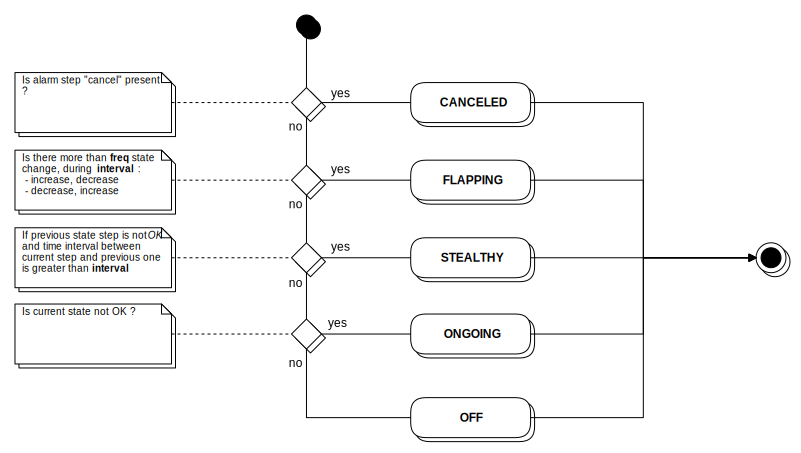

# Alarm management

This document describes the alarm management feature of Canopsis.

## Contents

### Description

An alarm is described by a set of [events](event.md):

- a check event with a non-OK
  state, starting the alarm
- a check event, with an OK state, ending the alarm
- eventually one or more check events with distinct non-OK state
- eventually one or more acknowledgment events
- eventually a ticket declaration event or a ticket association event
- eventually a changing state event
- eventually an alarm canceling event
- eventually an alarm restoring event
- eventually an alarm snooze event
- eventually an alarm comment event

This set of events is called, in Canopsis, an *alarm cycle* and is
associated to a contextual entity.

### Alarm step

The *alarm cycle* may only be ended after a status set to 0 if the
period of potential flapping has elapsed. It **MUST** have a list of
steps. Each *alarm step*, **CAN** carry one information among those below:

- the alarm is *on going*
- the alarm is *flapping*
- the alarm is *stealthy*
- the alarm has been acknowledged
- the alarm has been associated to a ticket
- a ticket has been declared for the alarm
- the alarm has been canceled
- the alarm has been restored from its canceled state
- the alarm state escalated
- the alarm state decreased
- the alarm has been snoozed
- the number of steps has reached an hard limit
- the alarm has been commented

Each step **MUST** be historized in its corresponding *alarm cycle*. And
once the alarm ended, the cycle **MUST** be closed, and archived.

#### Supervised step

A *supervised step* is an alarm step emitted by the incoming Canopsis events.

#### User step

A *user step* is an alarm step emitted by a Canopsis user. It **MUST**
provides the author of this step change, and a message explaining why
the change has been made.

#### Flapping steps

If an alarm is flapping and never stop being in this status, a large
amount of state escalations and state decreases will be recorded. To
prevent this from happening and alarms to be too voluminous, some state
changes **CAN** be *cropped*.

When a change of state is cropped, 2 step counters are incremented :

- a counter that counts the number of state escalations or decreases
- a counter that counts the number of state values : off (0), minor
  (1), major (2), critical (3)

Those kind of steps **MUST** be inserted in any order just after the
last change of status or incremented when flapping steps are cropped.
There are 6 different counter types.

State changes are cropped only if the number of state changes since the
last change of status is superior to `flapping_persistant_steps`
property (configurable).

#### Hard limit

Hard limit is a watchdog feature preventing an alarm to grow too big, in
case of flapping steps cropping not being enough. It simply controls the
maximum number of steps that an alarm can have.

If a step should be appended whereas the limit has been reached, it
**MUST** be discarded and can *not* be retrieved.

The only step allowed to be considered when an alarm has reached its
hard limit is an alarm cancelation.

Hard limit number of steps to be kept is configurable. This value
**CAN** be updated at any moment, and alarms that had been frozen
**MUST** continue to record steps if this limit has been extended.

### Alarm filter

Alarm filters permit to automate one or more actions when an alarm has a
specific property value (for example, state > 1) and a certain amount
of seconds have past since the last alarm update.

An alarm filter is composed of:

- a filter to select targeted entities
- a limit of time after which the filter became active
- a condition, which determine if the alarm is compatible with the filter
- a list of tasks to execute
- an output format and a list of output parameters to personalize
  the output message

The filter and the condition are mongo type filters. The limit is number
(interpreted as seconds). The output format is a python format type
string and the output parameters is a dictionary.

An example of a alarm filter structure (stored in default_alarmfilter):

```javascript
{
    "entity_filter" : "{"d": {"$eq": "/fake/alarm/id"}}",
    "limit" : 180.0,
    "condition" : "{"v.state.val": {"$gte": 1}}",
    "tasks" : [
        "alerts.systemaction.state_increase"
    ],
    "output_format": "{old} -- message",
    "repeat": 1
}
```

This filter only match entities with their rk equal to
"/fake/alarm/id". If nothing has append during 3 minutes and if
"key" value of the entity is not equal to "mala", it execute the
task "status_increase".

A list of all available tasks can be founded in [the corresponding
documentation](../TR/alarm.md) (all are available, except assocticket).

! Be carefull ! With `alerts.useraction.cancel`, there is no repetition
available and you should use a condition excluding `resolved` alarms to avoid
crashes. For example:

```json
"condition" : "{\"$and\":[{\"v.resolved\":null},{\"v.canceled\" : null}]}",
```

For the output message, it takes the old one (« {old} »), and append it
a static string (« -- message »).

The repeat parameter indicate how many times a filter can be applied on
an entity (with sufficient limit, filter, and condition). The default
value is `« 1 »`.

In etc/alerts/manager.conf, you can specify the author name putted in
the alarm (when the executed action need one).

### Functional test

Alarms cycle **MUST** respect the following schema:


Status **MUST** be computed in respect of the following schema:


