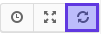
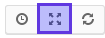
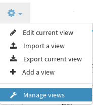
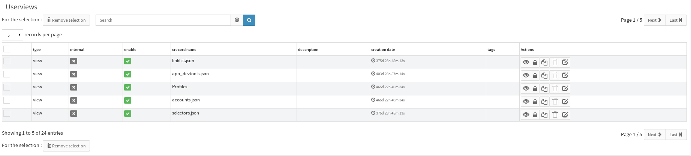
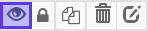

# Userviews

## Concept

In Canopsis frontend, almost everything element a user can see is
wrapped in a container called view.

### Main view and Satellite views

There is two main categories of views :

- The view that presents the content the user asked for. They
  basically represent dashboards and present informations that the
  user really care for. These views represent the *main view*.
- Views that decorates the content. They usually contains session
  informations, menus, buttons (log out, profile, and so on ...), or
  informations that are needed on each view (header, footer). These
  are the *satellite views*.

To sum up, main view will change between pages, and sattelite views
tends not to vary during user session.

### Regular views disposition

By default, views are arranged as listed below :

- Sattelite view : `view.app_header`
- Main view (depending on the current page)
- Sattelite view : `view.app_footer`

### Main view features

On the top right of the main view are located some view actions :

Action | Render | Description
-------|--------|------------
`Refresh`  |  | Manually refreshes the view
`Toggle flullscreen` |  | Hide menus, tabs, header and footer, and displays only the main view (or go back to the normal display if already in fullscreen mode)

## Manage views

A special view, called userviews, is included in Canopsis UI. It's in
fact a view manager/browser. You can access it with the gear menu :

As a result, you'll get :

For each view, some actions are available :

Action | Render | Description
-------|--------|------------
`View` |  | Go to the pointed view in read mode
`Rights` |  | Edit actual view's rights
`Duplicate` |  | Allow you to duplicate the view
`Remove` |  | Remove the View
`Edit` |  | Edit the record name
