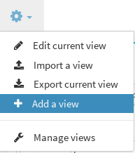
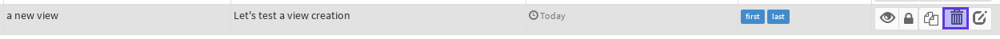

# Managing Views

Don't forget to look at [userviews](userview.md) section.

## Creating / Removing a View

To create a view, use the "add view" button located here :

And fill in the form :

You can add *tag* to help you order views in other forms like in *view management*.

or in *default view* editor

To remove a view, go to *userview* view, search the view you want to
delete and clic *remove button*

