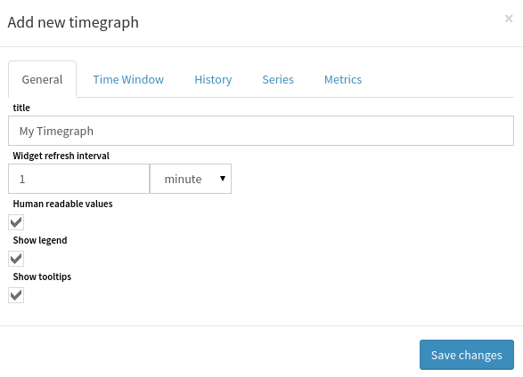
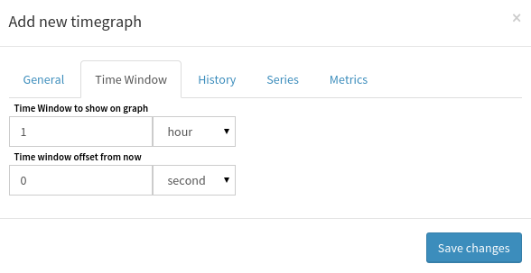
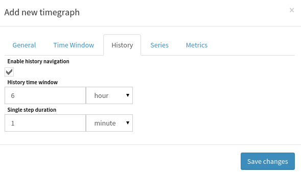
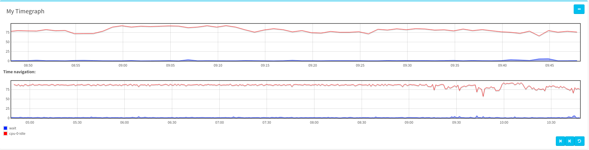
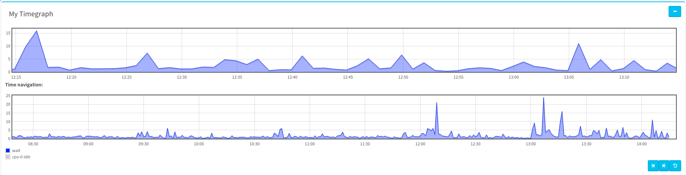

# How to use TimeGraph

This document describes how to insert and configure a *TimeGraph* widget.

The first step is to create some [series and/or curves](../perfdata.md).

## Configuring the widget

### General aspect

Insert a `timegraph` widget to begin with:

The following form will appear:

Detailed options:

- **Title**: your widget's title ;
- **Widget refresh interval**: interval between two chart updates ;
- **Human readable values**: if checked, will truncate `1000` to `1K`, etc. ;
- **Show legend**: if checked, will show a legend bellow the chart ;
- **Show tooltips**: if checked, will show a tooltip box when a
  point is hovered.

This configure the general aspect of the chart.

### Time Window and Navigation

Click on the *Time Window* tab to configure the time-window to show on
your chart:

Detailed options:

- **Time Window**: display data from `now - window-duration` to `now` on chart ;
- **Time Window Offset**: instead of using `now`, uses `now - offset`.

Those options will be used to determine which slice of data should be
displayed. Then, click on the *History* tab to configure the
time-navigation:

Detailed options:

- **Enable history navigation**: if checked, will show a second chart ;
- **History time window**: determine the wanted range of data, will
  be the time-window of the second chart ;
- **Step duration**: when you navigate on your chart (to the past,
  or the future), using the action-buttons, this will shift the
  time-window to this duration.

### Configure data sources

You can use two types of data source :

- serie: it will plot a pre-configured serie (see [how to create a
  serie](../perfdata.md)) ;
- metric: it will plot a single metric.

Click on the *Series* tab:

Detailed options:

- **Add**: this button add a new stylized serie to the widget ;
- **Serie**: choose the serie to plot ;
- **Curves**: choose the type of curve to use for plotting ;
- **Serie's color**: choose the curve's color ;
- **X / Y**: choose the axes (to use different scales on the same chart).

Then, click on the *Metrics* tab:

Detailed options (very similar to series):

- **Add**: this button add a new stylized metric to the widget ;
- **Metric**: choose the metric to plot ;
- **Curve**: choose the type of curve to use for plotting ;
- **Metric's unit**: if not provided by the metric, choose its unit
  (%, o, B, ...) ;
- **Metric's color**: choose the curve's color ;
- **X / Y**: choose the axes (to use different scales on the same chart).

Now you can save changes, and see the result.

## Using the widget

### Visualization

Here, the first chart shows data using the configured time-window, and
the second one shows data using the configured history time-window.

You can select a range on one of those two charts, it will reconfigure
the time-window on the first chart:

Then, you can click on a serie in the legend, to hide/unhide it:

If you hover a point with the mouse, and have the tooltip option
enabled, a small tooltip box will appears:

### Actions

On the right-bottom corner of the widget, you will find 3 buttons (only
one if time navigation is disabled):

Detailed actions:

1. Shift time-window of first chart to the past (use the configured *step duration*) ;
2. Shift time-window to the future ;
3. Reset time-window to its defaults, and restart widget refreshing.

**NB**: Every action modifying the time-window (action buttons, or
selection) will prevent the widget from refreshing, the *reset* button
restarts it.
