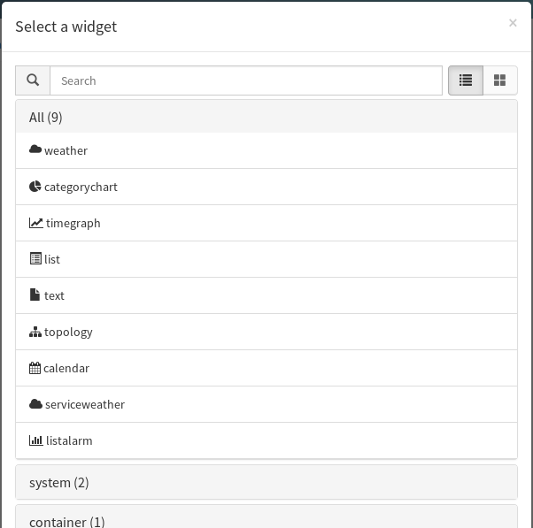
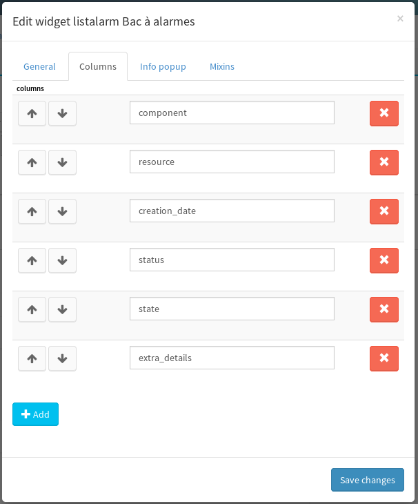
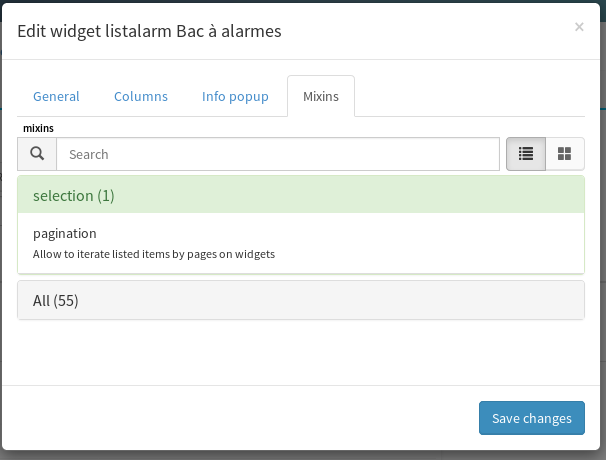
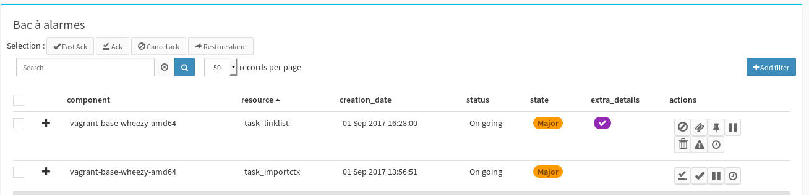
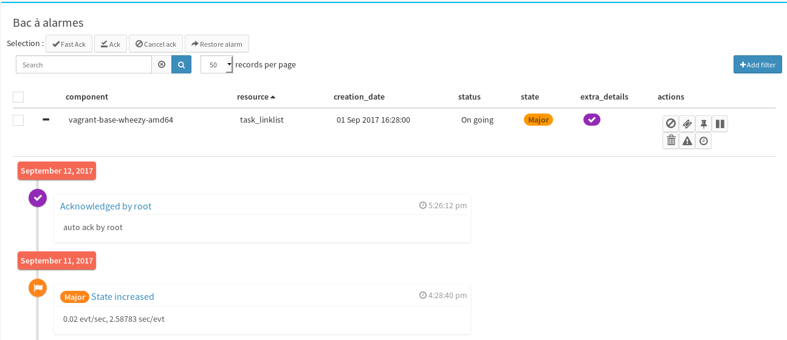
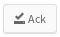
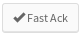
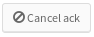
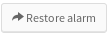

# Bac à alarmes

Le bac à alarmes permet de lister les alarmes ouvertes dans Canopsis, et d'effectuer des actions sur celles-ci. 

## Licence

Licence AGPL


## statut

- Disponible à partir de Canopsis 2.4
- nécessite l'utilisation du Context-Graph


## Installation

Le bac à alarmes dépend d'une seconde brique (`timeline`), l'installation se fait donc en 2 temps : 

### Installation du bac à alarmes : 


**NOTE** : Jusqu'à la sortie publique de canopsis 2.4 , une authentification peut être nécessaire pour télécharger ces briques

Exécuter les commandes suivantes sur un serveur canopsis : 

```
# su - canopsis 
$ cd var/www
$ ./bin/brickmanager install brick-listalarms
$ ./bin/brickmanager enable brick-listalarms

```

### Installation de la brique Timeline : 

Exécuter les commandes suivantes sur un serveur canopsis : 

```
# su - canopsis 
$ cd var/www
$ ./bin/brickmanager install brick-timeline
$ ./bin/brickmanager enable brick-timeline

```


## Configuration


#### Configuration du widget

- Créer ou sélectionner une vue, et passer en mode édition (`ctrl+e`)
- Cliquer sur le bouton 
- Sélectionner le widget `listalarm`:



La fenêtre de configuration s'ouvre alors : 

- dans l'onglet `general`, préciser un titre dans le champ title
- indiquer une colonne par défaut dans le champ `default_sort_column` 
- choisir de filtrer sur les alarmes ouvertes (`opened`) ou résolues (`resolved`)
- dans l'onglet `columns`, ajouter les colonnes correspondant aux champs des entités que vous voulez voir apparaître. Ajouter également les colonnes `status` et `extra_details`


- dans l'onglet `mixins`, rechercher le mixin `pagination` et cliquer dessus pour l'ajouter à la sélection


- cliquer sur  pour terminer la configuration du bac à alarmes


## Utilisation : 

Le bac à alarmes présente par défaut une liste d'alarmes, filtrées en fonction des paramètres configurés dans l'onglet `général` de l'édieteur de widget(voir paragraphe précédent).




On peut également consulter l'historique d'une alarme en cliquant sur le bouton `+` situé tout à gauche de la liste.




### Agir sur une alarme :  

La dernière colonne de chaque alarme représente les actions qu'il est possible d'effectuée sur une alarme

#### Actions disponibles sur une alarme non acquittée

Action                                       | Description
---------------------------------------------|-----------------------------------
          | Acquitter une alarme
 | Effectuer un acquittement rapide
  | Poser un [pbehavior]()
     | Retarder l'alarme de X minutes


#### Actions disponibles sur une alarme acquittée


Action                                                      | Description
------------------------------------------------------------|----------------------------------------------
            | Annuler l'acquittement de l'alarme
 | Déclarer un incident (dans un outil externe)
  | Assigner un n° d'incident
                 | Poser un [pbehavior]()
        | Supprimer l'alarme
       | Changer la criticité de l'alarme
                    | Retarder l'alarme de X minutes


#### Agir sur plusieurs alarmes : 

Il est possible de sélectionner plusieurs alarmes de la liste, et d'appliquer certaines actions sur l'ensemble de ces alarmes : 

Action                                                | Description
------------------------------------------------------|-----------------------------------
              | Acquitter une alarme
     | Effectuer un acquittement rapide
 | Poser un [pbehavior]()
      | Retarder l'alarme de X minutes


