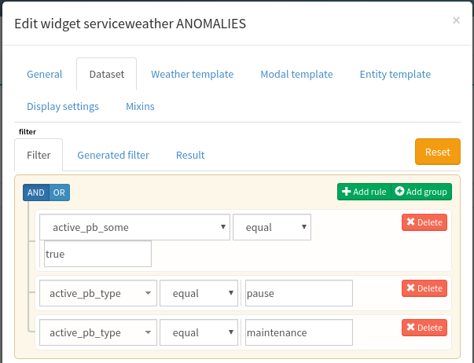
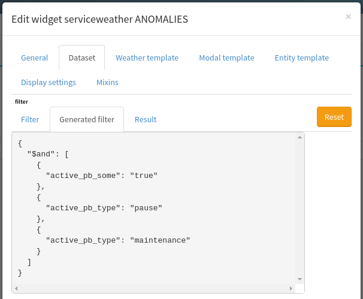

# Météo de service - weather

## Filtrage

**Note :** les paramètres de filtrage ne sont pas liés directement aux valeurs retournées par l’API.

Vos météo de service sont configurables : vous pouvez choisir quels informations afficher afin de donner un sens à une météo : n’afficher que les alertes en cours, que les éléments en pause etc…

Vous avez à disposition trois filtres spéciaux :

 * `active_pb_some` : un `booléen` valant `true`/`false`, `True`/`False`, ou `1`/`0`, indiquant si une tuile (un watcher) doit contenir au moins un `pbehavior` actif sur une entité ou un watcher (sauf si indication contraire) pour être affiché.
 * `active_pb_all` : même chose que pour `active_pb_some` sauf qu’il faut que **toutes** les entités liées aient un `pbehavior` actif pour être affiché.
 * `active_pb_watcher` : sélectionner les tuiles disposant d’un `pbehavior` actif sur un watcher.
 * `active_pb_include_type` ou `active_pb_type` : ce filtre peut être utilisé plusieurs fois et va vous permettre de demander d’afficher les tuiles contenant des `pbehavior` des types référencés. Les types inclues les pbehavior sur les entités et sur les watchers.
 * `active_pb_exclude_type` : ce filtre peut être utilisé plusieurs fois et va exclure les tuiles disposant d’au moins un pbehavior actif ayant un des types définis par cette valeur. Les types inclues les pbehavior sur les entités et sur les watchers.

Les filtres `active_pb_include|exclude_type` sont exclusifs et l’exclusion l’importe sur l’inclusion.

Ces options ne sont disponibles qu’au travers du filtre créé avec le `query builder` :

Voici un exemple de filtre créé sur une vue MdS :

Et le filtre généré correspondant (pour vérification) :

### Comportement des filtres

Les trois options mises ensemble se comportent comme un `ET` logique. Exemple :

 * `active_pb_some: True`
 * `active_pb_include_type: pause`

Cette règle peut se lire de la façon suivante : *afficher les tuiles ayant au moins un pbehavior actif et dont l’un au moins d’entre eux est de type pause*.

Autre exemple :

 * `active_pb_all: False`
 * `active_pb_some: True`
 * `active_pb_include_type: maintenance`

*afficher les tuiles ayant au moins une entité sans pbehavior, avec avec au moins un pbehavior, et de type maintenance au moins.*

Autre exemple :

 * `active_pb_all: True`
 * `active_pb_exclude_type: pause`

*afficher les tuiles dont toutes les entités ont un pbehavior actif, et exclure les tuiles disposant d’un pbehavior de type pause.*

Autre exemple :

 * `active_pb_include_type: maintenance`
 * `active_pb_include_type: pause`

*s’il y a des pbehavior actifs, ils doivent être de type pause ou maintenance.*

Autre exemple :

 * `active_pb_some: False`
 * `active_pb_watcher: True`

*n’afficher que les tuiles dont un pbehavior est sur le watcher mais aucun pbehavior sur les entités.*

Autre exemple :

 * `active_pb_some: True`

*afficher toute tuile disposant d’un pbehavior sur une entité ou un watcher.*