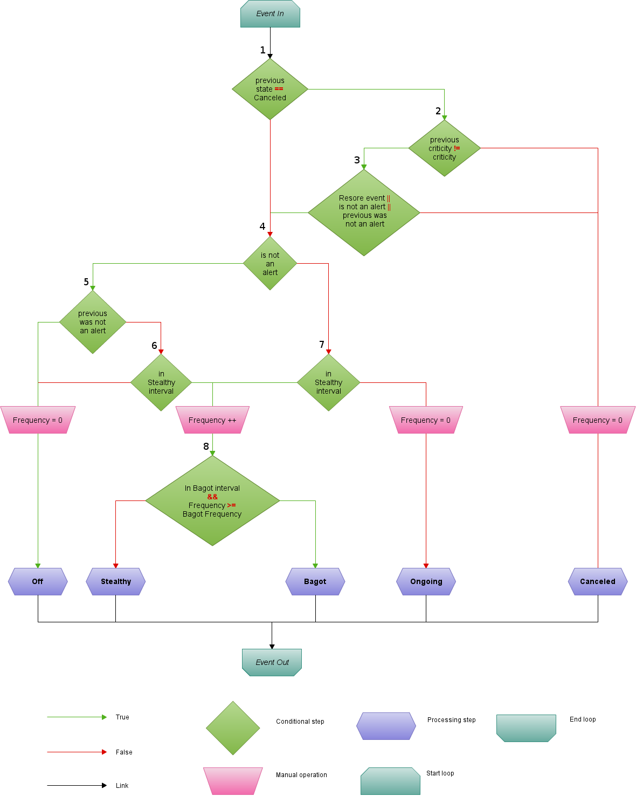

State specifications
======================

Possible state
----------------

* Off
* En cours
* Furtif
* Bagot
* cancel

*Off*
--------

An Event is considered ``Off`` if it is stable (i.e *Criticity* stable at ``0``).

*En cours*
----------

An Event is considered ``En cours`` if its *Criticity* is in an alert state (> 0).

*Furtif*
----------

An Event is considered ``Furtif`` if its *Criticity* changed from alert to stable in a specified amount of time.
If the said Event has its *Criticity* changed again within the specified time, it is still considered ``Furtif``.
If a change happens and the duration since the last change exceed the specified time, it will be flagged as ``En cours`` or ``Off`` depending on the new *Criticity*.

*Bagot*
-----------

An Event is considered ``Bagot`` if it has been flagged as ``Furtif`` a certain number of times on a specified period of time.

*Cancel*
-----------

An Event is considered ``cancel`` if the user flagged it as such from the Ux.
An Event flagged as ``cancel`` will change state if it goes from an alert state to a stable state.
Additionally, the user can specify if it should change state if its criticity changes within the various alert state or only between alert and stable states.

Flowchart
-----------

Additional informations
^^^^^^^^^^^^^^^^^^^^^^^^^

* ``Restore event`` : Boolean, equals ``True`` if the user wants an ``cancel`` event to change state when its criticity changes withing the various alert state, ``False`` if it changes only between alert and stable stated.
* ``alert`` : An alert is an event in an alert state (i.e. with a *Criticity* greater than 0)

Configuration
--------------

A `state-spec` crecord is needed for the configuration of the time intervals and frequencies, it has the following structure ::

  {
        "type": "object",
        "properties": {
                "crecord_type": {
                        "enum": ["state-spec"],
                        "required": true
                },
                "restore_event": {
                        "type": "boolean",
                        "required": true,
                        "default": true
                },
                "bagot": {
                        "type": "object",
                        "required": true,
                        "properties": {
                               "time": {
                                       "type": "number",
                                       "required": true
                               },
                               "freq": {
                                       "type": "number",
                                       "required": true
                               }
                        }
                },
                "stealthy_time": {
                        "type": "number",
                        "required": true
                }
        }
  }
