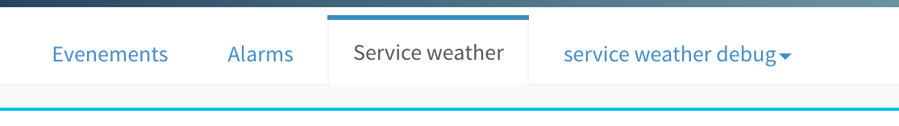
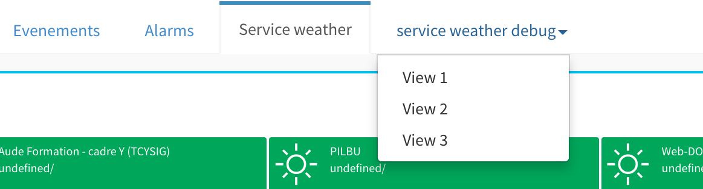
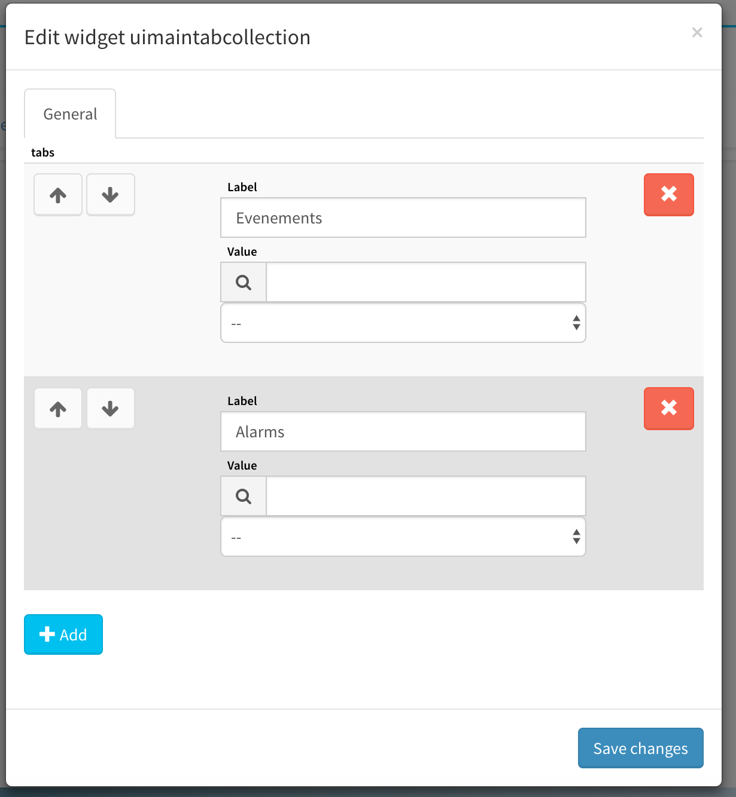

# Dropdown tabs

The goal of this evolution is to allow adding several subviews through a dropdown menu in the header_view.

The result will look as follow :

_Dropdown menu in a tab - collapsed_

_Dropdown menu in a tab - expanded_

## Functional requirements:

The following requirements are expected for this feature:

* the user can add several views on one tab, without technical limitation of the number of tabs.
* Each line of the dropdown menu is a  hypertext link to a user-defined rule
* the view is loaded dynamically: the target view is loaded in the same way as another tab,.
* Dropdown can be configured by the user like a normal tab
* Dropdown tabs are optional and must not break existing views

### Configuration

The user must be able to configure dropdown tabs just like standard tabs.

The configuration is done from the `uimaintabcollection` configuration window.

The current window looks like this :

The new window shoud look as follows:

The new behavior is defined as follows :

1. The `add` button keeps the same behavior and adds only new tabs on the widget
2. Clicking on this `tick` button saves the current label and adds another form, to edit a menu item.
3. When the new form is loaded for a menu item, it contains a `tick` button ( with a behavior as defined on "2."). The `close` button removes the current form, withut saving it. **note:** The `close`button does not appear for the 1st label (the Tab label)
4. The `delete` button destroys the full tab, including submenus.
5. The `save changes` button saves the whole view

## Technical specifications

The files for the widget that control clickable tabs are located in var/www/src/canopsis/uibase/src/widgets/uimaintabcollection/ . Those file manage the header view. 

Some schemajson editing could be required if the data is on the server. See with backend devs to modify those view declarations.

File that controle what view is displayed is : var/www/src/canopsis/core/src/routes/userview.js
The HBS is here : var/www/src/canopsis/core/src/routes/templates

It won't probably need changes but in case of it needs some fixes the main application file is here : var/www/src/canopsis/core/src/routes/application.js

### html example of a markdown tab

        <li class="dropdown">
            <a style="cursor:pointer" class="dropdown-toggle" href="#" id="dropdownMenu1">
            service weather debug
            </a>
            <ul class="dropdown-menu" aria-labelledby="dropdownMenu1">
                <li role="presentation"><a class="">View 1</a></li>
                <li role="presentation"><a class="">View 2</a></li>
                <li role="presentation"><a class="">View 3</a></li>
            </ul>
        </li>

### API calls
