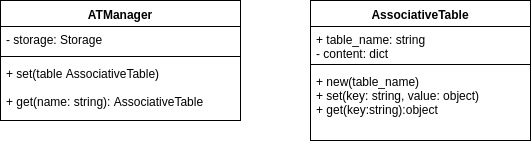
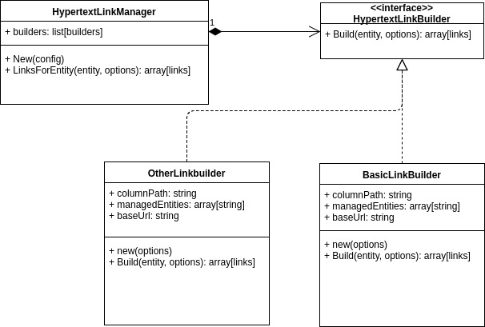

# Links generation in Canopsis

this document defines the specifications of the Links generation feature of Canopsis 2.xx

## Goal

this feature aims to provide a standard interface for building HyperText links based on configuration and
informations gained from the Context-graph included in Canopsis.


### User requirements

 * As a Canopsis user, I want to find links to procedures for a resource and/or component, in order to help me resolve an alert on these resources
 * As a Canopsis user, I want to find links to screenshots uploaded in Canopsis and linked with an alert on a resource and/or component, in order to help me understand the  alert


### Technical requirements

 * for all users, Canopsis should be able to generate hypertext links based on a static url and 1 variable stored in the Context-graph
 * for some specific use-cases, more complex transformations should be applied to the generated links.
 * for each use case, 1 or several links can be returned.
 * If no link is needed, the link generation code should return an empty array.
 * this feature should work on an HA environment

## Implementation

Two features will be implemented :

 * Configuration management which stores the configuration for each Canopsis instance.
 * Links management which builds links when required by the configuration management


### Configuration management

The configuration of the LinksManager is stored in a collection called AssociativeTables.

** storage representation : **  each document of the collection is structured as follows :


    {
      "name": "name of a configuration item",
      "content": [
        "key1": "value",
        "key2": "value2"
      ]
    }

To access these documents, 2 classes will be created :




 * class **AssociativeTable**:
    * Responsibility: value object that encapsulates values from the mongoDB collection

 * class **ATManager**:
    * Responsibility: simple DataMapper that interacts with the storage driver


### Links Management

This part of the feature is structured as described in the following image :




class **HypertextLinkManager** :

 * Responsibility :
    * load the configuration and instanciate all the required builders on instanciation
    * ask all instanciated builders for the generated links based on the entity sent to links_for_entity(entity, options)

abstract class **HypertextLinkBuilder** :

  * Responsibility : provide a standard interface for creating new builders, compatible with the HypertextLinkManager


class **BasicLinkBuilder** :

 * Responsibility :
    * replaces a placeholder value form a URL with 1 data extracted from the entity
    * return an array with all the generated links


## Usage

### New builders

A builder simply need an option dict, and provide a build() method wich
construct links, grouped by category names.

The new builder classes must be installed in the link_builder directory
(*canopsis/common/link_builder*).

### Configuration

First, declare a configuration name for context_graph engine. In
*etc/context_graph/manager.conf*, put ```hypertextlink_conf = MY_CONFIG```.
The default value is `link_builders_settings`.

Next, associate the file name a the new builder with a configuration. You
can do that be sending a POST request on *api/v2/associativetable/MY_CONFIG*
with a json payload as follow:
```{json}
{
    "basic_link_builder" : {
        "base_url" : "http://example.com/screenshot?file={name}",
        "category" : "screenshot"
    }
}
```
This conf will instanciate all *HypertextLinkBuilder* classes in
*basic_link_builder.py*, and configure it with a base_url and a category.

Last, reboot at least the context_graph engine:
```supervisorctl restart amqp2engines:engine-context-graph-0```
