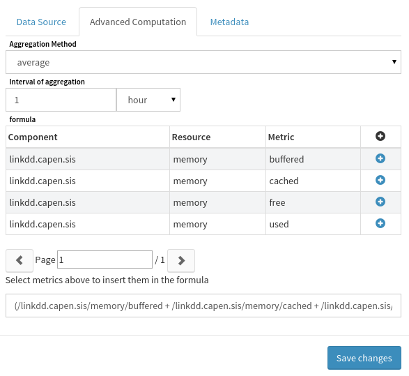
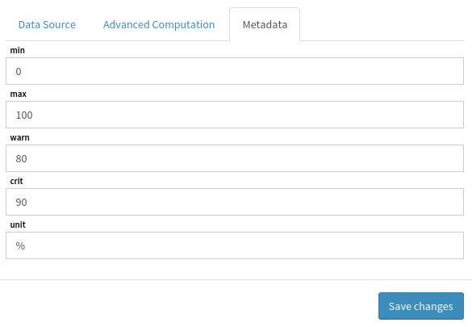
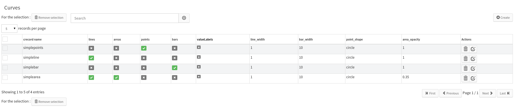
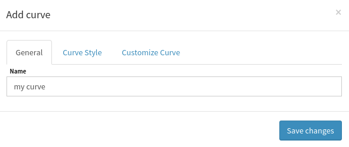
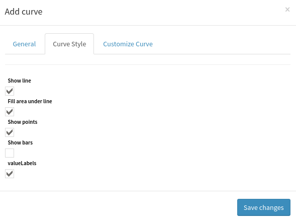

# Series and Curves

This document explains how to use the *Performance Data* view.

## Introduction

On this view, you can see three lists:

- **Metrics** : lists the known metrics ;
- **Series** : lists your series and allows you to create/edit/remove them ;
- **Curves** : lists your curves and allows you to create/edit/remove them.

A **metric** is a named value that can change over time. At the moment,
Canopsis knows four types of metrics :

- **GAUGE**: the actual value of the metric is the last incoming value ;
- **COUNTER**: increment the previous metric's value with this one ;
- **ABSOLUTE**: always positive value ;
- **DERIVE**: the current value corresponds to the metric's value
  derived over time.

A **serie** is an object containing :

- a name ;
- multiple metrics ;
- a formula, involving the selected metrics ;
- an aggregation, to fetch the metrics aligned on X axis ;
- some metadata (warn, crit, min, max, unit).

Just like a metric, a serie will generate a list of points (where each
point is a pair `(timestamp,value)`). Each point is the result of the
formula applied to the fetched metrics.

A **curve** describe how to plot a serie or a metric :

- do we want lines, areas, points, and/or bars ?
- do we want to plot the values with the curve ?
- how does look lines, areas, points, and/or bars ?

## How to make a serie

First, click on the *Create* button, a new form will appears :

Detailed form:

- **Name** : serie's name, will be used to labelize the serie on a chart ;
- **Data source** : metrics that will be fetched to feed the serie.

Detailed form:

* **Aggregation method** : method used to aggregate metrics points ;
* **Aggregation interval** : time interval between two aggregated points.
* **Formula** :
  * mathematical formula that will be used to consolidate the fetched 
    metrics in a single point ;
  * click on a metric in the list to add it in the formula.

Detailed form:

- **min** : defines the minimum value this serie will take ;
- **max** : defines the maximum value this serie will take ;
- **warn** : warning threshold ;
- **crit** : critical threshold ;
- **unit** : serie's unit.

## How to make a curve

First, click on the *Create* button, a new form will appears:

Detailed form:

- **name** : curve's name.

Detailed form:

- **Show line** : if checked, will plot a line chart ;
- **Fill area under line** : if checked, will plot an area on the chart ;
- **Show points** : if checked, will plot each point on the chart ;
- **Show bars** : if checked, will plot a bar chart ;
- **Show values** : if checked, will display values above each point.

Detailed form:

- **Line width** : line/bar width in pixel ;
- **Bar width** : bar width in X unit ;
- **Lines style** : if the line is continuous, dashed, ... ;
- **Point's shape** : shape used to plot a point ;
- **Area opacity** : number from 0 to 1, 0 being transparent and 1 being opaque.
