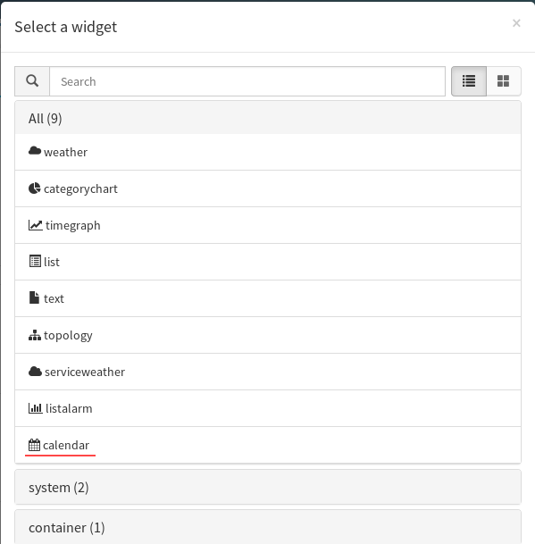
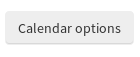
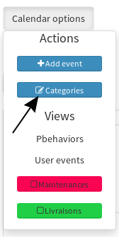

# Calendar

La brique calendar est un calendrier qui permet d'afficher et de programmer des évènements via l'interface de Canopsis

## Licence

Licence AGPL


## statut

- Canopsis 2.4 et versions antérieures : La brique Calendrier permet de créer et visualiser des évènements, à titre d'information pour les utilisateurs.
- Canopsis 2.5 et versions supérieures : La brique Calendrier Permettra de gérer les évènements périodiques (pbehaviors) et pourra afficher les alertes remontées par Canopsis


## Installation

Exécuter les commandes suivantes sur un serveur canopsis : 

```
# su - canopsis 
$ cd var/www
$ ./bin/brickmanager install brick-calendar
$ ./bin/brickmanager enable brick-calendar

```


## Configuration


#### Configuration du widget

1. Créer ou sélectionner une vue, et passer en mode édition (`ctrl+e`)
2. Cliquer sur le bouton 
3. Sélectionner le widget `calendar`:

4. Cliquer sur le bouton 
5. Dans la fenêtre de confiduration, choisir l'onglet `mixins` et taper `calendar` dans le champ de recherche.
6. Cliquer sur les 3 mixins qui apparaissent pour les faire monter dans la section `selection`
7. Cliquer sur 


#### Configuration des données

1. Dans la vue calendrier, cliquer sur 
2. Cliquer sur 
3. Créer au moins 2 catégories pour que le widget fonctionne correctement. 


## Utilisation

 Vous pouvez créer un évènement en utilisant le menu  ou simplement en cliquant directement sur la date appropriée dans le widget.


