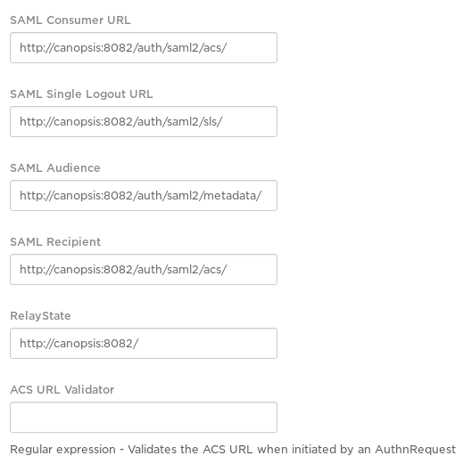
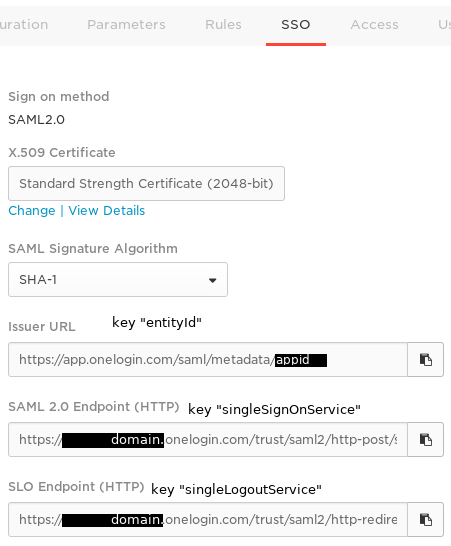
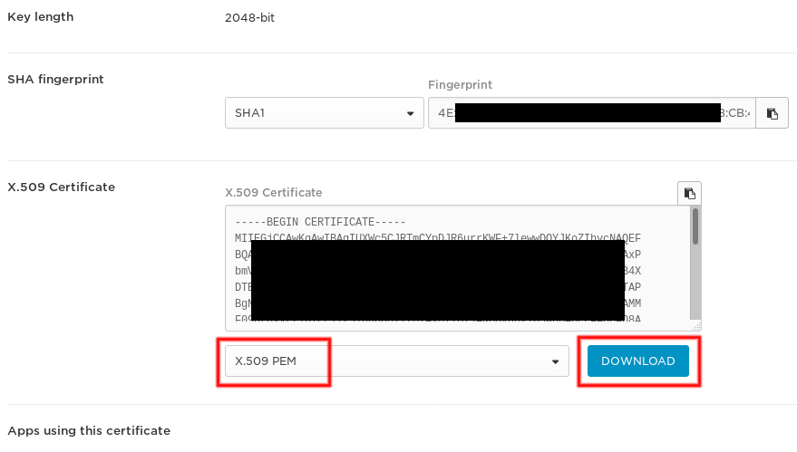

## SAML2

Intégration de l’authentification avec SAML2

Nécessite l’installation de la brique `CAT`.

### Paramétrage IdP

 * ACS Consumer URL : `http[s]://canopsis.fqdn.tld/auth/saml2/acs/`
 * Single Logout URL : `http[s]://canopsis.fqdn.tld/auth/saml2/sls/`
 * Audience : `http[s]://canopsis.fqdn.tld/auth/saml2/metadata/`
 * Recipient : `http[s]://canopsis.fqdn.tld/auth/saml2/acs/`
 * RelayState : `http[s]://canopsis.fqdn.tld/`

L’IdP doit impérativement fournir dans les réponses d’authentification une valeur normalisée `NameID`. Il suffit de créer un *mapping* entre ce champs normalisé et une information unique dans le backend utilisé par l’IdP. Dans le cas contraire l’authentification côté Canopsis **ne pourra pas fonctionner**.

Exemple de configuration OneLogin :



### Création du paramétrage - Côté Canopsis

**Travaillez dans un dossier temporaire accessible par l’utilisateur `canopsis`, par exemple `/opt/canopsis/tmp/saml2_setup`.**

Vous pouvez suivre cette documentation : https://github.com/onelogin/python-saml#knowing-the-toolkit

En particulier la génération des clefs et des paramètres :

```
mkdir certs
openssl req -new -x509 -days 3652 -nodes -out certs/sp.crt -keyout certs/sp.key
```

Écrire dans le fichier `settings.json` :

```json
{
    "strict": true,
    "debug": false,
    "sp": {
        "entityId": "CANOPSIS_BASE_URL/auth/saml2/metadata/",
        "assertionConsumerService": {
            "url": "CANOPSIS_BASE_URL/auth/saml2/acs/",
            "binding": "urn:oasis:names:tc:SAML:2.0:bindings:HTTP-POST"
        },
        "singleLogoutService": {
            "url": "CANOPSIS_BASE_URL/auth/saml2/sls/",
            "binding": "urn:oasis:names:tc:SAML:2.0:bindings:HTTP-Redirect"
        },
        "NameIDFormat": "urn:oasis:names:tc:SAML:1.1:nameid-format:emailAddress",
        "x509cert": "",
        "privateKey": ""
    },
    "idp": {
        "entityId": "https://app.onelogin.com/saml/metadata/appid",
        "singleSignOnService": {
            "url": "https://domain.onelogin.com/trust/saml2/http-post/sso/appid",
            "binding": "urn:oasis:names:tc:SAML:2.0:bindings:HTTP-Redirect"
        },
        "singleLogoutService": {
            "url": "https://domain.onelogin.com/trust/saml2/http-redirect/slo/appid",
            "binding": "urn:oasis:names:tc:SAML:2.0:bindings:HTTP-Redirect"
        },
        "x509cert": "CONTENU_CERTIFICAT_X509_IDP"
    }
}
```

En prenant ici pour exemple la configuration OneLogin :



Remplacer les occurrences des paramètres suivants :

 * Les url `https://domain.onelogin.com...` sont à remplacer intégralement par les données de configuration de L'IdP sur lequel vous allez vous brancher ;
 * `CANOPSIS_BASE_URL` ; exemple : `https://canopsis.domain.tld/` **ATTENTION** Il faut **OBLIGATOIREMENT** que cette URL soit un `FQDN` ;
 * `CONTENU_CERTIFICAT_X509_IDP` avec le contenu au format PEM du certificat public de l’IdP.

Exemple de certificat fourni par l’IdP OneLogin :



Pour le certificat de l’IdP, télécharger le, puis :

```bash
cat idp_cert.pem | grep -v "BEGIN CERTIFICATE" | grep -v "END CERTIFICATE" | tr '\n' ' ' | sed -e 's/ //g'
```

Écrire dans le fichier `advanced_settings.json` :

```json
{
    "security": {
        "nameIdEncrypted": false,
        "authnRequestsSigned": false,
        "logoutRequestSigned": false,
        "logoutResponseSigned": false,
        "signMetadata": false,
        "wantMessagesSigned": false,
        "wantAssertionsSigned": false,
        "wXoantNameId" : true,
        "wantNameIdEncrypted": false,
        "wantAssertionsEncrypted": false,
        "signatureAlgorithm": "http://www.w3.org/2000/09/xmldsig#rsa-sha1",
        "digestAlgorithm": "http://www.w3.org/2000/09/xmldsig#sha1"
    },
    "contactPerson": {
        "technical": {
            "givenName": "technical_name",
            "emailAddress": "technical@example.com"
        },
        "support": {
            "givenName": "support_name",
            "emailAddress": "support@example.com"
        }
    },
    "organization": {
        "en-US": {
            "name": "sp_test",
            "displayname": "SP test",
            "url": "http://sp.example.com"
        }
    }
}
```

Ces fichiers de configuration sont à adapter, il n’existe pas de configuration générique, cela dépend des paramètres de sécurité de l’IdP.

Créer le fichier de configuration de la correspondance Utilisateur Canopsis <-> Utilisateur IdP :

```json
{
        "userid": null,
        "firstname": null,
        "lastname": null,
        "mail": null
}
```

Dans le cas où toutes les valeurs sont à `null` des paramètres par défaut seront appliqués.

Si vous voulez paramétrer vous même la correspondance, mettez simplement une chaîne de caractère contenant le nom de l’attribut fourni par l’IdP. Exemple avec OneLogin :

```json
{
        "userid": "User.email",
        "firstname": "User.FirstName",
        "lastname": "User.LastName",
        "mail": "User.email"
}
```

### Intégration des paramètres en base

Créer cette structure :

```
saml2_setup/
    certs/
        sp.crt
        sp.key
    settings.json
    advanced_settings.json
    canopsis_user.json
    conf_path
    secret_key
```

Le fichier `conf_path` devra contenir le chemin de destination de la configuration SAML2 lorsqu’elle sera utilisée par le webserver canopsis. Exemple : `/opt/canopsis/tmp/saml2`.

Le fichier `secret_key` permettra de déchiffrer les données SAML2 en cas de chiffrement. Si vous n’activez pas le chiffrement, créez quand même ce fichier.

Ensuite, dans l’environnement Canopsis, exécutez ceci dans un shell Python :

```bash
python -c 'from canopsis_cat.saml2 import SAML2Conf; SAML2Conf.insert_conf("/opt/canopsis/tmp/saml2_setup", SAML2Conf.provide_default_collection())'
```

Vous pouvez relancer cette commande autant de fois que nécessaire : la configuration en place sera tout simplement écrasée intégralement.

Donc si vous voulez apporter une modification de la configuration, pas besoin de passer par la base de données : modifiez les fichiers "source" sur disque, exécutez la commande ; c’est fini.

### Activation de l’authentification SAML2

Éditer le fichier de configuration canopsis `etc/webserver.conf` :

```ini
[webservices]
; version pré-monopackage < 2.5.0
saml2 = 1
; version monopackage >= 2.5.0
canopsis_cat.webcore.services.saml2 = 1
```

Puis exécutez :

```bash
su - canopsis -c "service webserver restart"
```

### Tests et log

Le fichier de log `var/log/saml2.log` contiendra les erreurs SAML2 s’il y en a.

Pour tester l’authentification :

 * Rendez-vous sur la page de login de canopsis ;
 * Entrez un utilisateur autre que ceux présents dans Canopsis, et n’importe quoi en mot de passe (changements à venir) ;
 * Vous devez être redirigé vers la page de login de l’IdP SAML2 ;
 * Une fois authentifié via l’IdP, vous devez être redirigé vers Canopsis sans erreur.

### Troubleshooting

Observer les logs `var/log/saml2.log` et `var/log/webserver.log`.

#### FQDN

```
OneLogin_Saml2_Error: Invalid dict settings at the file: sp_acs_url_invalid,sp_sls_url_invalid
```

Vérifier que les URL `sp` sont toutes des FQDN.

#### Désynchro de configuration

```
[2018-03-01 10:47:30,220] [ERROR] [saml2] SAML Authentication errors: ['invalid_response'] | The response was received at http://canopsis.local:8082/auth/saml2/acs/ instead of http://canopsis:8082/auth/saml2/acs/
```

Ici l’IdP est mal configurée. Assurez-vous que la configuration active dans le webserver est conforme à ce qu’attend l’IdP et inversement.

Redémarrer le webserver si besoin afin d’être certain de la configuration actuellement utilisée.
