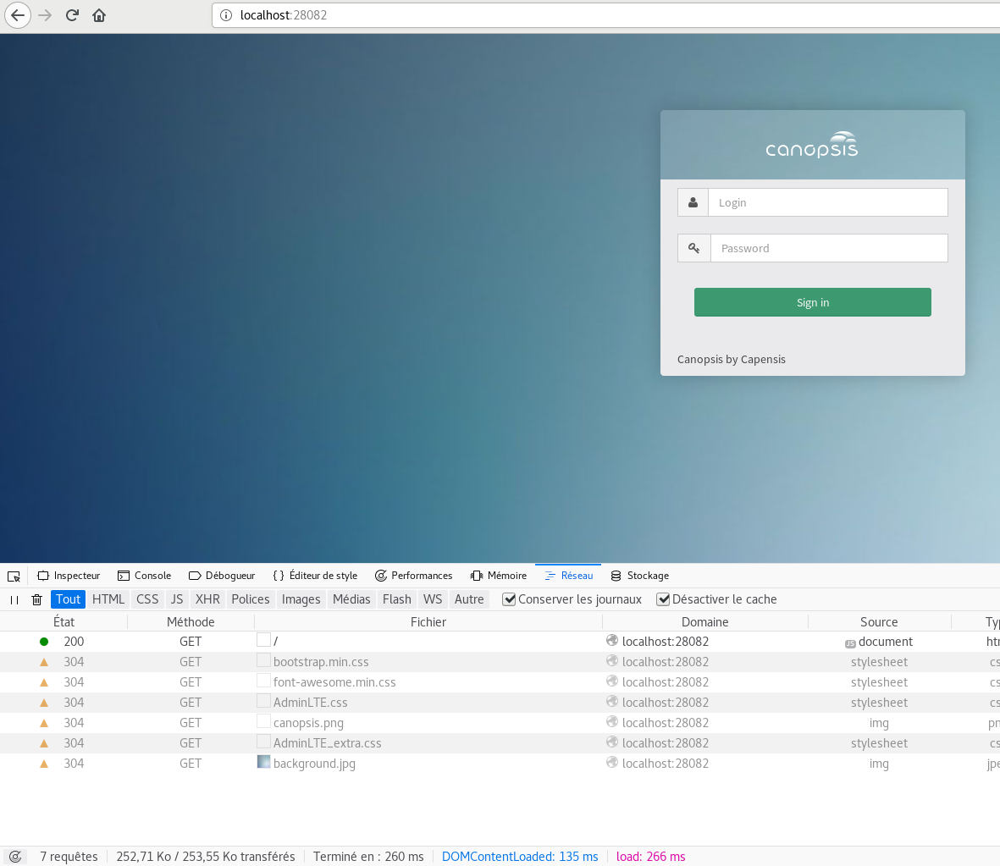
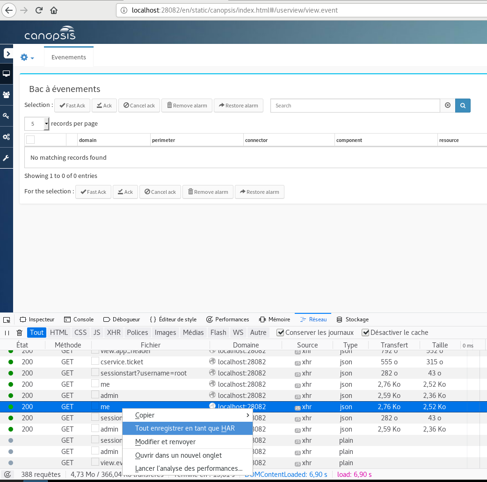
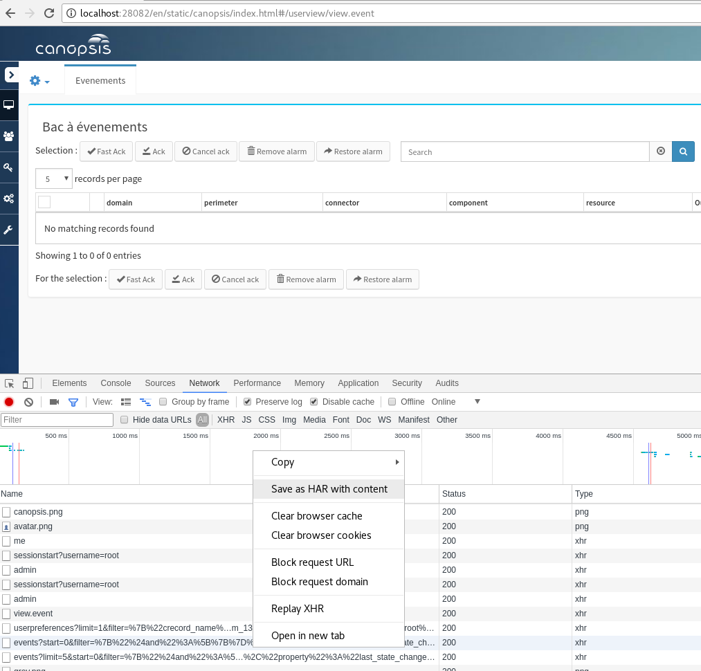

# Debug Front

## Export HAR - Analyse des requêtes

Exporter toutes les données d’une session Canopsis dans un fichier exploitable directement sans avoir besoin de refaire les tests.

Premièrement, ouvrez votre navigateur ou un nouvel onglet dédié à la session de debug, puis suivez les instructions ci-dessous selon le navigateur que vous utilisez.

**ATTENTION** : tout sera passé en **clair**, y compris les **mots de passe**. Veuillez donc **utiliser un compte de test** sur Canopsis, et **ne jamais** utiliser l’onglet de debug pour autre chose.

### Firefox

 * Ouvrir la console de développement `Ctrl+Shift+I` puis onglet `Réseau` ou bien `Menu -> Développement Web -> Réseau`
 * Cocher la case `Garder les journeaux`, si elle existe
 * Cocher la case `Désactiver le cache`

Une fois que vous avez effectué les actions conduisant à la reproduction du bug, cliquez-droit n’importe où dans la zone des requêtes HTTP puis `Tout enregistrer en tant que HAR`.

Transmettez le fichier que le navigateur va vous proposer de télécharger.

### Chrome / Chromium

 * Ouvrir la console de développement `Ctrl+Shift+I` puis onglet `Réseau` ou bien `Menu -> More Tools -> Developer Tools -> Network`
 * Cocher les cases `Garder les logs` et `Désactiver le cache`

Une fois que vous avez effectué les actions conduisant à la reproduction du bug, cliquez-droit n’importe où dans la zone des requêtes HTTP puis `Tout enregistrer en tant que HAR`.

Transmettez le fichier que le navigateur va vous proposer de télécharger.

## Export HAR - Transmission

Afin d’éviter de transmettre des fichiers volumineux, compresser le fichier avec `ZIP` par exemple.
