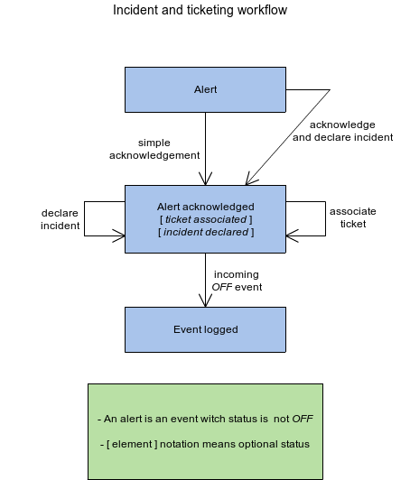
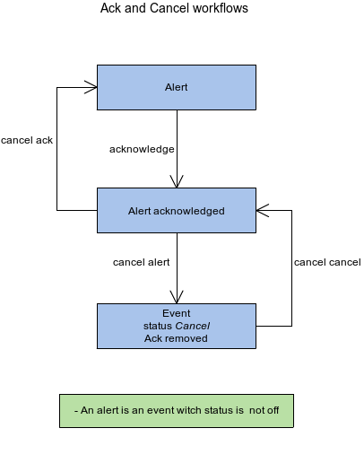

Workflow
========

Ticketing and incident
----------------------

Acknowledgement and cancellations
---------------------------------

* All actions **from UI** are triggered by action buttons witch sends the appropriate event to canopsis. **Sent events** are treaten by engines and enables acknowledgement and cancellation management.
* When an event changes to an alert, it is possible **to acknowlege** it. The acknowledgement engine is in charge to set the right acknowledgement information to the referenced event in the **ack field** such as `who`, `why` and `when` the acknowledgement was produced.
* Once acknowledged, the acknowledgement can be **removed** from the alert. This will put the event in the same **previous state** as before it was acknowledged.
* An acknowledged event can also be **canceled**. This action is managed by the cancel engine. The cancel action will store information about the `who`, `why` and `when` in the **cancel field** of the event. A canceled alert put the event in `cancel` status.
* The `canceled` event can be `uncanceled`. This action leads to the previous acknowleged **status restoration** and `cancel` field deleted in the reference event.
* All information about acknowledgement and cancelation are **kept** in logged event and **remains readable** from the history board.
* If an event in `off` status comes to canopsis, the acknowledgement is **reseted** as it is considered as a solved alert. However, if the event was not in `on going` status at this moment, information about `acknowledgement` or `cancel` is kept into the event as the alert is **remains logicaly unsolved**.

Events statuses information
---------------------------

see : `statuses information </developper-guide/state-spec.html>`_