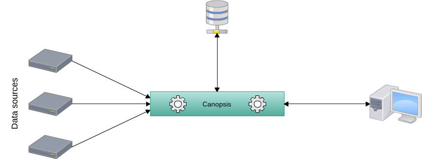

.. _FR__Architecture:

=====================
Canopsis Architecture
=====================

This document describes the architecture requirements of Canopsis.

.. contents::
   :depth: 2

References
==========

List of referenced functional requirements...

 - :ref:`FR::Engine <FR__Engine>`
 - :ref:`FR::JSON-API-Protocol <FR__JSON_API_Protocol>`

Updates
=======

.. csv-table::
   :header: "Author(s)", "Date", "Version", "Summary", "Accepted by"

   "David Delassus", "2015/09/16", "0.4", "Update data storage requirements", ""
   "David Delassus", "2015/09/01", "0.3", "Update references", ""
   "David Delassus", "2015/09/01", "0.2", "Rename document", ""
   "David Delassus", "2015/09/01", "0.1", "Document creation", ""

Contents
========

.. _FR__Architecture__Desc:

Description
-----------

Because Canopsis is built on top of several technologies, it has specific requirements.

To know those requirements we have to know its needs :

 - Canopsis sources will gather informations to send them as message to Canopsis
 - it will need a messaging queue system in order to transport messages
 - in order to store incoming data, it will need a database platform
 - to expose data, it will need a web server to process requests

.. _FR__Architecture__DataSrc:

Data Source
-----------

A data source MUST be independent and MUST NOT rely on Canopsis toolchain to
produce messages.

.. _FR__Architecture__Messaging:

Messaging Queue System
----------------------

Each Canopsis :ref:`engine <FR__Engine__Desc>` listen on a queue and chain the
message to the next configured queues, each one of them associated to an engine.

The technical solution MUST support :

 - message queuing
 - load-balanced consumers
 - consume to all consumers
 - consumers subscription to a set of messages
 - authentication support

.. _FR__Architecture__DataStore:

Data storage
------------

The data storage is the main bridge between the engines and the front-end.

The technical solution MUST support :

 - API with JSON support
 - indexing
 - in memory cache
 - authentication support
 - file storage support

.. _FR__Architecture__DataServe:

Data exposure
-------------

Data will be exposed to the front-end via an API which MUST support :

 - :ref:`JSON custom protocol <TR__JSON_API_Protocol>`
 - authentication (with credentials or token)
 - external authentication (with CAS, LDAP)

.. _FR__Architecture__Schema:

Schema
======

