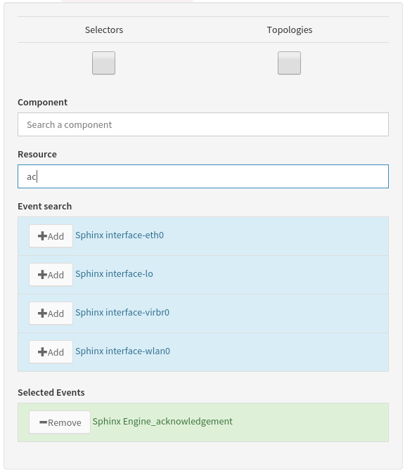

.. _dev-frontend-architecture:

Architecture
============

1. Presentation
---------------

Canopsis UI is built on top on the `Emberjs <http://www.emberjs.com>`_ framework. This framework is use in Canopsis as a skeletton that let developper plug functionnalities all around the Canopsis core. Canopsis UI also uses some other frameworks like `requirejs <http://requirejs.org>`_ or the famous css framework `bootstrap <http://getbootstrap.com>`_ In this documentation will be explained how canopsis core is designed and what are it's mechanics. It is also explained how to integrate new features in order they best fit existing content.

Canopsis UI once installed on a server is served by the `Gunicorn <http://gunicorn.org>`_ webserver with some static **javascript, html, css** files and some **dynamic content** computed and server throught the `Canopsis API </developer-guide/API/index.html>`_

Please note that the folder referential is based on the **webcore** folder which in Canopsis sources is located in the subfolder ``canopsis/sources/webcore/var/www/canopsis`` . This path once Canopsis built is by default ``/opt/canopsis/var/www/canopsis``. Some resources may however only be avaiable from other location. This is the case for *locales* translation *.po* files that are located by default in ``/opt/canopsis/locale`` or schemas that are documented in the `model </developer-guide/uiv2/model_layer.html>`_ part of the Canopsis documentation.

2. The Entry point
------------------

When the *index.html* file is queried by a client to the server, index.html loads a few files (mainly css ones) directly. However, it includes the **canopsis.js** file that is the entry point of the canopsis UI system. File loading is handled by requirejs and once loaded, the canopsis.js file instanciate the require.js framework recursively and this leads to the call of each canopsis requirement for the initial load.

3. Dependencies overview
------------------------

Canopsis UI is made of many dependencies that together render the User Interface once loaded. These dependencies are made of:

 - `editors <components/editors.html>`_
 - `factories <#>`_
 - `loaders <#>`_
 - `renderers <#>`_
 - `schemas <#>`_
 - `templates <#>`_

4. Canopsis dependencies Loaders
--------------------------------

The initial application load though canopsis.js calls some Canopsis javascript files which role is to load Canopsis UI resources such as Ember js components, asynchonously. These loaders manage resources such as **templates, ember components, Canopsis forms, some tools or widgets**. All those resources are part of the canopsis UI and are various combination of HTML templates and/or javascript view/controllers. The dependencies for each of these loaders are hardcoded into each file but their design let further integration as easy as copying a line and fill it with a new value. Below, some loader example may light about how to integrate some features from low application level.

Loaders are based on a list of javascript objects that descibes how ember will require components from server. An object description with all information looks like:

.. code-block:: javascript

   {
      name: 'components/component-actionbutton',
      url: 'canopsis/uibase/components/actionbutton/component',
      template: 'canopsis/uibase/components/actionbutton/template.html'
   }

This requirement object will tell the Canopsis template loader to fetch the action button html template fil file then it's content will be compiled and stored in the ``Ember.TEMPLATE`` object.
The url information is used to load the dependency controller/view.

Loaders are mostly based on the same model and adding a new entry is as simple as adding a well formatted object in a list depending on the type of loaded resource.

Loaders are used to load components such as editors, helpers, renderers and such...

5. Canopsis editors
-------------------

Editors in canopsis UI application are graphical components that are called when a user need to input information into the system. They can have many forms depending on the user action context datatype. For instance, editors can be either a simple textbox to input text or a more complext date time picker component that enables the user to provide a date information to the context.

Often the data input context is a canopsis form that is parametrized by a Canopsis Schema. Such schema determines what data are related to the form and how the user will be prompted to input then (what editor will be displayed)

When an editor is created, the editor context expects that the input value generated is set as the **content** field of the component. This way, the editor context (a form in canopsis UI) knows that the user input is always and only the **content** field of the editor.

An editor is a template that most of time calls a component object (see `components <#components>`_ ) that allow more complex operation / GUI rendering to manage user inputs. It looks like the following:

.. code-block:: html

   {{component-eventselector content=attr.value title=attr.field}}

Here, the template of our editor contains the call of the eventselector component where it's content value is binded to the attr.value variable of the context. In Canopsis forms contexts, this is the location where the form will get the user input in order to generate a coherent form record. The title field is also set with `attr.field` value. This means that the title field within the component will be equal to the `attr.field` value witch is in this case the field value contained in the schema. It is for eventselector the value `event selection`.

Finally, in the canopsis UI forms, when the schema of any model uses for an attribute the **"role"** key, the value **"eventselector"**, in the form our editor with the call of a component will looks like the picture below.

6. Canopsis renderers
---------------------

A render in Canopsis is a web component that aims to display a given data in a specific form.

Renderers are simple GUI components made a html template for information displaying.

In Schemas, an attribute **role** defines witch renderer will be used to display the data in the Canopsis interface.

For exemple, the state information contained in events, when displayed into a table, are rendered thanks to the call of a helper in the renderer's template. Here is the code of the state renderer:

.. code-block:: html

   {{stateview value this}}

This code will just call the stateview helper with two parameters: the state value known in the render context as **"value"** field that is for the example equal to `0` and the **this** instance that is contextually the record that represents the event.

.. image:: ../../_static/images/frontend/staterenderer.png

7. Canopsis UI Model
--------------------

The Canopsis UI Model system is based upon json schemas that describes datatypes for each document type managed into canopsis. Those schemas are used in both front office and back office in order to keep redundancy in the project.

8. Widgets
----------

Widgets are components used in Canopsis UI. They are made of a controller and a template and they can be parametrized in order to best fit users need. see more `widgets <widgets/creating-a-simple-widget.html>`_

9. Packaging
------------

You can create your own UI parts in two steps, independently the UI file tree.

A. file creation
################

Create a directory, named ``testmodule`` in this example, which contains at least an ``init.js`` file which describes imports of sub-components (mixin, templates, images, etc.) related to the ember/requirejs project installation format.

B. register module
##################

Once you wrote your installation file, you just have to run the Canopsis script ``brickmanager`` such as...

.. code-block:: bash

    #Available in the sources/webcore directory of canopsis
    ./bin/brickmanager enable testmodule

You can check the module load with ``./bin/brickmanager list``

Enjoy
