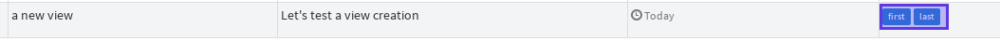
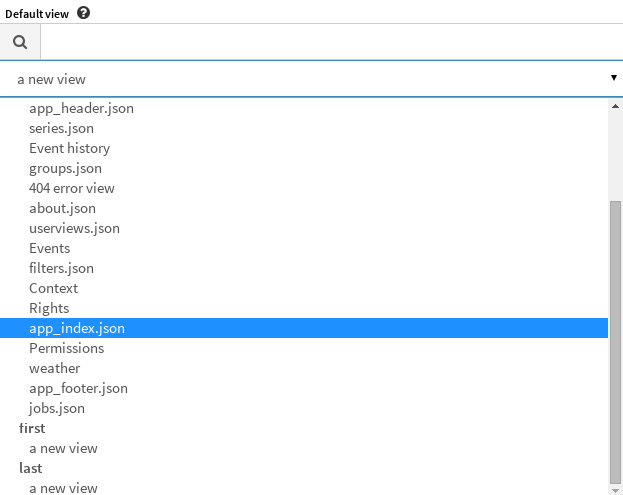

.. _user-ui-viewmanagement:

Managing Views
==============

.. note::
   Don't forget to look at :ref:`user-ui-userviews` Section

Creating / Removing a View
--------------------------

To create a view, just use the "add view" button located here :

.. image:: ../../../_static/images/views/viewmanagement_addview.png

And fill in the form

.. image:: ../../../_static/images/views/viewmanagement_addviewform.png

You can add ``tag`` to help you order views in other forms like in ``view management``

or in ``default view`` editor

To remove a view, go to ``userview`` view, search the view you want to delete and clic ``remove button``

.. image:: ../../../_static/images/views/viewmanagement_removeview.png

Containers and Widgets
----------------------

The next step is to put some widgets on a view.

In most of case, you will first have to include :ref:`user-ui-widgets` into :ref:`containers <user-ui-widgets-containers>`

Don't forget to add options to widgets with the Canopsis :ref:`user-ui-mixins` feature

